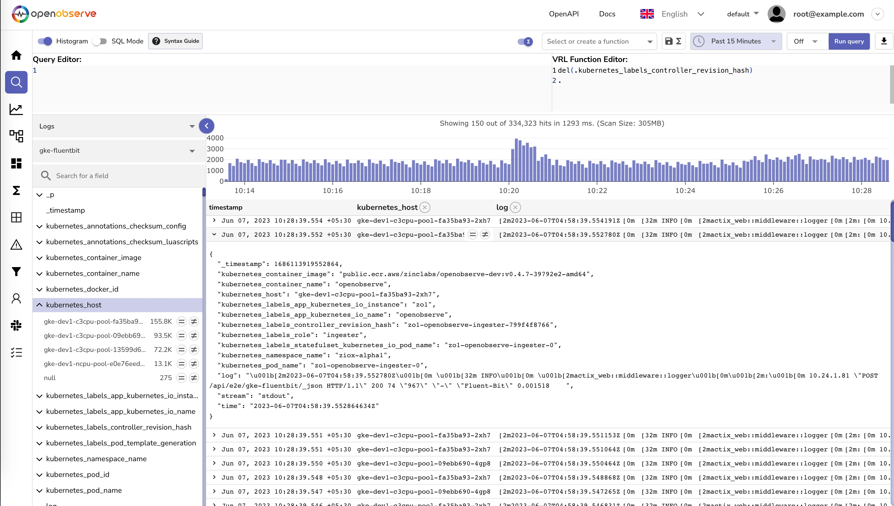
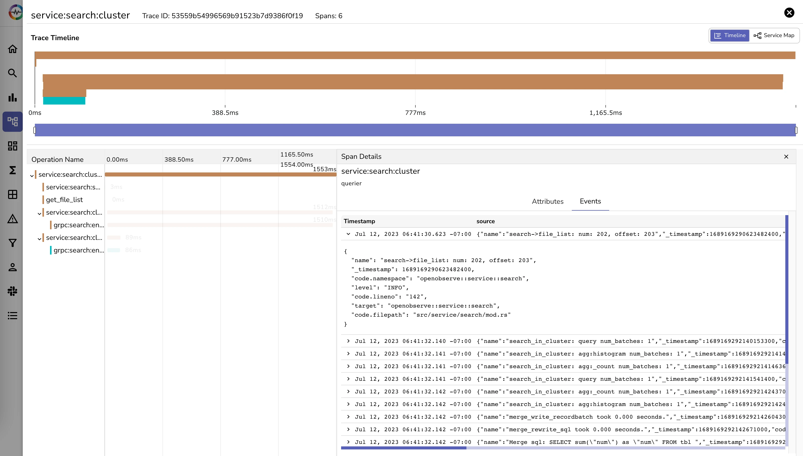
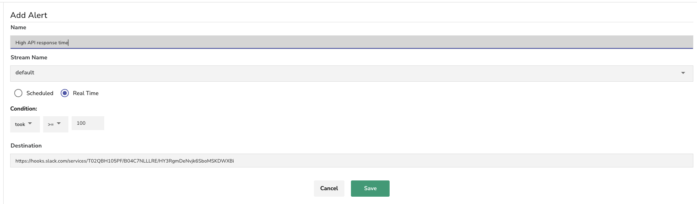
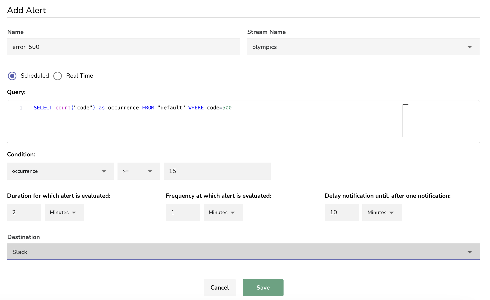
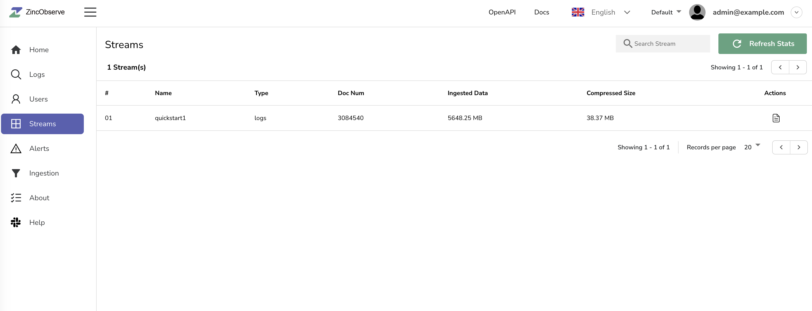
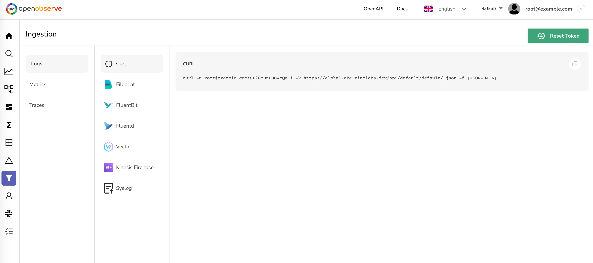

<p align="center">
  <a href="https://openobserve.ai"></a>
</p>
<p align="center">
    <em>🚀 Elevate your data management to new heights with OpenObserve! Simplify your implementation process by 10x 🌟, slash storage costs by a staggering 140x 💰, and enjoy blazing-fast 🏎️ performance at a petabyte scale 🌌. OpenObserve is a robust alternative to Elasticsearch/Splunk/Datadog, and perfect for managing logs, metrics, and traces with ease and efficiency.</em>
</p>
<p align="center">
<a href="https://github.com/openobserve/openobserve" target="_blank">
    
</a>
<a href="https://github.com/openobserve/openobserve/stargazers" target="_blank">
    
</a>
<a href="https://github.com/openobserve/openobserve/issues" target="_blank">
    
</a>
<a href="https://github.com/openobserve/openobserve/graphs/contributors" target="_blank">
    
</a>
<a href="https://github.com/openobserve/openobserve/releases" target="_blank">
    
</a>
</p>

OpenObserve (O2 for short) is a cloud-native observability platform built specifically for logs, metrics, traces, analytics, RUM (Real User Monitoring - Performance, Errors, Session Replay) designed to work at petabyte scale.

It is straightforward and easy to operate, in contrast to Elasticsearch, which requires understanding and tuning numerous settings. Get OpenObserve up and running in under 2 minutes.

OpenObserve serves as a seamless replacement for Elasticsearch for users who ingest data using APIs and perform searches. OpenObserve comes with its own user interface, eliminating the need for separate installation.

You can reduce your log storage costs by ~140x compared to Elasticsearch by using OpenObserve. Below, we present the results from pushing logs from our production Kubernetes cluster to both Elasticsearch and OpenObserve using Fluent Bit.


## 🎥 Introduction Video

https://github.com/openobserve/openobserve/assets/4242188/77c71e8c-23f6-4123-b42a-7113b464f7a6

## 🌟 Features:

- **Logs, Metrics, Traces**: Comprehensive support for various data types.
- **OpenTelemetry Support**: Full compatibility with OTLP for logs, metrics, and traces.
- **Real User Monitoring (RUM)**: Includes performance tracking, error logging, and session replay.
- **Alerts & Dashboards**: Features 14 different chart types for comprehensive data visualization.
- **Advanced Ingest and Query Functions**: Aid in enrichment, redaction, log reduction, and compliance, like redacting sensitive data from logs.
- **Advanced Embedded GUI**: Intuitive and user-friendly interface.
- **SQL and PromQL Support**: Query logs and traces with SQL, and metrics with SQL and PromQL.
- **Single Binary Installation**: Easy installation and running, with binaries available for multiple platforms under [releases](https://github.com/openobserve/openobserve/releases).
- **Versatile Storage Options**: Supports local disk, S3, MinIO, GCS, Azure Blob Storage.
- **High Availability and Clustering**: Ensures reliable and scalable performance.
- **Dynamic Schema**: Adapts to your data structure seamlessly.
- **Built-in Authentication**: Secure and ready to use.
- **Ease of Operation**: Designed for simplicity and efficiency.
- **Seamless Upgrades**: Hassle-free updates.
- **Multilingual UI**: Supports 11 languages, including English, Turkish, German, and more.

For a full list of features, check the [documentation](https://openobserve.ai/docs/#project-status-features-and-roadmap).

## ⚡️ Quick start

### 🐳 Docker:
```bash
docker run -d \
      --name openobserve
      -v $PWD/data:/data \
      -p 5080:5080 \
      -e ZO_ROOT_USER_EMAIL="root@example.com" \
      -e ZO_ROOT_USER_PASSWORD="Complexpass#123" \
      public.ecr.aws/zinclabs/openobserve:latest
```

### 🐙 Docker Compose:
```yaml
services:
  openobserve:
    image: public.ecr.aws/zinclabs/openobserve:latest
    restart: unless-stopped
    environment:
      ZO_ROOT_USER_EMAIL: "root@example.com"
      ZO_ROOT_USER_PASSWORD: "Complexpass#123"
    ports:
      - "5080:5080"
    volumes:
      - data:/data
volumes:
  data:
```

## 📷 Screenshots

### Home


### Logs



### Traces (Opentelemetry Supported)



### Visualization and Dashboard


### Alerts

#### Real-Time Alerts



#### Scheduled Alerts



### Streams



### Ingestion



## ⚖️ License

OpenObserve is licensed under the AGPL-3.0 license. For more details, see the [LICENSE](https://github.com/openobserve/openobserve/blob/main/LICENSE).

## 🌍 Community

### 🔗 Join our Slack Channel

[](https://join.slack.com/t/zincobserve/shared_invite/zt-11r96hv2b-UwxUILuSJ1duzl_6mhJwVg)

Easiest way to get support is to join the [Slack channel](https://join.slack.com/t/zincobserve/shared_invite/zt-11r96hv2b-UwxUILuSJ1duzl_6mhJwVg).

### 📱 Join our WeChat Group


