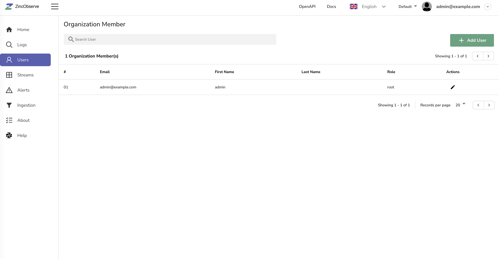

🚀 10x easier, 🚀 10x cheaper, 🚀 petabyte scale - Elasticsearch/Splunk/Datadog alternative for 🚀 (logs, metrics, traces).

# ZincObserve
ZincObserve is a cloud native observability platform built specifically for logs, metrics, traces and analytics designed to work at petabyte scale.

It is very simple and easy to operate as opposed to Elasticsearch which requires a couple dozen knobs to understand and tune which you can get up and running in under 2 minutes.

It is a drop-in replacement for Elasticsearch if you are just ingesting data using APIs and searching using kibana (Kibana is not supported nor required with ZincObserve. ZincObserve provides its own UI which does not require separate installation unlike kibana).

You can reduce your log storage costs by ~140x compared to Elasticsearch by using ZincObserve. Below are the results when we pushed logs from our production kubernetes cluster to Elasticsearch and ZincObserve using fluentbit. ZincObserve stored data in Amazon s3 and Elasticsearch stored data on Amazon EBS volumes.

## Introduction video

## Features:

Some of the features are:

1. Advanced Embedded GUI
1. It's a drop in replacement for elasticsearch 
1. Single binary for installation & running. Binaries available under [releases](https://github.com/zinclabs/zincobserve/releases) for multiple platforms.
1. SQL for sophisticated queries, no need to learn yet another query language.
1. Embedded scripting functions for ingestion & query to aid advanced capabilities like enrichment, redaction, log reduction, compliance, etc.
1. Dynamic Schema
1. Out of the box authentication
1. Storage in local Disk, s3, MinIO, GCS
1. Vastly easier to operate
1. Seamless upgrades
1. High availability and clustering

For full list of features check [documentation](https://docs.zinc.dev/ZincObserve/#project-status-features-and-roadmap)

# Installation

You can install ZincObserve in under 2 minutes by following the [quickstart](https://docs.zinc.dev/ZincObserve/quickstart/) documentation

# ZincObserve Cloud 

You can also try ZincObserve without installing it in under 2 minutes by trying out ZincObserve Cloud  at [https://observe.zinc.dev](https://observe.zinc.dev)

# How to get support

Easiest way to get support is to join the [Slack channel](https://join.slack.com/t/zincobserve/shared_invite/zt-11r96hv2b-UwxUILuSJ1duzl_6mhJwVg).

# How to develop & contribute to Zinc

Check the [contributing guide](./CONTRIBUTING.md)

# Screenshots

## Home

## Logs

## Log details

## Users

## Streams

## Ingestion

