<p align="center">
  <a href="https://openobserve.ai"></a>
</p>
<p align="center">
    <em>Open source Datadog alternative for logs, metrics, traces, and frontend monitoring. Modern observability platform: 10x easier, 140x lower storage cost, high performance, petabyte scale.</em>
</p>
<p align="center">
<a href="https://github.com/openobserve/openobserve/releases" target="_blank">
    
</a>
<a href="https://github.com/openobserve/openobserve/blob/main/LICENSE" target="_blank">
    
</a>
<a href="https://github.com/openobserve/openobserve/stargazers" target="_blank">
    
</a>
<a href="https://github.com/openobserve/openobserve/graphs/contributors" target="_blank">
    
</a>
<a href="https://github.com/openobserve/openobserve/issues" target="_blank">
    
</a>
<a href="https://github.com/openobserve/openobserve/commits/main" target="_blank">
    
</a>
</p>

<p align="center">
  <a href="https://cloud.openobserve.ai/">Cloud</a> ·
  <a href="https://openobserve.ai/docs/">Documentation</a> ·
  <a href="https://short.openobserve.ai/community">Slack</a> ·
  <a href="https://openobserve.ai/docs/quickstart/">Quickstart</a>
</p>

---

OpenObserve (O2) is a cloud-native observability platform for logs, metrics, traces, analytics, Real User Monitoring (RUM), and AI/LLM observability. It's a cost-effective alternative to Datadog, Splunk, and Elasticsearch for teams that need full observability without the complexity or cost — with Parquet columnar storage and an S3-native design that cuts storage costs by up to **140x**.

## Table of Contents

- [Why OpenObserve?](#why-openobserve)
- [Quick Start](#quick-start)
- [Product Tour](#product-tour)
- [Architecture](#architecture)
- [Comparisons](#comparisons)
- [Production Ready](#production-ready)
- [Security & Compliance](#security--compliance)
- [Enterprise Edition](#enterprise-edition)
- [Community & Support](#community--support)
- [Contributing](#contributing)
- [FAQ](#faq)
- [License](#license)
- [SBOM](#sbom)

## Why OpenObserve?

A single platform for all of your observability signals. Here's why teams choose OpenObserve:

| Benefit | Description |
| --- | --- |
| **140x lower storage cost** | Parquet columnar storage + S3-native architecture dramatically reduce costs vs Elasticsearch |
| **Single binary deployment** | Up and running in under 2 minutes — no complex cluster setup required |
| **OpenTelemetry native** | Built on the OpenTelemetry standard — no vendor lock-in |
| **Unified platform** | Logs, metrics, traces, RUM, dashboards, alerts, and incidents in one tool |
| **High performance** | Better query performance than Elasticsearch on a quarter of the hardware |
| **SQL + PromQL** | Query logs and traces with SQL, metrics with SQL or PromQL — no proprietary query language |
| **Built in Rust** | Memory-safe, high-performance, single binary |

**Cost comparison: OpenObserve vs Elasticsearch**

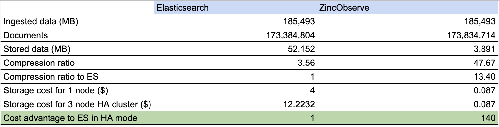

## Quick Start

### OpenObserve Cloud (fastest way)

Get started in minutes without managing infrastructure. The free tier includes up to 50 GB/day of ingestion.

**[Get Started Free →](https://cloud.openobserve.ai/)**

### 🐳 Docker

```bash
docker run -d \
      --name openobserve \
      -v $PWD/data:/data \
      -p 5080:5080 \
      -e ZO_ROOT_USER_EMAIL="root@example.com" \
      -e ZO_ROOT_USER_PASSWORD="Complexpass#123" \
      public.ecr.aws/zinclabs/openobserve:latest
```

Then open [http://localhost:5080](http://localhost:5080) and log in with the credentials above.

For other installation methods, see the [quickstart documentation](https://openobserve.ai/docs/quickstart). For clustered deployments, see the [High Availability deployment guide](https://openobserve.ai/docs/ha_deployment/).

## Product Tour

OpenObserve ships with a powerful, unified web UI for every signal — logs, traces, metrics, dashboards, RUM, alerts, incidents, pipelines, and AI observability.

[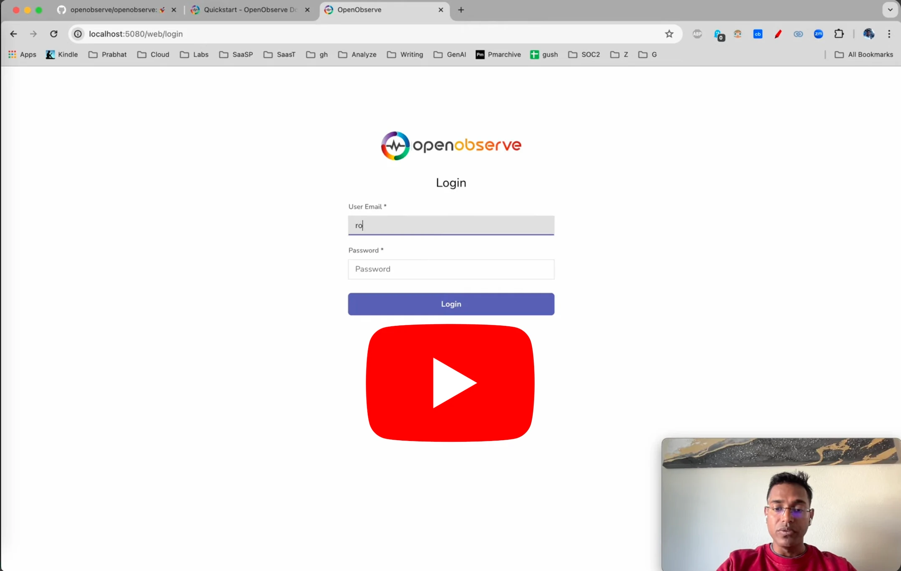](https://www.youtube.com/watch?v=4VwuC1tpRP4)

### 🏠 Unified Overview

A single home for your workspace — active incidents, service health (error rate, latency, requests), anomalies, and recent events at a glance.

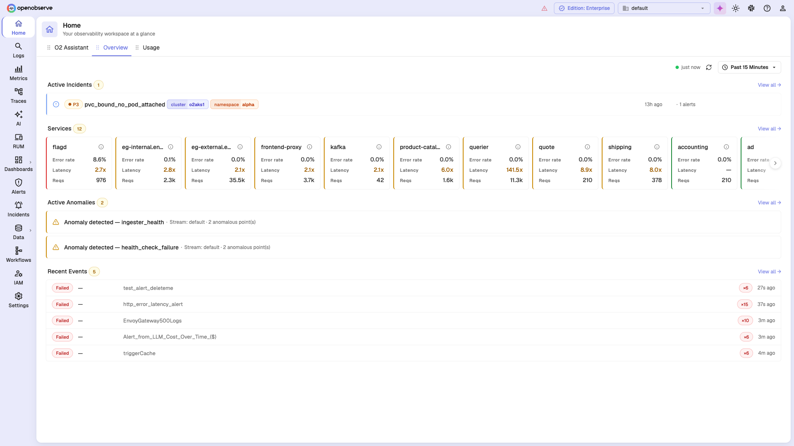

### 📊 Logs

Centralized log management with full-text search, SQL queries, quick filters, and a visual query builder. Instantly search across all your logs, build dashboards from log data, and set up alerts — all on Parquet columnar storage for 140x lower storage cost than Elasticsearch. [Read more →](https://openobserve.ai/logs/)

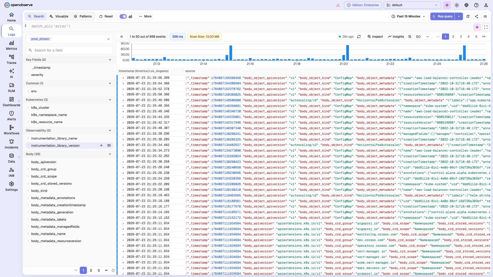

### 🔍 Distributed Tracing

Powered by OpenTelemetry, tracing helps you follow requests across services and pinpoint performance bottlenecks. Explore the full request flow with waterfalls, flame graphs, and Gantt charts; click any span to drill into the trace. [Read more →](https://openobserve.ai/traces/)

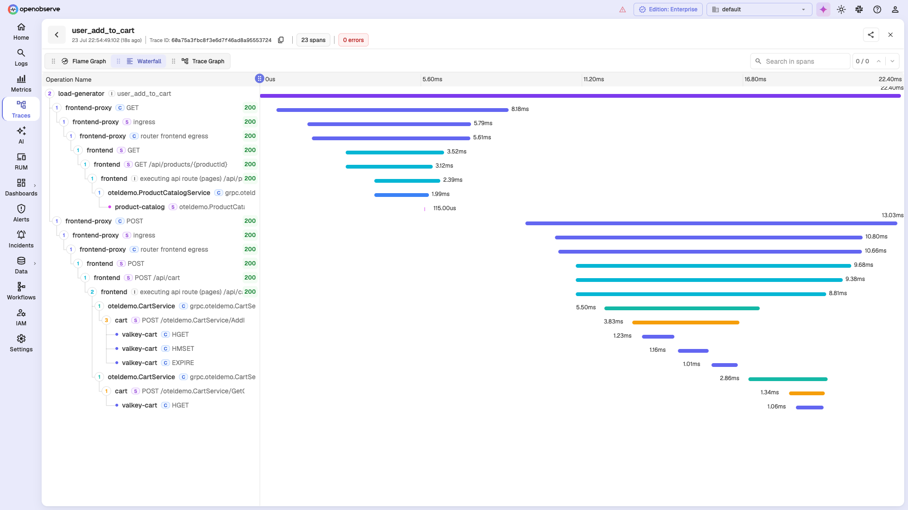

### 🕸️ Service Graph

Visualize service-to-service dependencies and request flow across your system, with per-edge request counts and health-based coloring (healthy, degraded, warning, critical) to spot problem hotspots at a glance.

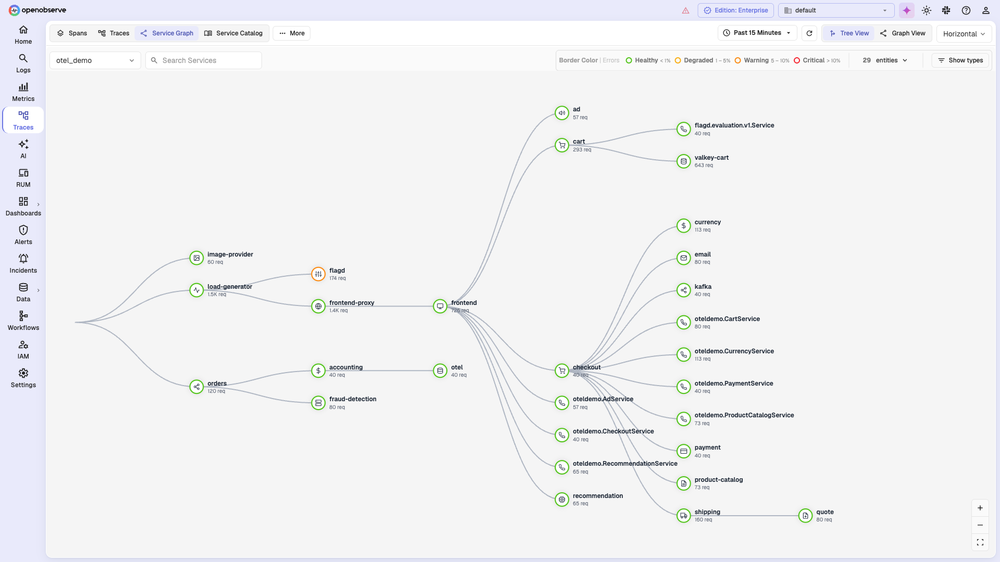

### 📈 Metrics

Explore metrics from your infrastructure and applications, then query them with SQL or PromQL. Browse thousands of metrics with faceted filters, preview them inline, combine multiple queries with formulae, and visualize the results with 19+ chart types. [Read more →](https://openobserve.ai/metrics/)

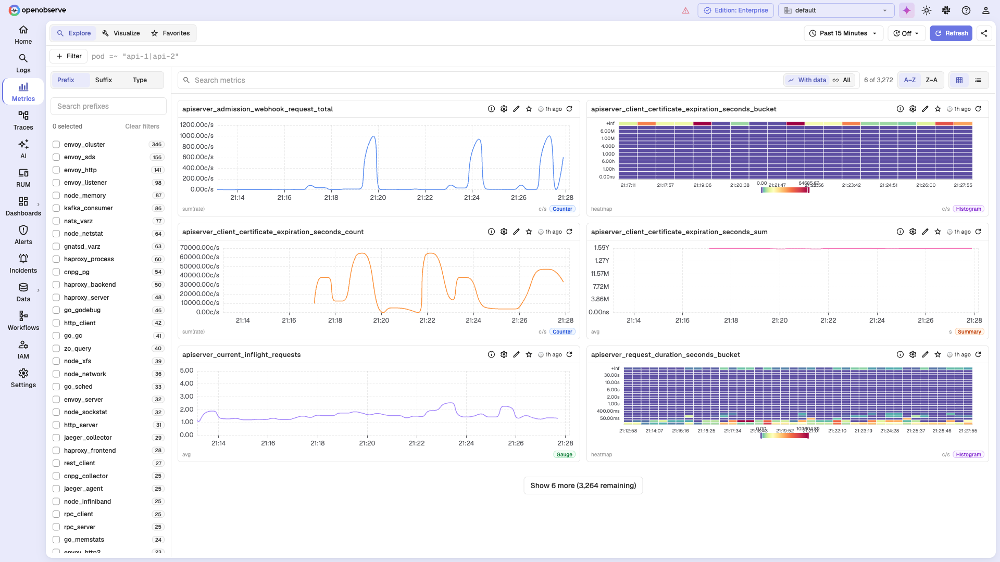

### 📉 Dashboards

Build custom dashboards from any signal with 19+ built-in chart types and 200+ visualization variations, a drag-and-drop panel builder, template variables, and geo maps. [Read more →](https://openobserve.ai/dashboards/)

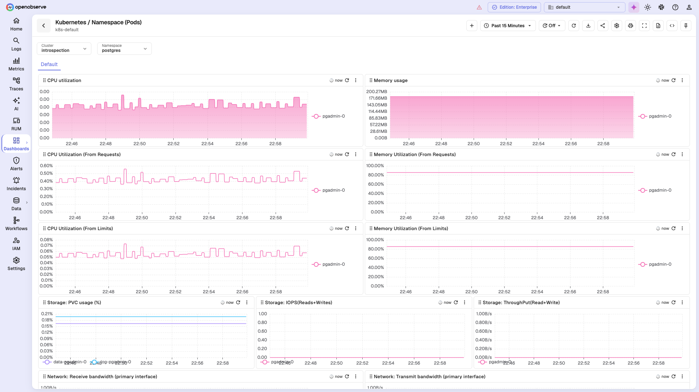

### 👀 Frontend Monitoring (RUM)

Real User Monitoring with Core Web Vitals, error tracking, performance analytics, and full session replay — so you can see exactly what your users experience. [Read more →](https://openobserve.ai/frontend-monitoring/)

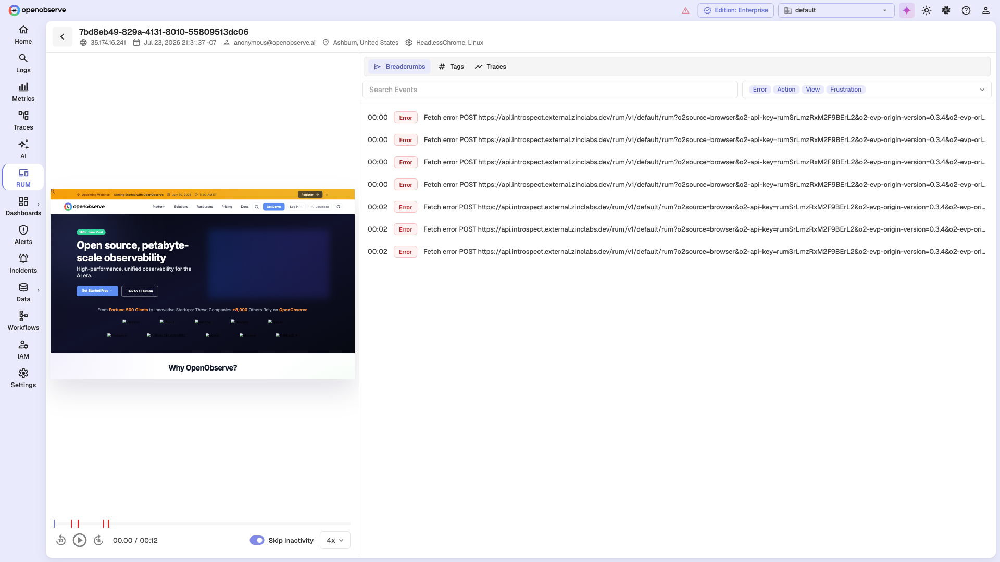

### 🔔 Alerts

Get notified when something unusual happens on any signal — logs, metrics, or traces. Define thresholds, scheduled or real-time alerts, and notification channels, with alert history and anomaly detection to catch issues early. [Read more →](https://openobserve.ai/alerts/)

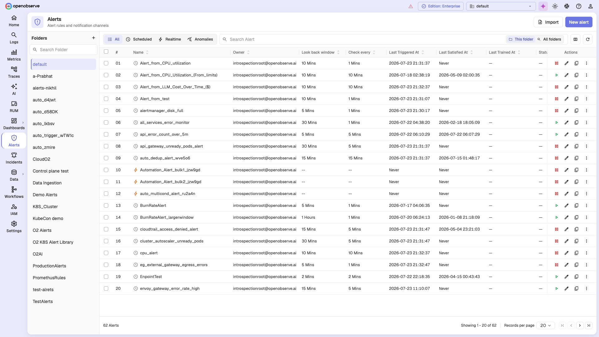

### 🚨 Incidents

Correlate related alerts into incidents and track them through their lifecycle — open, acknowledged, and resolved — with severity and dimension context for faster response.

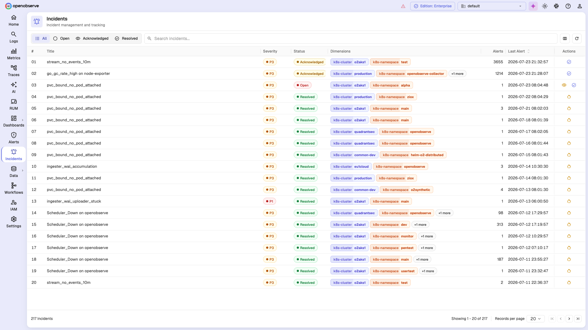

### 🔀 Pipelines

Enrich, redact, reduce, or normalize data at ingest time with a visual editor. Build stream-processing flows — including logs-to-metrics conversion — from source, transform (VRL functions and conditions), and destination nodes. No external tools required. [Read more →](https://openobserve.ai/pipelines/)

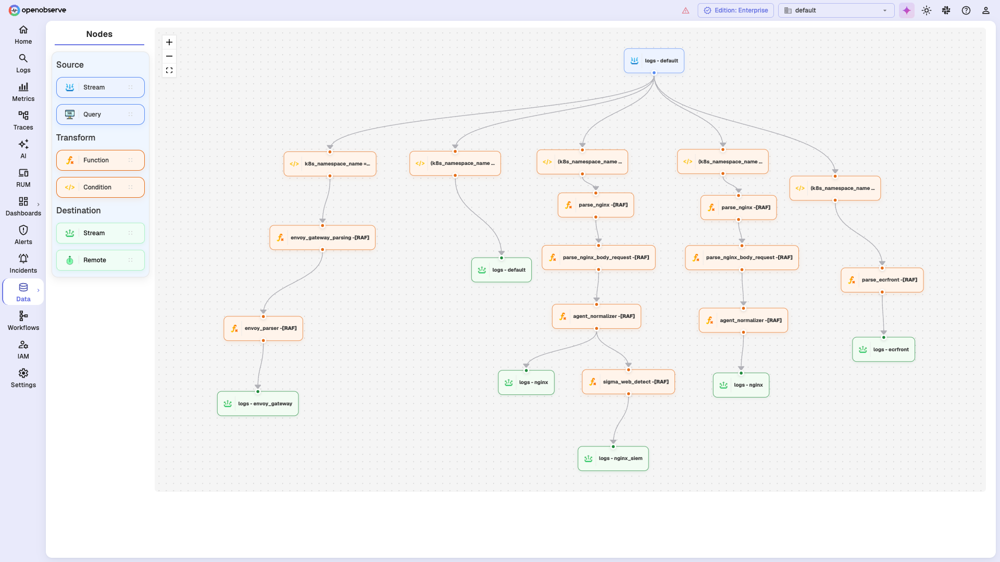

### 🤖 AI Observability

Monitor your GenAI and LLM applications: track cost, tokens, latency percentiles, and error rates across models, with agent graphs, session traces, and evaluation/quality scoring.

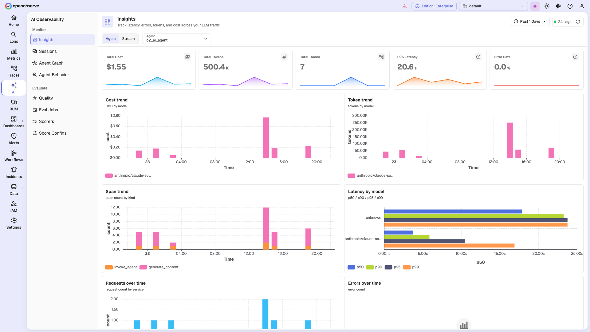

### ✨ O2 AI Assistant

An in-product assistant that writes your SQL, VRL, and PromQL and walks you through logs, traces, metrics, and incidents — turning natural-language questions into queries, dashboards, and alerts.

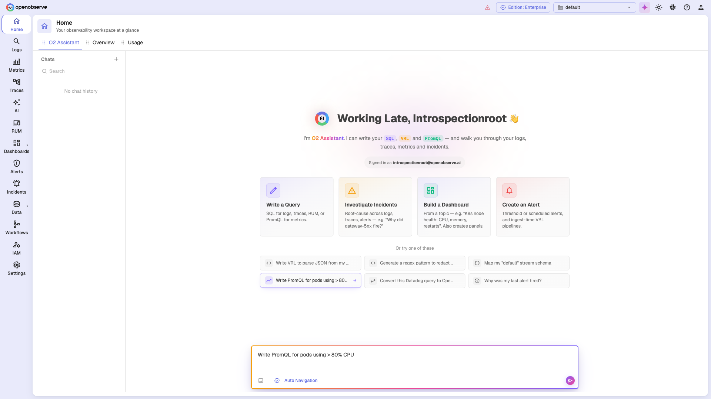

For the full feature list, see the [documentation](https://openobserve.ai/docs/#project-status-features-and-roadmap).

## Architecture

OpenObserve achieves 140x lower storage costs and high performance through a modern, cloud-native architecture:

- **Parquet columnar storage** — efficient compression and fast analytical queries
- **S3-native design** — inexpensive object storage with intelligent caching
- **Built in Rust** — memory-safe, high-performance, single binary
- **Partitioning, indexing, and smart caching** — reduces search space by up to 99% for most queries
- **Native multi-tenancy** — organizations and streams as first-class concepts with complete data isolation
- **Stateless architecture** — rapid scaling and low RPO/RTO for disaster recovery

### Scale & Deployment

- **Thousands of concurrent users** can query a single cluster simultaneously
- **Single binary** scales to terabytes — unique in the observability space
- **High Availability mode** scales to petabytes for the most demanding workloads
- **Multi-region deployments** with cluster federation via Super Cluster architecture *(Enterprise)*
- **Federated search** across regions and clusters *(Enterprise)*

### High Availability & Disaster Recovery

Deploy in High Availability mode with clustering for mission-critical workloads requiring maximum uptime. OpenObserve's stateless architecture with S3-backed storage enables very low Recovery Point Objective (RPO) and Recovery Time Objective (RTO): stateless nodes restart rapidly, and durability is guaranteed by S3's 99.999999999% (11 nines).

[Read the architecture documentation →](https://openobserve.ai/docs/architecture/) · [Read the enterprise deployment guide →](https://openobserve.ai/docs/ha_deployment/)

## Comparisons

### OpenObserve vs Datadog

| Aspect | OpenObserve | Datadog |
| --- | --- | --- |
| Deployment | Self-hosted or Cloud | SaaS only |
| Pricing model | Per-GB (free up to 200 GB/day) | Per-host + per-GB |
| Open source | Yes (AGPL-3.0) | No |
| OpenTelemetry | Native OTLP | Supported |
| Query language | SQL + PromQL | Proprietary |
| Vendor lock-in | None | High |

### OpenObserve vs Elasticsearch

| Aspect | OpenObserve | Elasticsearch |
| --- | --- | --- |
| Storage cost | **140x lower** | High (hot/warm/cold tiers) |
| Setup complexity | Single binary | Complex cluster management |
| Query language | SQL | Lucene/KQL |
| Hardware requirements | ~1/4 the resources | High memory/CPU |

### OpenObserve vs Splunk

| Aspect | OpenObserve | Splunk |
| --- | --- | --- |
| Licensing | Open source | Expensive enterprise licensing |
| Deployment | Single binary or HA cluster | Complex |
| Query language | SQL + PromQL | SPL (proprietary) |
| Cost | Predictable, low | Unpredictable, high |

### OpenObserve vs Grafana/Loki/Prometheus Stack

| Aspect | OpenObserve | Grafana Stack |
| --- | --- | --- |
| Components | Single platform | Multiple tools (Grafana + Loki + Prometheus + Tempo) |
| Management | One binary | Multiple deployments |
| High cardinality | Full support | Loki struggles with high cardinality |
| Query performance | Fast on large volumes | Loki slow on large data |

## Production Ready

OpenObserve is battle-tested in production environments worldwide:

- **Thousands of active deployments** across diverse industries
- **Largest deployment: 2+ PB/day** ingestion
- **Single binary scales to terabytes** — unique in the observability space

[Read customer stories →](https://openobserve.ai/customer-stories/)

## Security & Compliance

### Security Features

- **Secure by design** with hardened container images
- **Data encryption** at rest and in transit
- **Sensitive Data Redaction (SDR)** — automatically redact sensitive data at ingestion and query time *(Enterprise)*
- **Single Sign-On (SSO)** — OIDC, OAuth, SAML, LDAP/AD integration *(Enterprise)*
- **Role-Based Access Control (RBAC)** — granular permissions *(Enterprise)* — [Learn more →](https://openobserve.ai/docs/user-guide/identity-and-access-management/role-based-access-control/)

### Compliance Certifications

- ✅ **SOC 2 Type II** certified
- ✅ **ISO 27001** certified
- ✅ **GDPR** compliant
- ✅ **HIPAA** ready (BAA available with Enterprise contracts)

OpenObserve meets the stringent security and compliance requirements of regulated industries including finance, healthcare, and government.

## Enterprise Edition

OpenObserve is a true open source project. **The open source edition is feature-complete and production-ready** — logs, metrics, traces, dashboards, alerts, pipelines, and everything you need to run observability at scale. It will always remain actively maintained and free to use without restrictions.

For organizations that need enterprise-grade features and support, an Enterprise edition adds:

**Enterprise features**

- **Single Sign-On (SSO)** — OIDC, OAuth, SAML 2.0, LDAP/AD, and major identity providers (Okta, Azure Entra, Google, GitHub, GitLab, Keycloak)
- **Advanced RBAC** — granular role-based access control with custom roles — [Learn more →](https://openobserve.ai/docs/user-guide/identity-and-access-management/role-based-access-control/)
- **Audit trails** — comprehensive immutable audit logs with configurable retention
- **Federated search** — query across multiple clusters and regions with Super Cluster
- **Sensitive Data Redaction (SDR)** — automatically redact PII at ingestion and query time
- **Advanced encryption** — AES-256 SIV cipher keys with Google Tink KeySet and Akeyless integration
- **Query & workload management (QoS)** — control query resource usage and priorities in multi-tenant environments

**Support & SLAs**

- Dedicated support with contractual SLA guarantees and priority response times
- Technical account management, architecture review, and deployment assistance
- Migration support from existing tools, plus training and onboarding

**Pricing**

- **Free tier**: up to 50 GB/day of ingestion (~1.5 TB/month), including full commercial use *(registration required at 50 GB/day)*
- Volume discounts and multi-year contracts available
- [View the complete feature comparison →](https://openobserve.ai/downloads/)

For enterprise inquiries and custom deployments, [contact our sales team](https://openobserve.ai/contactus/).

## Community & Support

The best way to get help, share ideas, and connect with other OpenObserve users is through our community channels.

### 🔗 Join us on Slack

[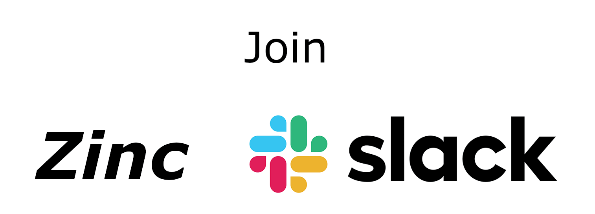](https://short.openobserve.ai/community)

Our Slack community is the most active place for installation and configuration help, sharing best practices, discussing the roadmap, and connecting with the core team.

**[Join the conversation →](https://short.openobserve.ai/community)**

### 📱 Join the OpenObserve community on WeChat


### Other ways to connect

- 💬 [GitHub Discussions](https://github.com/openobserve/openobserve/discussions) — longer-form discussions and Q&A
- 🐛 [GitHub Issues](https://github.com/openobserve/openobserve/issues) — report bugs or request features
- 📖 [Documentation](https://openobserve.ai/docs) — guides, tutorials, and API references

## Contributing

We welcome contributions from the community! Whether you're fixing bugs, adding features, improving documentation, or sharing feedback, your help makes OpenObserve better for everyone.

To get started, read our [Contributing Guide](CONTRIBUTING.md), which covers setting up your development environment, code standards, submitting pull requests, and reporting issues.

## FAQ

### How does OpenObserve achieve 140x lower storage costs?

Through a combination of Parquet columnar storage (efficient compression) and an S3-native architecture (inexpensive object storage). See the cost comparison chart in the [Why OpenObserve?](#why-openobserve) section.

### What are the limitations?

All data in OpenObserve is **immutable** — once ingested, it cannot be modified or deleted (only entire retention periods can be dropped). This is by design and is a feature for logs and compliance use cases, ensuring data integrity and audit trails.

### Is this production-ready?

Yes. OpenObserve runs in production across thousands of deployments worldwide, including environments processing in excess of 2 PB/day. See our [customer stories](https://openobserve.ai/customer-stories/) for real-world examples.

### How does query performance compare to Elasticsearch?

OpenObserve delivers better performance than Elasticsearch for most workloads, with faster search and significantly faster analytics — while using about a quarter of the hardware. The columnar Parquet format is particularly effective for complex aggregations and analytics.

### Is there a steep learning curve?

No. OpenObserve is designed to be intuitive from day one:

- **Familiar query languages** — SQL for logs and traces, PromQL for metrics; no proprietary query language to learn
- **Easy-to-use GUI** — an intuitive interface with a drag-and-drop dashboard builder
- **No complex tuning** — unlike Elasticsearch, there are no shards, replicas, or heap sizes to manage. Just install and go.

Most users are productive within hours, not weeks.

## License

**Open Source Edition** — licensed under [AGPL-3.0](https://github.com/openobserve/openobserve/blob/main/LICENSE). We chose AGPL to ensure that improvements to OpenObserve remain open source and benefit the entire community, while still allowing free commercial use. [Why AGPL, and why it's good for the community →](https://openobserve.ai/blog/what-are-apache-gpl-and-agpl-licenses-and-why-openobserve-moved-from-apache-to-agpl/)

**Enterprise Edition** — licensed under a commercial Enterprise License Agreement (not AGPL), which provides additional flexibility for enterprise deployments.

## SBOM

Software Bill of Materials for OpenObserve. You can analyze either SBOM with [Dependency-Track](https://dependencytrack.org/).

### Rust

The SBOM is available [here](./openobserve.cdx.xml). To regenerate it:

```bash
cargo install cargo-cyclonedx
cargo-cyclonedx cyclonedx
```

### JavaScript

The SBOM is available [here](./web/sbom.json). To regenerate it:

```bash
npm install --global @cyclonedx/cyclonedx-npm
cd web
cyclonedx-npm > sbom.json
```
