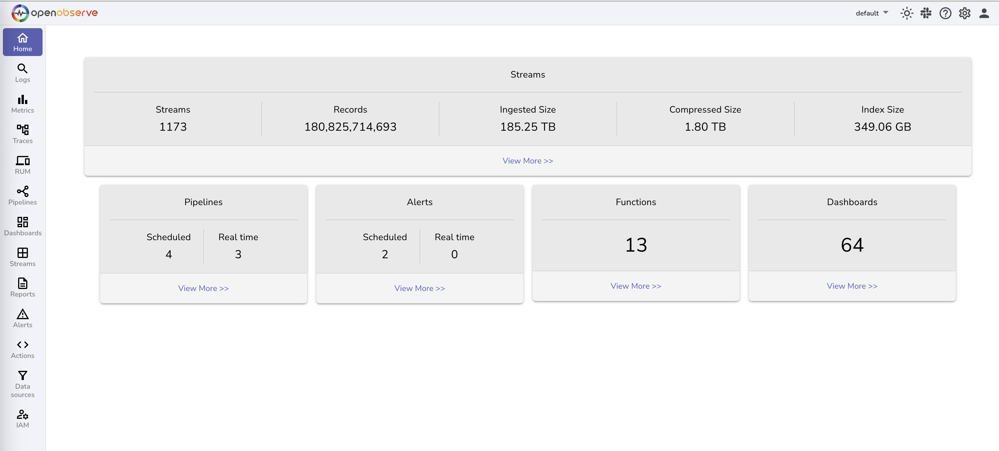

🚀 10x easier, 🚀 140x lower storage cost, 🚀 high performance, 🚀 petabyte scale - Elasticsearch/Splunk/Datadog alternative for 🚀 (logs, metrics, traces).

# [OpenObserve Cloud](https://cloud.openobserve.ai) | [Docs](https://openobserve.ai/docs/) | [Slack](https://join.slack.com/t/zincobserve/shared_invite/zt-11r96hv2b-UwxUILuSJ1duzl_6mhJwVg) | [Website](https://openobserve.ai)

# OpenObserve

OpenObserve is a cloud native observability platform built specifically for logs, metrics, traces, analytics, RUM (Real User Monitoring - Performance, Errors, Session Replay) designed to work at petabyte scale.

It is very simple and easy to operate as opposed to Elasticsearch which requires a couple dozen knobs to understand and tune which you can get up and running in under 2 minutes.

It is a drop-in replacement for Elasticsearch if you are just ingesting data using APIs and searching using kibana (Kibana is not supported nor required with OpenObserve. OpenObserve provides its own UI which does not require separate installation unlike kibana).

You can reduce your log storage costs by ~140x compared to Elasticsearch by using OpenObserve. Below are the results when we pushed logs from our production kubernetes cluster to Elasticsearch and OpenObserve using fluentbit. OpenObserve stored data in Amazon s3 and Elasticsearch stored data on Amazon EBS volumes.

## Introduction video

https://github.com/openobserve/openobserve/assets/4242188/77c71e8c-23f6-4123-b42a-7113b464f7a6

## Features:

Some of the features are:

1. Logs, Metrics, Traces 
1. OpenTelemetry support for logs, metrics traces (OTLP)
1. RUM (Real user Monitoring) - Performance, Errors, Session Replay
1. Alerts, Dashboards (14 different chart types (time series, bar, geo maps, heatmap, scatter, table, pie, etc.)
1. Ingest and Query functions to aid advanced capabilities like enrichment, redaction, log reduction, compliance, etc. e.g. you can use ingest functions to redact sensitive data like email IDs, AWS keys, etc. from logs before the get stored in logs.
1. Advanced Embedded GUI
1. SQL for Logs and Traces. SQL and PromQL for metrics. No need to learn yet another query language.
1. Single binary for installation & running. Binaries available under [releases](https://github.com/openobserve/openobserve/releases) for multiple platforms.
1. Storage in local Disk, s3, MinIO, GCS, Azure Blob Storage
1. High availability and clustering
1. Drop in replacement for elasticsearch
1. Dynamic Schema
1. Out of the box authentication
1. Vastly easier to operate
1. Seamless upgrades
1. UI in 11 supported languages (English, Turkish, German, French, Spanish, Portuguese, Chinese, Japanese, Korean, Italian, Dutch)

For full list of features check [documentation](https://openobserve.ai/docs/#project-status-features-and-roadmap)

# Installation

You can install OpenObserve in under 2 minutes by following the [quickstart](https://openobserve.ai/docs/quickstart/) documentation

# OpenObserve Cloud

You can also try OpenObserve without installing it in under 2 minutes by trying out OpenObserve Cloud at [https://cloud.openobserve.ai](https://cloud.openobserve.ai)

# Screenshots

## Home

## Logs

## Traces (Opentelemetry supported)

## Visualization and dashboard

## Alerts

### Real time alerts

### Scheduled alerts

## Streams

## Ingestion

# Community

- #### How to develop and contribute to OpenObserve

  Check the [contributing guide](./CONTRIBUTING.md) . Also check the [roadmap items](https://github.com/orgs/openobserve/projects/7)

- #### Join our Slack Channel

  

  Easiest way to get support is to join the [Slack channel](https://join.slack.com/t/zincobserve/shared_invite/zt-11r96hv2b-UwxUILuSJ1duzl_6mhJwVg).

- #### Join our weChat Group

  
