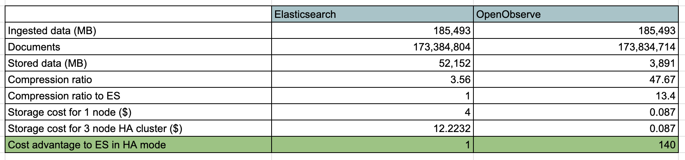

<p align="center">
  <a href="https://openobserve.ai"></a>
</p>
<p align="center">
    <em>Open source Datadog alternative for logs, metrics, traces, and frontend monitoring. Modern observability platform: 10x easier, 140x lower storage cost, high performance, petabyte scale.</em>
</p>
<p align="center">
<a href="https://github.com/openobserve/openobserve" target="_blank">
    
</a>
<a href="https://github.com/openobserve/openobserve/stargazers" target="_blank">
    
</a>
<a href="https://github.com/openobserve/openobserve/issues" target="_blank">
    
</a>
<a href="https://github.com/openobserve/openobserve/graphs/contributors" target="_blank">
    
</a>
<a href="https://github.com/openobserve/openobserve/releases" target="_blank">
    
</a>
</p>

OpenObserve (O2) is a cloud-native observability tool built for logs, metrics, traces, analytics, and Real User Monitoring (RUM). It's designed as a cost-effective alternative to Datadog, Splunk, and Elasticsearch for teams that need full observability without the complexity or cost.

## Why OpenObserve?
OpenObserve is a single observability tool for all your monitoring needs. Here's why teams choose OpenObserve:

| Benefit |  Description |
| --------| ------------| 
| 140x Lower Storage Cost | Parquet columnar storage + S3-native architecture dramatically reduces costs vs Elasticsearch | 
| Single Binary Deployment| Get running in under 2 minutes. No complex cluster setup required |
| OpenTelemetry Native| Built on OpenTelemetry standard—no vendor lock-in| 
| Unified Platform| Logs, metrics, traces, RUM, dashboards, alerts in one tool| 
| High Performance | Better query performance than Elasticsearch on 1/4 the hardware| 
| SQL + PromQL | Query logs/traces with SQL, metrics with SQL or PromQL—no proprietary query language| 
| Built in Rust | Memory-safe, high-performance, single binary| 


Cost Comparison: OpenObserve Vs Elasticsearch
  


## 🎥 Introduction Video

[](https://www.youtube.com/watch?v=4VwuC1tpRP4)

## 🏗️ Architecture

OpenObserve achieves 140x lower storage costs and high performance through its modern architecture:

- **Parquet columnar storage**: Efficient compression and query performance
- **S3-native design**: Leverages inexpensive object storage with intelligent caching
- **Built in Rust**: Memory-safe, high-performance, single binary deployment
- **Partitioning, indexing and smart caching**: Reduces search space by up to 99% for most queries
- **Native multi-tenancy**: Organizations and streams as first-class concepts with complete data isolation
- **Stateless architecture**: Enables rapid scaling and low RPO/RTO for disaster recovery

This architecture delivers 140x cost savings while providing better performance than Elasticsearch.

### Scale & Deployment

- **Thousands of concurrent users** can query a single cluster simultaneously
- **Single binary** scales to terabytes - unique in the observability space
- **High Availability mode** scales to petabytes for the most demanding workloads
- **Multi-region deployments** with cluster federation via Super Cluster architecture (Enterprise feature)
- **Federated search** across regions and clusters (Enterprise feature)
- **Capacity planning tools** to size deployments for your workload

### High Availability & Disaster Recovery

Deploy in High Availability mode with clustering for mission-critical workloads requiring maximum uptime and performance.

**Low RPO/RTO**: OpenObserve's stateless architecture with S3-backed storage enables very low Recovery Point Objective (RPO) and Recovery Time Objective (RTO). Stateless nodes can be rapidly restarted, and data durability is guaranteed by S3's 99.999999999% (11 nines) durability. That's a lot of nines.

[Read detailed architecture documentation →](https://openobserve.ai/docs/architecture/)

[Read enterprise deployment guide →](https://openobserve.ai/docs/ha_deployment/)

## Features

For a full list of features, check the [documentation](https://openobserve.ai/docs/#project-status-features-and-roadmap).

### Logs Management
OpenObserve provides a centralized log management solution with full-text search, SQL queries, and powerful filtering. Built on Parquet columnar storage for 140x lower storage costs than Elasticsearch.
Instantly search through all your logs using quick filters and a powerful query builder. Create dashboards from log data and set up alerts. [Read more →](https://openobserve.ai/logs/)


### Distributed Tracing
Distributed tracing is essential to troubleshoot issues in microservices applications. Powered by OpenTelemetry, tracing in OpenObserve helps you track user requests across services to identify performance bottlenecks.
See user requests in a detailed breakdown with Flamegraphs and Gantt Charts. Click on any span to see the entire trace and understand where issues occurred. [Read more →](https://openobserve.ai/traces/)


### Metrics & Dashboards
Ingest metrics from your infrastructure or applications and create customized dashboards. 19+ built-in chart types plus custom charts for 200+ visualization variations.
Query metrics with SQL or PromQL. Add multiple queries and combine them with formulae. [Read more →](https://openobserve.ai/metrics/)


### Frontend Monitoring (RUM)
Real User Monitoring with performance tracking, error logging, and session replay. Understand exactly what your users experience.
[Read more →](https://openobserve.ai/frontend-monitoring/)


### Alerts
Get notified when anything unusual happens in your application. Set alerts on any telemetry signal (logs, metrics, traces), create thresholds, and configure notification channels.
Advanced features like alert history and anomaly detection help you identify issues before they reach your customers. [Read more →](https://openobserve.ai/alerts/)


### Pipelines
Enrich, redact, reduce, or normalize data on ingest. Stream processing for logs-to-metrics conversion and more. No external tools required.
[Read more →](https://openobserve.ai/pipelines/)


## Getting Started

### OpenObserve Cloud (Fastest Way)
Get started in minutes without managing infrastructure. Free tier includes up to 200 GB/day ingestion.
[Get Started Free →](https://cloud.openobserve.ai/)

### 🐳 Docker:
```bash
docker run -d \
      --name openobserve \
      -v $PWD/data:/data \
      -p 5080:5080 \
      -e ZO_ROOT_USER_EMAIL="root@example.com" \
      -e ZO_ROOT_USER_PASSWORD="Complexpass#123" \
      public.ecr.aws/zinclabs/openobserve:latest
```


For other ways to quickly install OpenObserve or use OpenObserve cloud, check [quickstart documentation](https://openobserve.ai/docs/quickstart).

For installing OpenObserve in High Availability mode, check [High Availability deployment documentation](https://openobserve.ai/docs/ha_deployment/).

## ***Production Ready***

*OpenObserve is battle-tested in production environments worldwide:*

* ***Thousands of active deployments** across diverse industries*  
* ***Largest deployment: 2+ PB/day** ingestion*  
* ***Single binary scales to terabytes**—unique in the observability space*

[***Customer Stories →***](https://openobserve.ai/customer-stories/)

## ***Comparisons to Familiar Tools***

### ***OpenObserve vs Datadog***

| *Aspect* | *OpenObserve* | *Datadog* |
| ----- | ----- | ----- |
| *Deployment* | *Self-hosted or Cloud* | *SaaS only* |
| *Pricing model* | *Per-GB (free up to 200GB/day)* | *Per-host \+ per-GB* |
| *Open source* | *Yes (AGPL-3.0)* | *No* |
| *OpenTelemetry* | *Native OTLP* | *Supported* |
| *Query language* | *SQL \+ PromQL* | *Proprietary* |
| *Vendor lock-in* | *None* | *High* |

*OpenObserve is a **Datadog alternative** that gives you full control over your data and costs.*

### ***OpenObserve vs Elasticsearch***

| *Aspect* | *OpenObserve* | *Elasticsearch* |
| ----- | ----- | ----- |
| *Storage cost* | ***140x lower*** | *High (hot/warm/cold tiers)* |
| *Setup complexity* | *Single binary* | *Complex cluster management* |
| *Query language* | *SQL* | *Lucene/KQL* |
| *Hardware requirements* | *1/4 the resources* | *High memory/CPU* |

*OpenObserve achieves 140x lower storage costs through Parquet columnar format and S3-native architecture.*

### ***OpenObserve vs Splunk***

| *Aspect* | *OpenObserve* | *Splunk* |
| ----- | ----- | ----- |
| *Licensing* | *Open source* | *Expensive enterprise licensing* |
| *Deployment* | *Single binary or HA cluster* | *Complex* |
| *Query language* | *SQL \+ PromQL* | *SPL (proprietary)* |
| *Cost* | *Predictable, low* | *Unpredictable, high* |

*OpenObserve is an **open-source Splunk alternative** without the licensing complexity.*

### ***OpenObserve vs Grafana/Loki/Prometheus Stack***

| *Aspect* | *OpenObserve* | *Grafana Stack* |
| ----- | ----- | ----- |
| *Components* | *Single platform* | *Multiple tools (Grafana \+ Loki \+ Prometheus \+ Tempo)* |
| *Management* | *One binary* | *Multiple deployments* |
| *High cardinality* | *Full support* | *Loki struggles with high cardinality* |
| *Query performance* | *Fast on large volumes* | *Loki slow on large data* |

*OpenObserve consolidates logs, metrics, and traces in one platform instead of stitching together multiple tools.*


## 📷 Screenshots

OpenObserve includes a powerful web UI for logs, traces, dashboards, alerts, and more.

### Logs Search


### Distributed Tracing
Trace details page with full request flow visualization:


### Dashboards


### Frontend Monitoring
Real user monitoring with session replay:


<details>
<summary>See more screenshots</summary>

### Home


### Golden Metrics from Traces


### More Dashboard Examples


### Performance Analytics


### Error Tracking


### Alerts


### Streams


### Ingestion


### Pipeline


### Functions


</details>

## 🔐 Security & Compliance

### Security Features

- **Highly secure architecture** with secure container images
- **Sensitive Data Redaction (SDR)**: Automatically redact sensitive data during ingestion and query time (Enterprise feature)
- **Data encryption**: At rest and in transit
- **Single Sign-On (SSO)**: OIDC, OAuth, SAML, LDAP/AD integration (Enterprise feature)
- **Role-Based Access Control (RBAC)**: Granular permissions management (Enterprise feature) - [Learn more →](https://openobserve.ai/docs/user-guide/identity-and-access-management/role-based-access-control/)

### Compliance Certifications

- ✅ **SOC 2 Type II** certified
- ✅ **ISO 27001** certified
- ✅ **GDPR** compliant
- ✅ **HIPAA** ready (BAA available with Enterprise contracts)

OpenObserve meets the stringent security and compliance requirements of regulated industries including finance, healthcare, and government.

## ⚖️ License

**Open Source Edition**: Licensed under AGPL-3.0. We chose AGPL to ensure that improvements to OpenObserve remain open source and benefit the entire community. This license protects the commons while still allowing free commercial use.

**Enterprise Edition**: Licensed under a commercial Enterprise License Agreement, not AGPL. This provides additional flexibility for enterprise deployments and eliminates any concerns about AGPL requirements.

For more details:
- [Open Source LICENSE](https://github.com/openobserve/openobserve/blob/main/LICENSE)
- [Why AGPL and why it's good for the community](https://openobserve.ai/blog/what-are-apache-gpl-and-agpl-licenses-and-why-openobserve-moved-from-apache-to-agpl/)

## 💼 Enterprise Support

OpenObserve is built as a true open source project, and we're committed to the community. **The open source version is feature-complete and production-ready** - it includes logs, metrics, traces, dashboards, alerts, pipelines, and everything you need to run observability at scale. It will always remain actively maintained and free to use without restrictions.

### Enterprise Edition

For organizations requiring enterprise-grade features and support, we offer an Enterprise edition with:

**Enterprise Features:**
- **Single Sign-On (SSO)**: OIDC, OAuth, SAML 2.0, LDAP/AD, and integration with major identity providers (Okta, Azure Entra, Google, GitHub, GitLab, Keycloak)
- **Advanced RBAC**: Granular role-based access control with custom roles and permissions - [Learn more →](https://openobserve.ai/docs/user-guide/identity-and-access-management/role-based-access-control/)
- **Audit trails**: Comprehensive immutable audit logs with configurable retention
- **Federated search**: Query across multiple clusters and regions with Super Cluster
- **Sensitive Data Redaction (SDR)**: Automatically redact PII and sensitive data during ingestion and queries
- **Advanced encryption**: AES-256 SIV cipher keys with Google Tink KeySet and Akeyless integration
- **Query management**: Control query resource usage and priorities
- **Workload management (QoS)**: Quality of Service controls for multi-tenant environments

**Enterprise Support & SLAs:**
- Dedicated support with contractual SLA guarantees
- Priority response times for critical issues
- Technical account management
- Architecture review and deployment assistance
- Migration support from existing tools
- Training and onboarding programs

**Pricing:**
- **Free tier**: Up to 200 GB/day of ingestion (roughly 6 TB/month), including full commercial use
- *Registration required at 100 GB/day*
- Volume discounts and multi-year contracts available
- [View complete feature comparison →](https://openobserve.ai/downloads/)

For enterprise inquiries and custom deployments, contact our sales team.

## 🤝 Contributing

We welcome contributions from the community! Whether you're fixing bugs, adding features, improving documentation, or sharing feedback, your help makes OpenObserve better for everyone.

To get started, please read our [Contributing Guide](CONTRIBUTING.md) which covers:
- How to set up your development environment
- Code standards and best practices
- How to submit pull requests
- Reporting bugs and requesting features

## 🌍 Community

The best way to get help, share ideas, and connect with other OpenObserve users is through our community channels. We're a friendly group of developers, operators, and observability enthusiasts.

### 🔗 Join us on Slack

[](https://short.openobserve.ai/community)

Our Slack community is the most active place for:
- Getting help with installation and configuration
- Sharing best practices and use cases
- Discussing feature requests and roadmap
- Connecting with the core team and other users

[Join the conversation →](https://short.openobserve.ai/community)

### 📱 Join OpenObserve community on WeChat


### Other ways to connect

- 💬 [GitHub Discussions](https://github.com/openobserve/openobserve/discussions) - For longer-form discussions and Q&A
- 🐛 [GitHub Issues](https://github.com/openobserve/openobserve/issues) - Report bugs or request features
- 📖 [Documentation](https://openobserve.ai/docs) - Guides, tutorials, and API references

## ❓ FAQ

### How does OpenObserve achieve 140x lower storage costs?

Through a combination of Parquet columnar storage format (efficient compression), S3-native architecture (leveraging inexpensive object storage). See the detailed comparison chart in the "Why OpenObserve?" section above.

### What are the limitations?

All data in OpenObserve is **immutable** - once ingested, it cannot be modified or deleted (only entire retention periods can be dropped). This is by design and is actually a feature for logs and compliance requirements, ensuring data integrity and audit trails.

### Is this production-ready?

Yes. OpenObserve is running in production with thousands of deployments worldwide, including environments processing in excess of 2 PB/day. See our [customer stories](https://openobserve.ai/customer-stories/) for real-world examples.

### How does query performance compare to Elasticsearch?

OpenObserve delivers better performance than Elasticsearch for most workloads. Users report faster search performance and significantly faster analytics queries, all while using 1/4th the hardware resources. The columnar storage format (Parquet) is particularly effective for complex aggregations and analytics workloads.

### Is there a steep learning curve?

No. OpenObserve is designed to be intuitive from day one:
- **Familiar query languages**: Use SQL for logs and traces, PromQL for metrics - no proprietary query language to learn
- **Easy-to-use GUI**: Intuitive interface with drag-and-drop dashboard builder
- **Helpful community**: Active Slack community and comprehensive documentation to help you get started quickly
- **No complex tuning**: Unlike Elasticsearch, you don't need to understand shards, replicas, heap sizes, or other complex configurations. Just install and go.

Most users are productive within hours, not weeks. Some even claim minutes, but we'll let you be the judge.

## 🔐 SBOM

Software Bill of Materials for OpenObserve

### Rust

SBOM can be found [here](./openobserve.cdx.xml). You can analyze it using [dependency track](https://dependencytrack.org/).

In order to generate the SBOM, you can use the following commands:

Install cargo-cyclonedx:

```bash
cargo install cargo-cyclonedx
```

Generate the SBOM:
```bash
cargo-cyclonedx cyclonedx
```

### JavaScript

SBOM can be found [here](./web/sbom.json ). You can analyze it using [dependency track](https://dependencytrack.org/).

In order to generate the SBOM, you can use the following commands:

Install cyclonedx-npm:

```bash
npm install --global @cyclonedx/cyclonedx-npm
```

Generate the SBOM:
```bash
cd web
cyclonedx-npm > sbom.json
```
