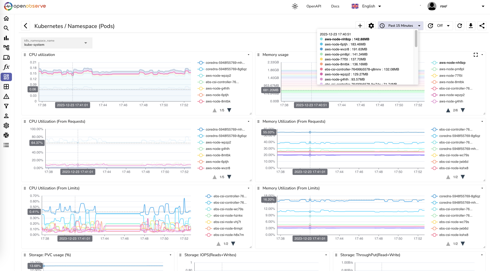
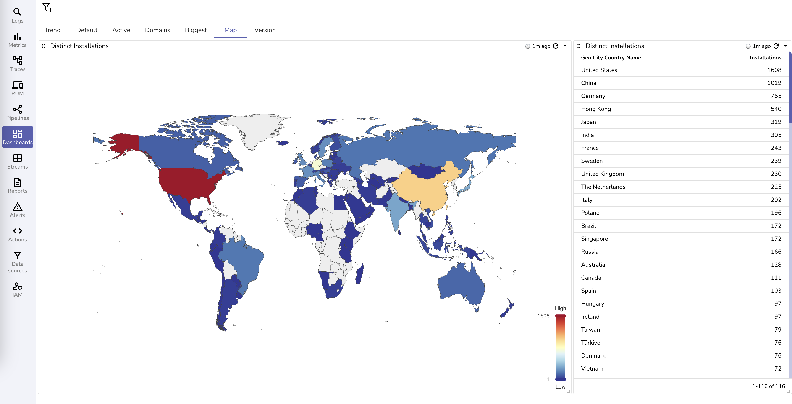
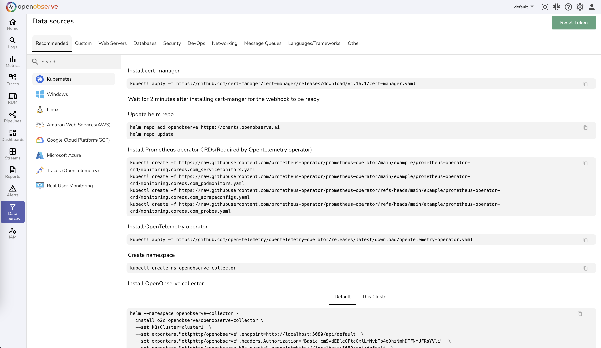

<p align="center">
  <a href="https://openobserve.ai"></a>
</p>
<p align="center">
    <em>Modern observability platform: 10x easier, 140x lower storage cost, high performance, petabyte scale - Elasticsearch/Splunk/Datadog alternative for logs, metrics, traces, frontend monitoring and more.</em>
</p>
<p align="center">
<a href="https://github.com/openobserve/openobserve" target="_blank">
    
</a>
<a href="https://github.com/openobserve/openobserve/stargazers" target="_blank">
    
</a>
<a href="https://github.com/openobserve/openobserve/issues" target="_blank">
    
</a>
<a href="https://github.com/openobserve/openobserve/graphs/contributors" target="_blank">
    
</a>
<a href="https://github.com/openobserve/openobserve/releases" target="_blank">
    
</a>
</p>

OpenObserve (O2 for short) is a cloud-native observability platform built specifically for logs, metrics, traces, analytics, frontend monitoring and more. Start with a single binary that scales to terabytes, or deploy in High Availability mode for petabyte-scale workloads.

## Why OpenObserve?

### 1. Simplicity
It is straightforward and easy to operate compared to other observability tools that require understanding and tuning numerous settings. Get OpenObserve up and running on a single node in under 2 minutes. No PhD required. 

### 2. Cost Efficiency
You can reduce your log storage costs by ~140x compared to Elasticsearch. Yes, you read that right - 140x, not a typo. This is achieved through columnar storage format (Parquet), aggressive compression, and S3-native architecture. See the detailed comparison below where we ingested the same amount of data in OpenObserve and Elasticsearch and found OpenObserve storage cost to be ~140x lower. Your CFO will love you.


### 3. Performance
OpenObserve delivers better performance than Elasticsearch while using 1/4th the hardware resources. Users report faster search performance and significantly faster analytics queries. The columnar storage format (Parquet) with intelligent partitioning and caching reduces the search space by up to 99% for most queries. Built in Rust for memory safety and high performance, OpenObserve handles thousands of concurrent users querying a single cluster simultaneously.

### 4. Single Binary Platform
Consolidate metrics, logs, and traces on one single, efficient platform. OpenObserve comes with its own UI, eliminating the need for multiple installations. One binary to rule them all.

## 🎥 Introduction Video

[](https://www.youtube.com/watch?v=4VwuC1tpRP4)

## 🏗️ Architecture

OpenObserve achieves 140x lower storage costs and high performance through its modern architecture:

- **Parquet columnar storage**: Efficient compression and query performance
- **S3-native design**: Leverages inexpensive object storage with intelligent caching
- **Built in Rust**: Memory-safe, high-performance, single binary deployment
- **Partitioning, indexing and smart caching**: Reduces search space by up to 99% for most queries
- **Native multi-tenancy**: Organizations and streams as first-class concepts with complete data isolation
- **Stateless architecture**: Enables rapid scaling and low RPO/RTO for disaster recovery

This architecture delivers 140x cost savings while providing better performance than Elasticsearch.

### Scale & Deployment

- **Thousands of concurrent users** can query a single cluster simultaneously
- **Single binary** scales to terabytes - unique in the observability space
- **High Availability mode** scales to petabytes for the most demanding workloads
- **Multi-region deployments** with cluster federation via Super Cluster architecture (Enterprise feature)
- **Federated search** across regions and clusters (Enterprise feature)
- **Capacity planning tools** to size deployments for your workload

### High Availability & Disaster Recovery

Deploy in High Availability mode with clustering for mission-critical workloads requiring maximum uptime and performance.

**Low RPO/RTO**: OpenObserve's stateless architecture with S3-backed storage enables very low Recovery Point Objective (RPO) and Recovery Time Objective (RTO). Stateless nodes can be rapidly restarted, and data durability is guaranteed by S3's 99.999999999% (11 nines) durability. That's a lot of nines.

[Read detailed architecture documentation →](https://openobserve.ai/docs/architecture/)

[Read enterprise deployment guide →](https://openobserve.ai/docs/ha_deployment/)

## 🌟 Capabilities

- **Logs, Metrics, Traces**: Full support for all three pillars of observability.
- **OpenTelemetry Support**: Native OTLP ingestion for logs, metrics, and traces.
- **Real User Monitoring (RUM)**: Performance tracking, error logging, and session replay.
- **Dashboards, Reports, Alerts**: 19+ built-in chart types plus a custom chart capability that enables creating 200+ chart variations including 3D visualizations. Scheduled reports and flexible alerting.
- **Pipelines**: Enrich, redact, reduce, or normalize data on ingest. Stream processing for logs-to-metrics and more.
- **Built-in Web UI**: No separate frontend to install or manage.
- **SQL and PromQL Support**: Query logs and traces with SQL, metrics with SQL or PromQL.
- **Single Binary or High Availability Mode**: Start with one binary, scale to full High Availability when you need it.
- **Flexible Storage**: Local disk, S3, MinIO, GCS, or Azure Blob Storage.
- **High Availability and Clustering**: Production-grade High Availability deployment.
- **Dynamic Schema**: No predefined schema required - just start sending data.
- **Built-in Authentication**: Secure by default.
- **Simple Upgrades**: No complex migration scripts required.
- **Multilingual UI**: Available in 11 languages including English, Spanish, German, French, Chinese, and more.

For a full list of features, check the [documentation](https://openobserve.ai/docs/#project-status-features-and-roadmap).

## ⚡️ Quick start

### 🐳 Docker:
```bash
docker run -d \
      --name openobserve \
      -v $PWD/data:/data \
      -p 5080:5080 \
      -e ZO_ROOT_USER_EMAIL="root@example.com" \
      -e ZO_ROOT_USER_PASSWORD="Complexpass#123" \
      public.ecr.aws/zinclabs/openobserve:latest
```


For other ways to quickly install OpenObserve or use OpenObserve cloud, check [quickstart documentation](https://openobserve.ai/docs/quickstart).

For installing OpenObserve in High Availability mode, check [High Availability deployment documentation](https://openobserve.ai/docs/ha_deployment/).

## 🏆 Production Ready

OpenObserve is battle-tested in production environments worldwide (and by "battle-tested", we mean real production traffic, not just our test lab):

- **Thousands of active deployments** across diverse industries
- **Largest deployment processes 2 PB/day** of data ingestion
- **Single binary scales to terabytes** - unique in the observability space, no other single-binary solution achieves this scale
- **High Availability mode scales to petabytes** - for the most demanding workloads

[Read customer stories →](https://openobserve.ai/customer-stories/)

## 📷 Screenshots

OpenObserve includes a powerful web UI for logs, traces, dashboards, alerts, and more.

### Logs Search


### Distributed Tracing
Trace details page with full request flow visualization:


### Dashboards


### Frontend Monitoring
Real user monitoring with session replay:


<details>
<summary>See more screenshots</summary>

### Home


### Golden Metrics from Traces


### More Dashboard Examples




### Performance Analytics


### Error Tracking


### Alerts


### Streams


### Ingestion


### Pipeline


### Functions


</details>

## 🔐 Security & Compliance

### Security Features

- **Highly secure architecture** with secure container images
- **Sensitive Data Redaction (SDR)**: Automatically redact sensitive data during ingestion and query time (Enterprise feature)
- **Data encryption**: At rest and in transit
- **Single Sign-On (SSO)**: OIDC, OAuth, SAML, LDAP/AD integration (Enterprise feature)
- **Role-Based Access Control (RBAC)**: Granular permissions management (Enterprise feature) - [Learn more →](https://openobserve.ai/docs/user-guide/identity-and-access-management/role-based-access-control/)

### Compliance Certifications

- ✅ **SOC 2 Type II** certified
- ✅ **ISO 27001** certified
- ✅ **GDPR** compliant
- ✅ **HIPAA** ready (BAA available with Enterprise contracts)

OpenObserve meets the stringent security and compliance requirements of regulated industries including finance, healthcare, and government.

## ⚖️ License

**Open Source Edition**: Licensed under AGPL-3.0. We chose AGPL to ensure that improvements to OpenObserve remain open source and benefit the entire community. This license protects the commons while still allowing free commercial use.

**Enterprise Edition**: Licensed under a commercial Enterprise License Agreement, not AGPL. This provides additional flexibility for enterprise deployments and eliminates any concerns about AGPL requirements.

For more details:
- [Open Source LICENSE](https://github.com/openobserve/openobserve/blob/main/LICENSE)
- [Why AGPL and why it's good for the community](https://openobserve.ai/blog/what-are-apache-gpl-and-agpl-licenses-and-why-openobserve-moved-from-apache-to-agpl/)

## 💼 Enterprise Support

OpenObserve is built as a true open source project, and we're committed to the community. **The open source version is feature-complete and production-ready** - it includes logs, metrics, traces, dashboards, alerts, pipelines, and everything you need to run observability at scale. It will always remain actively maintained and free to use without restrictions.

### Enterprise Edition

For organizations requiring enterprise-grade features and support, we offer an Enterprise edition with:

**Enterprise Features:**
- **Single Sign-On (SSO)**: OIDC, OAuth, SAML 2.0, LDAP/AD, and integration with major identity providers (Okta, Azure Entra, Google, GitHub, GitLab, Keycloak)
- **Advanced RBAC**: Granular role-based access control with custom roles and permissions - [Learn more →](https://openobserve.ai/docs/user-guide/identity-and-access-management/role-based-access-control/)
- **Audit trails**: Comprehensive immutable audit logs with configurable retention
- **Federated search**: Query across multiple clusters and regions with Super Cluster
- **Sensitive Data Redaction (SDR)**: Automatically redact PII and sensitive data during ingestion and queries
- **Advanced encryption**: AES-256 SIV cipher keys with Google Tink KeySet and Akeyless integration
- **Query management**: Control query resource usage and priorities
- **Workload management (QoS)**: Quality of Service controls for multi-tenant environments

**Enterprise Support & SLAs:**
- Dedicated support with contractual SLA guarantees
- Priority response times for critical issues
- Technical account management
- Architecture review and deployment assistance
- Migration support from existing tools
- Training and onboarding programs

**Pricing:**
- **Free tier**: Up to 200 GB/day of ingestion (roughly 6 TB/month), including full commercial use
- *Registration required at 100 GB/day*
- Volume discounts and multi-year contracts available
- [View complete feature comparison →](https://openobserve.ai/downloads/)

For enterprise inquiries and custom deployments, contact our sales team.

## 🤝 Contributing

We welcome contributions from the community! Whether you're fixing bugs, adding features, improving documentation, or sharing feedback, your help makes OpenObserve better for everyone.

To get started, please read our [Contributing Guide](CONTRIBUTING.md) which covers:
- How to set up your development environment
- Code standards and best practices
- How to submit pull requests
- Reporting bugs and requesting features

## 🌍 Community

The best way to get help, share ideas, and connect with other OpenObserve users is through our community channels. We're a friendly group of developers, operators, and observability enthusiasts.

### 🔗 Join us on Slack

[](https://short.openobserve.ai/community)

Our Slack community is the most active place for:
- Getting help with installation and configuration
- Sharing best practices and use cases
- Discussing feature requests and roadmap
- Connecting with the core team and other users

[Join the conversation →](https://short.openobserve.ai/community)

### 📱 Join OpenObserve community on WeChat


### Other ways to connect

- 💬 [GitHub Discussions](https://github.com/openobserve/openobserve/discussions) - For longer-form discussions and Q&A
- 🐛 [GitHub Issues](https://github.com/openobserve/openobserve/issues) - Report bugs or request features
- 📖 [Documentation](https://openobserve.ai/docs) - Guides, tutorials, and API references

## ❓ FAQ

### How does OpenObserve achieve 140x lower storage costs?

Through a combination of Parquet columnar storage format (efficient compression), S3-native architecture (leveraging inexpensive object storage). See the detailed comparison chart in the "Why OpenObserve?" section above.

### What are the limitations?

All data in OpenObserve is **immutable** - once ingested, it cannot be modified or deleted (only entire retention periods can be dropped). This is by design and is actually a feature for logs and compliance requirements, ensuring data integrity and audit trails.

### Is this production-ready?

Yes. OpenObserve is running in production with thousands of deployments worldwide, including environments processing in excess of 2 PB/day. See our [customer stories](https://openobserve.ai/customer-stories/) for real-world examples.

### How does query performance compare to Elasticsearch?

OpenObserve delivers better performance than Elasticsearch for most workloads. Users report faster search performance and significantly faster analytics queries, all while using 1/4th the hardware resources. The columnar storage format (Parquet) is particularly effective for complex aggregations and analytics workloads.

### Is there a steep learning curve?

No. OpenObserve is designed to be intuitive from day one:
- **Familiar query languages**: Use SQL for logs and traces, PromQL for metrics - no proprietary query language to learn
- **Easy-to-use GUI**: Intuitive interface with drag-and-drop dashboard builder
- **Helpful community**: Active Slack community and comprehensive documentation to help you get started quickly
- **No complex tuning**: Unlike Elasticsearch, you don't need to understand shards, replicas, heap sizes, or other complex configurations. Just install and go.

Most users are productive within hours, not weeks. Some even claim minutes, but we'll let you be the judge.

## 🔐 SBOM

Software Bill of Materials for OpenObserve

### Rust

SBOM can be found [here](./openobserve.cdx.xml). You can analyze it using [dependency track](https://dependencytrack.org/).

In order to generate the SBOM, you can use the following commands:

Install cargo-cyclonedx:

```bash
cargo install cargo-cyclonedx
```

Generate the SBOM:
```bash
cargo-cyclonedx cyclonedx
```

### JavaScript

SBOM can be found [here](./web/sbom.json ). You can analyze it using [dependency track](https://dependencytrack.org/).

In order to generate the SBOM, you can use the following commands:

Install cyclonedx-npm:

```bash
npm install --global @cyclonedx/cyclonedx-npm
```

Generate the SBOM:
```bash
cd web
cyclonedx-npm > sbom.json
```

