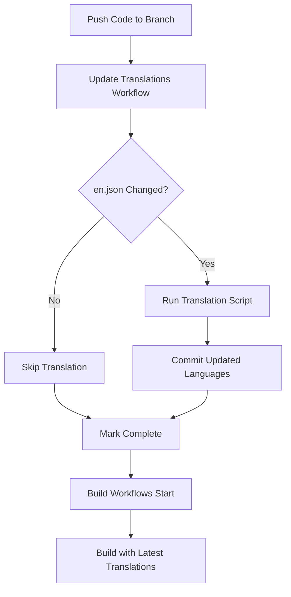

# Translation Management

Automated translation system for OpenObserve using AWS Translate.

## Overview

This system automatically translates the English locale file (`en.json`) into multiple languages **during the build process**. It intelligently preserves existing translations and only translates new keys, making it safe to run repeatedly.

## 🚀 How It Works

**Automatic workflow triggered by `en.json` changes:**

1. **Developer updates `en.json`** and pushes to any branch (main, develop, feature branches)
2. **GitHub Action detects the change** and automatically triggers
3. **Translation script runs** using AWS Translate to update all language files
4. **Changes are committed** back to the same branch automatically
5. **Build workflows use updated files** - all subsequent builds have fresh translations

This means **translations are always up-to-date** without any manual intervention!

## Supported Languages

- 🇹🇷 Turkish (tr)
- 🇨🇳 Chinese (zh)
- 🇫🇷 French (fr)
- 🇪🇸 Spanish (es)
- 🇩🇪 German (de)
- 🇮🇹 Italian (it)
- 🇵🇹 Portuguese (pt)
- 🇯🇵 Japanese (ja)
- 🇰🇷 Korean (ko)
- 🇳🇱 Dutch (nl)

## How It Works

1. **Source File**: All translations originate from `web/src/locales/languages/en.json`
2. **Translation**: New keys are automatically translated using AWS Translate
3. **Preservation**: Existing translations are never overwritten
4. **Nested Support**: Handles nested JSON structures correctly

## Local Development

### Prerequisites

1. **Python 3.11+**
2. **AWS Credentials** with access to AWS Translate service
3. **AWS CLI configured** or environment variables set

### Setup

```bash
# From the web directory
npm run translate:setup
```

Or manually:

```bash
cd scripts/translations
pip3 install -r requirements.txt
```

### Configure AWS Credentials for Local Development

**Option 1 - AWS CLI (recommended):**
```bash
aws configure
```

**Option 2 - IAM Role (if running on EC2/ECS):**
```bash
# Uses instance profile automatically
# No configuration needed
```

**Option 3 - Environment variables:**
```bash
export AWS_ACCESS_KEY_ID=your_access_key
export AWS_SECRET_ACCESS_KEY=your_secret_key
export AWS_DEFAULT_REGION=us-east-1
```

**Option 4 - Assume IAM Role locally:**
```bash
aws sts assume-role \
  --role-arn arn:aws:iam::ACCOUNT_ID:role/GitHubActions-TranslationRole \
  --role-session-name local-translation

# Then export the credentials from the output
```

> **Note:** GitHub Actions uses OIDC and assumes the IAM role automatically. Local development can use any of the above methods.

### Running Translations

Translate all languages:
```bash
# From the web directory
npm run translate

# Or directly
cd scripts/translations
python3 main.py
```

Translate specific languages:
```bash
cd scripts/translations
python3 main.py fr es de
```

## GitHub Actions Workflow

### Automatic Translation Updates

The workflow (`.github/workflows/update-translations.yml`) automatically runs when:

- **Trigger**: Any push that modifies `web/src/locales/languages/en.json`
- **Branches**: **All branches** (`**`)
- **Action**:
  1. Runs Python translation script
  2. Updates all language JSON files
  3. Commits changes back to the same branch
  4. Subsequent builds use the updated files

### Setup Requirements

The workflow uses **IAM Role with OIDC** for secure, credential-less authentication.

#### IAM Role Configuration

The workflow is already configured to use:
- **IAM Role**: `arn:aws:iam::058694856476:role/GitHubActionsRole`
- **Region**: `us-east-1`

This is the same role used by other OpenObserve workflows (e.g., `build-pr-image.yml`).

#### Required IAM Permissions

Ensure the `GitHubActionsRole` has the following permission for AWS Translate:

```json
{
  "Version": "2012-10-17",
  "Statement": [
    {
      "Effect": "Allow",
      "Action": [
        "translate:TranslateText"
      ],
      "Resource": "*"
    }
  ]
}
```

> **Note:** If you need to add this permission, attach a policy to the existing `GitHubActionsRole` in AWS IAM Console.

#### GitHub Repository Setup

**No additional secrets required!** The workflow uses the existing OIDC configuration.

The role is already configured in the workflow file and will automatically authenticate via GitHub's OIDC provider.

### Workflow Behavior



**Workflow Execution Order:**

1. **Any push** → `update-translations.yml` runs FIRST
2. Checks if `en.json` changed
   - If YES: Translates and commits
   - If NO: Skips (fast)
3. Marks workflow as complete
4. **Build workflows trigger** → Use updated translations

**Key Features:**
- ✅ **Always runs first** - All builds wait for translation workflow
- ✅ **Smart detection** - Only translates if en.json actually changed
- ✅ **Non-blocking** - Quick skip if no translation needed
- ✅ **Auto-commit** - Updates committed back to same branch
- ✅ **Build dependency** - Builds wait for translation completion
- ✅ **Works everywhere** - All branches (main, develop, feature branches)

### Manual Workflow Trigger

You can also run translations manually:

1. Go to **Actions** tab in GitHub
2. Select **Update Translations** workflow
3. Click **Run workflow**
4. (Optional) Specify specific languages: `fr es de`
5. Translations will be committed to the current branch

## File Structure

```
scripts/translations/
├── README.md           # This file
├── main.py            # Entry point for translation script
├── translator.py      # Core translation logic
└── requirements.txt   # Python dependencies

web/src/locales/languages/
├── en.json           # Source file (English)
├── tr.json           # Turkish translations
├── zh.json           # Chinese translations
├── fr.json           # French translations
├── es.json           # Spanish translations
├── de.json           # German translations
├── it.json           # Italian translations
├── pt.json           # Portuguese translations
├── ja.json           # Japanese translations
├── ko.json           # Korean translations
└── nl.json           # Dutch translations
```

## Adding New Languages

1. Add language code to `get_supported_languages()` in `translator.py`
2. Update the README to reflect the new language
3. Run the translation script

## Troubleshooting

### AWS Credentials Error
```
ERROR: No credentials for the translation service.
```
**Solution**: Configure AWS credentials (see setup section)

### Import Error
```
ModuleNotFoundError: No module named 'boto3'
```
**Solution**: Run `npm run translate:setup` or `pip3 install -r requirements.txt`

### Translation Quality Issues
- Machine translations are not perfect
- Review translations before merging PRs
- Consider manual review for critical UI text
- Native speakers should review translations

## Workflow Example

### Scenario: Adding New UI Text

1. **Developer adds new text to `en.json`:**
   ```json
   {
     "dashboard": {
       "newFeature": "This is a new feature"
     }
   }
   ```

2. **Push to branch:**
   ```bash
   git add web/src/locales/languages/en.json
   git commit -m "feat: add new dashboard feature text"
   git push origin feat/new-dashboard-feature
   ```

3. **Workflow automatically:**
   - Detects `en.json` change
   - Runs translation script
   - Translates `newFeature` to all 10 languages
   - Commits updated `fr.json`, `es.json`, etc. to the same branch

4. **Build workflows:**
   - Use the newly updated translation files
   - No additional steps needed

## Best Practices

1. **Review Commits**: Check auto-generated translation commits for accuracy
2. **Test in UI**: Verify translations display correctly in the application
3. **Manual Fixes**: Edit translations manually if needed - they won't be overwritten
4. **Context Matters**: Some terms may need manual translation for proper context
5. **Feature Branches**: Translations happen on your branch before merging

## Cost Considerations

AWS Translate pricing (as of 2024):
- **$15 per million characters**

### Cost Per Workflow Run:

| Update Type | Characters | Languages | Total Chars | Cost |
|-------------|-----------|-----------|-------------|------|
| Small (10 strings) | 500 | 10 | 5,000 | $0.08 |
| Medium (50 strings) | 2,500 | 10 | 25,000 | $0.38 |
| Large (200 strings) | 10,000 | 10 | 100,000 | $1.50 |
| Full translation | 60,000 | 10 | 600,000 | $9.00 |

### Monthly Estimates:

**Active Development:**
- 10-15 `en.json` updates/month
- Average 20 new strings per update
- **Monthly cost: $0.80 - $1.20**

**Production:**
- 5-8 `en.json` updates/month
- Average 15 new strings per update
- **Monthly cost: $0.40 - $0.80**

**First-time full translation:** ~$9 (one-time)

### Cost Optimization:
- ✅ Only new keys are translated (existing translations preserved)
- ✅ Only runs when `en.json` actually changes
- ✅ Works on feature branches (consolidates before merge)
- ✅ Typical monthly cost: **Under $2**

## Alternative Translation Services

To use a different service, modify `translator.py`:
- Google Cloud Translate
- DeepL API
- Azure Translator
- OpenAI GPT-4 (for context-aware translations)

## Support

For issues or questions:
1. Check this README first
2. Review existing GitHub issues
3. Create a new issue with the `translations` label
