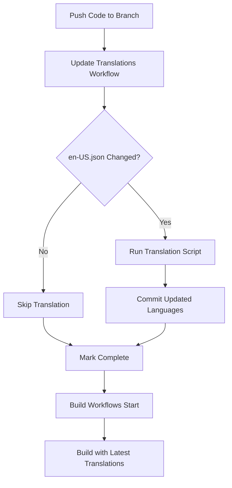

# Translation Management

Automated translation system for OpenObserve using DeepSeek (an LLM) via its
OpenAI-compatible API.

## Overview

This system automatically translates the English locale file (`en-US.json`) into multiple languages **during the build process**. It intelligently preserves existing translations and only translates new keys, making it safe to run repeatedly.

## 🚀 How It Works

**Automatic workflow triggered by `en-US.json` changes:**

1. **Developer updates `en-US.json`** and pushes to any branch (main, develop, feature branches)
2. **GitHub Action detects the change** and automatically triggers
3. **Translation script runs** using DeepSeek to update all language files
4. **Changes are committed** back to the same branch automatically
5. **Build workflows use updated files** - all subsequent builds have fresh translations

This means **translations are always up-to-date** without any manual intervention!

## Supported Languages

- 🇹🇷 Turkish (tr)
- 🇨🇳 Chinese (zh)
- 🇫🇷 French (fr)
- 🇪🇸 Spanish (es)
- 🇩🇪 German (de)
- 🇮🇹 Italian (it)
- 🇵🇹 Portuguese (pt)
- 🇯🇵 Japanese (ja)
- 🇰🇷 Korean (ko)
- 🇳🇱 Dutch (nl)

## How It Works

1. **Source File**: All translations originate from `web/src/locales/languages/en-US.json`
2. **Translation**: New/changed keys are translated by DeepSeek, in batches, with
   interpolation placeholders (`{count}`, `%s`, `@:linked.key`) validated per string
3. **Preservation**: Existing translations are never overwritten unless their English source changed
4. **Nested Support**: Handles nested JSON structures correctly

## Local Development

### Prerequisites

1. **Python 3.11+**
2. **DeepSeek API key** exported as `DEEPSEEK_API_KEY`

### Setup

```bash
# From the web directory
npm run translate:setup
```

Or manually:

```bash
cd scripts/translations
pip3 install -r requirements.txt
```

### Configure the API key for Local Development

```bash
export DEEPSEEK_API_KEY=your_api_key
# optional overrides:
export DEEPSEEK_MODEL=deepseek-v4-flash        # model id
export DEEPSEEK_BASE_URL=https://api.deepseek.com
export TRANSLATION_BATCH_SIZE=50               # strings per API call
```

### Running Translations

Translate all languages:
```bash
# From the web directory
npm run translate

# Or directly
cd scripts/translations
python3 main.py
```

Translate specific languages:
```bash
cd scripts/translations
python3 main.py fr-FR es-ES de-DE
```

## GitHub Actions Workflow

### Automatic Translation Updates

The workflow (`.github/workflows/update-translations.yml`) automatically runs when:

- **Trigger**: Any push that modifies `web/src/locales/languages/en-US.json`
- **Branches**: **All branches** (`**`)
- **Action**:
  1. Runs Python translation script
  2. Updates all language JSON files
  3. Commits changes back to the same branch
  4. Subsequent builds use the updated files

### Setup Requirements

The workflow authenticates to DeepSeek with an API key stored as a repository secret.

#### GitHub Repository Setup

Add one repository secret:

| Secret | Value |
|--------|-------|
| `DEEPSEEK_API_KEY` | Your DeepSeek API key |

Set it under **Settings → Secrets and variables → Actions → New repository secret**
(or via `gh secret set DEEPSEEK_API_KEY`). The workflow fails fast with a clear
error if this secret is missing.

### Workflow Behavior


```mermaid
graph TD
    A[Push Code to Branch] --> B[Update Translations Workflow]
    B --> C{en-US.json Changed?}
    C -->|Yes| D[Run Translation Script]
    C -->|No| E[Skip Translation]
    D --> F[Commit Updated Languages]
    E --> G[Mark Complete]
    F --> G
    G --> H[Build Workflows Start]
    H --> I[Build with Latest Translations]
```

**Workflow Execution Order:**

1. **Push code** → `update-translations.yml` runs
2. Checks if `en-US.json` changed
   - If YES: Translates and commits back to branch
   - If NO: Skips (fast, ~10 seconds)
3. **If translations were committed** → New push event
4. **Build workflows trigger** on the new commit → Use updated translations

**Key Features:**
- ✅ **Always runs** - Checks every push for en-US.json changes
- ✅ **Smart detection** - Only translates if en-US.json actually changed
- ✅ **Non-blocking** - Quick skip if no translation needed
- ✅ **Auto-commit** - Updates committed back to same branch
- ✅ **Natural flow** - Translation commit triggers builds automatically
- ✅ **Works everywhere** - All branches (main, develop, feature branches)

### Manual Workflow Trigger

You can also run translations manually:

1. Go to **Actions** tab in GitHub
2. Select **Update Translations** workflow
3. Click **Run workflow**
4. (Optional) Specify specific languages: `fr-FR es-ES de-DE`
5. Translations will be committed to the current branch

## File Structure

```
scripts/translations/
├── README.md           # This file
├── main.py            # Entry point for translation script
├── translator.py      # Core translation logic
└── requirements.txt   # Python dependencies

web/src/locales/languages/
├── en-US.json           # Source file (English)
├── tr-TR.json           # Turkish translations
├── zh-CN.json           # Chinese translations
├── fr-FR.json           # French translations
├── es-ES.json           # Spanish translations
├── de-DE.json           # German translations
├── it-IT.json           # Italian translations
├── pt-PT.json           # Portuguese translations
├── ja-JP.json           # Japanese translations
├── ko-KR.json           # Korean translations
└── nl-NL.json           # Dutch translations
```

## Adding New Languages

1. Add language code to `get_supported_languages()` in `translator.py`
2. Update the README to reflect the new language
3. Run the translation script

## Troubleshooting

### Workflow Not Detecting en-US.json Changes

**Symptom:** You changed `en-US.json` but workflow says "en-US.json not modified"

**Solution 1 - Check workflow logs:**
1. Go to **Actions** → **Update Translations** → Click the run
2. Look at "Check if en-US.json was modified" step
3. It shows debug info: event type, before/after SHAs, and changed files

**Solution 2 - Debug detection:**
```bash
# Locally check what git sees
git show --name-only --pretty="" HEAD
# Should show web/src/locales/languages/en-US.json

# Check last push
git diff HEAD~1 --name-only
```

**Root cause:** The detection uses `git diff` to compare commits. If:
- Multiple commits in one push → Uses `github.event.before` and `github.sha`
- First commit on branch → Uses `git show HEAD`
- Manual trigger → Uses `git show HEAD`

### API Key Error
```
DEEPSEEK_API_KEY is not set — cannot reach the translation service.
```
**Solution**: Set the `DEEPSEEK_API_KEY` secret (CI) or environment variable (local).

### Import Error
```
ModuleNotFoundError: No module named 'openai'
```
**Solution**: Run `npm run translate:setup` or `pip3 install -r requirements.txt`

### Translation Quality Issues
- Machine translations are not perfect
- Review translations before merging PRs
- Consider manual review for critical UI text
- Native speakers should review translations

### Build Has Old Translations

**Symptom:** Build doesn't have the latest translations

**Solution:** Check if translation workflow ran and committed:
1. Go to **Actions** → Find the **Update Translations** run
2. Check if it detected en-US.json changes and committed translations
3. If translations were committed, the commit should trigger a new build
4. The new build will have updated translations

## Workflow Example

### Scenario: Adding New UI Text

1. **Developer adds new text to `en-US.json`:**
   ```json
   {
     "dashboard": {
       "newFeature": "This is a new feature"
     }
   }
   ```

2. **Merge the `en-US.json` change to `main`:**
   ```bash
   git add web/src/locales/languages/en-US.json
   git commit -m "feat: add new dashboard feature text"
   # open a PR and merge to main
   ```

3. **Workflow automatically (on `main` only):**
   - Triggers because `web/src/locales/languages/en-US.json` changed
   - Runs translation script
   - Translates only the **new or modified** keys to all 10 languages
   - Commits updated `fr-FR.json`, `es-ES.json`, etc. plus `.translation_state.json`

4. **Build workflows:**
   - Use the newly updated translation files
   - No additional steps needed

> **Why `main` only?** Running on every feature branch re-translated the same
> strings repeatedly (per branch, per rebase, again on merge). Gating to `main`
> translates each string once, when it actually lands.

## Change detection (`.translation_state.json`)

`scripts/translations/.translation_state.json` records, per locale, a hash of the
English source each translated value was derived from. On every run the script:

- **Translates** a key only when it is new, missing in a target file, or its English
  source text changed since the last run (so editing an existing label re-translates it).
- **Keeps** already-translated text whose source is unchanged — it is never re-sent to
  the API, and English is never "translated" to English.
- **Prunes** keys that were removed from `en-US.json`.
- **Bootstraps** safely: the first run after this file is introduced adopts existing
  translations as-is (no costly full re-translation, no overwriting manual fixes).

Commit `.translation_state.json` together with the translation files — it is the
source of truth that keeps subsequent runs incremental.

## Best Practices

1. **Review Commits**: Check auto-generated translation commits for accuracy
2. **Test in UI**: Verify translations display correctly in the application
3. **Manual Fixes**: Manual edits to a key are preserved until its English source changes
4. **Context Matters**: Some terms may need manual translation for proper context
5. **Land on `main`**: Translations are generated when `en-US.json` is merged to `main`

## Cost Considerations

Translation is billed per token by DeepSeek. The whole `en-US.json` is ~205k
characters (~8,300 strings); a full 10-language rebuild is a one-time cost, and
day-to-day runs only translate the handful of new/changed keys per `en-US.json`
merge.

### Cost Optimization:
- ✅ Only **new or modified** keys are translated (unchanged text is never re-sent)
- ✅ Strings are sent in **batches** (`TRANSLATION_BATCH_SIZE`, default 50) to cut request overhead
- ✅ Runs on **`main` only**, and only when `en-US.json` changes (no per-branch re-billing)
- ✅ Superseded runs are cancelled (`concurrency` with `cancel-in-progress`)
- ✅ Failed API calls / placeholder-mismatched outputs are retried next run, not silently kept

## Alternative Translation Services

To use a different backend, modify `translate_batch()` in `translator.py`. It uses
the OpenAI-compatible chat-completions API, so any provider exposing that interface
(OpenAI, DeepSeek, or a self-hosted model) drops in by changing `DEEPSEEK_BASE_URL`
and `DEEPSEEK_MODEL`.

## Support

For issues or questions:
1. Check this README first
2. Review existing GitHub issues
3. Create a new issue with the `translations` label
