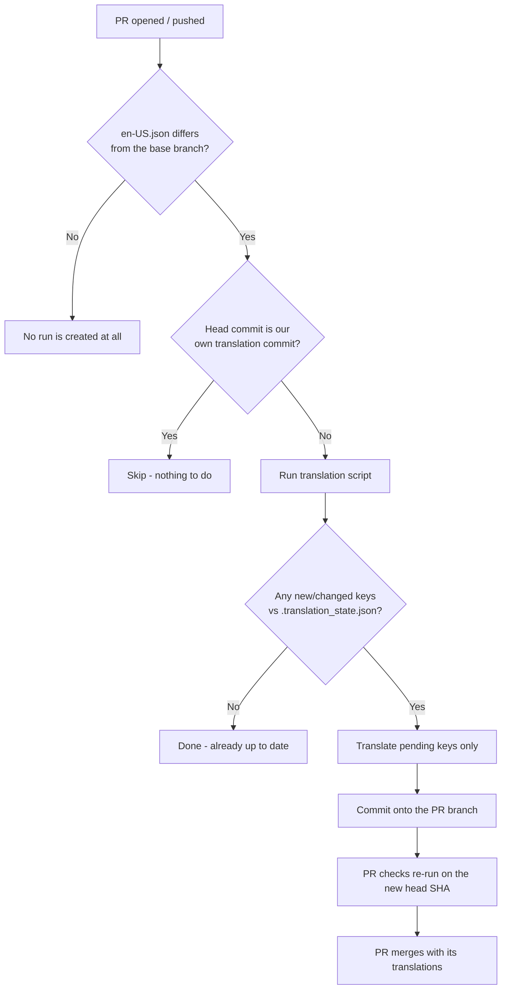

# Translation Management

Automated translation system for OpenObserve using DeepSeek (an LLM) via its
OpenAI-compatible API.

## Overview

This system automatically translates the English locale file (`en-US.json`) into multiple languages. It intelligently preserves existing translations and only translates new keys, making it safe to run repeatedly.

## 🚀 How It Works

**Translations are generated inside the PR that changes `en-US.json`:**

1. **Developer updates `en-US.json`** on a branch and opens a PR
2. **GitHub Actions detects it** via the workflow's `paths:` filter — PRs that don't touch `en-US.json` never start a run at all
3. **Translation script runs** using DeepSeek to update all language files
4. **A commit is pushed back onto the PR's own branch** (`chore(i18n): update translations from en-US.json`)
5. **The PR merges as a unit** — English strings and their translations land together

This means **translations are always up-to-date** without any manual intervention,
and they are reviewed by the person who added the English strings — no ownerless
follow-up PR to chase.

## Supported Languages

The list lives in `LANGUAGE_NAMES` in `translator.py` — that dict is the single
source of truth for both the locale codes and the language names used in the prompt.

- 🇹🇷 Turkish (tr-TR)
- 🇨🇳 Simplified Chinese (zh-CN)
- 🇹🇼 Traditional Chinese (zh-TW)
- 🇫🇷 French (fr-FR)
- 🇪🇸 Spanish (es-ES)
- 🇩🇪 German (de-DE)
- 🇮🇹 Italian (it-IT)
- 🇵🇹 Portuguese (pt-PT)
- 🇯🇵 Japanese (ja-JP)
- 🇰🇷 Korean (ko-KR)
- 🇳🇱 Dutch (nl-NL)
- 🇷🇺 Russian (ru-RU)
- 🇵🇱 Polish (pl-PL)
- 🇻🇳 Vietnamese (vi-VN)

RTL languages (Arabic, Persian) are deliberately excluded until the web app has
`dir="rtl"` support — see the note in `translator.py`.

## How It Works

1. **Source File**: All translations originate from `web/src/locales/languages/en-US.json`
2. **Translation**: New/changed keys are translated by DeepSeek, in batches, with
   interpolation placeholders (`{count}`, `%s`, `@:linked.key`) validated per string
3. **Preservation**: Existing translations are never overwritten unless their English source changed
4. **Nested Support**: Handles nested JSON structures correctly

## Local Development

### Prerequisites

1. **Python 3.11+**
2. **DeepSeek API key** exported as `DEEPSEEK_API_KEY`

### Setup

```bash
cd scripts/translations
pip3 install -r requirements.txt
```

### Configure the API key for Local Development

```bash
export DEEPSEEK_API_KEY=your_api_key
# optional overrides:
export DEEPSEEK_MODEL=deepseek-v4-flash        # model id
export DEEPSEEK_BASE_URL=https://api.deepseek.com
export TRANSLATION_BATCH_SIZE=50               # strings per API call
export TRANSLATION_CONCURRENCY=4               # batches in flight per locale (1 = serial)
```

### Running Translations

Translate all languages:
```bash
cd scripts/translations
python3 main.py
```

Translate specific languages:
```bash
cd scripts/translations
python3 main.py fr-FR es-ES de-DE
```

## GitHub Actions Workflow

### Automatic Translation Updates

The workflow (`.github/workflows/update-translations.yml`) automatically runs when:

- **Trigger**: A pull request whose `web/src/locales/languages/en-US.json` differs
  from the base branch (on open, reopen, and every subsequent push)
- **Branches**: the PR's own head branch (plus manual `workflow_dispatch` from a
  feature branch). Same-repo PRs only — see [Fork PRs](#fork-prs).
- **Action**:
  1. Runs Python translation script
  2. Updates all language JSON files
  3. Commits them onto the PR branch as `chore(i18n): update translations from en-US.json`
  4. The translations merge with the PR, so `main` never has untranslated strings

### Run lifecycle guarantees

Three properties of the workflow matter when you are reading a run:

- **A newer push cancels the run in flight.** The concurrency group is keyed on the
  PR number with `cancel-in-progress: true`. Nothing is committed until a run
  finishes, and the surviving run re-derives the full pending set from
  `.translation_state.json` — so a cancelled run loses spend, never progress.
- **Partial progress is always shipped.** Locale files are written atomically, one
  locale at a time, and the commit step runs under `if: always()`. A run that fails
  validation on some strings — or is cancelled manually — still commits the locales
  it finished. Anything unfinished stays pending for the next push to the branch.
- **The push re-runs the PR's checks.** The commit is pushed with a user PAT rather
  than `GITHUB_TOKEN`, because GitHub deliberately does not trigger workflows for
  `GITHUB_TOKEN` pushes — the new head SHA would carry no status checks and required
  checks could never pass.

### Setup Requirements

The workflow needs two repository secrets:

| Secret | Value | Why |
|--------|-------|-----|
| `DEEPSEEK_API_KEY` | Your DeepSeek API key | Authenticates the translation calls |
| `TRANSLATIONS_APPROVE_TOKEN` | PAT (repo scope) for a real user account | Pushes the translation commit so the PR's checks re-run |

Set them under **Settings → Secrets and variables → Actions → New repository secret**
(or via `gh secret set …`). The workflow fails fast with a clear error if
`DEEPSEEK_API_KEY` is missing; if `TRANSLATIONS_APPROVE_TOKEN` is missing it falls
back to `GITHUB_TOKEN`, which still commits the translations but leaves the PR's
checks unre-run on the new head SHA.

### Fork PRs

A fork PR's branch lives in the contributor's repository, which no token in this
workflow can push to, so the job is skipped for fork PRs. Handle those by running
the workflow manually (`workflow_dispatch`) once the branch is available locally, or
by letting the next same-repo PR that touches `en-US.json` pick the keys up — the
state file makes it translate everything still pending, not just that PR's strings.

### Workflow Behavior


```mermaid
graph TD
    A[PR opened / pushed] --> C{en-US.json differs<br/>from the base branch?}
    C -->|No| E[No run is created at all]
    C -->|Yes| B{Head commit is our<br/>own translation commit?}
    B -->|Yes| G2[Skip - nothing to do]
    B -->|No| D[Run translation script]
    D --> F{Any new/changed keys<br/>vs .translation_state.json?}
    F -->|No| G[Done - already up to date]
    F -->|Yes| H[Translate pending keys only]
    H --> I[Commit onto the PR branch]
    I --> J[PR checks re-run on the new head SHA]
    J --> K[PR merges with its translations]
```

**Workflow Execution Order:**

1. **Push to a PR branch** → GitHub's `paths:` filter decides whether a run is created
2. Script reconciles `en-US.json` against `.translation_state.json`
   - New / changed keys: translated
   - Everything else: kept, never re-sent to the API
3. **If any file changed** → commit pushed onto the PR's head branch
4. **The PR merges** carrying both the English strings and their translations

**Key Features:**
- ✅ **Cheap trigger** - a PR without `en-US.json` changes creates no run at all
- ✅ **Smart detection** - only new or modified keys are translated
- ✅ **Owned and reviewed** - translations land in the author's PR, not an ownerless follow-up PR
- ✅ **`main` is never missing translations** - English and translated strings land in the same merge
- ✅ **Crash/cancel safe** - completed locales are still committed
- ✅ **No re-billing across branches** - the committed state file means each string is
  translated once, on whichever branch first introduces it

### Manual Workflow Trigger

You can also run translations manually:

1. Go to **Actions** tab in GitHub
2. Select **Update Translations** workflow
3. Choose the **feature branch** to run against (not `main` — the workflow commits to
   the branch it runs on and refuses to target `main`)
4. (Optional) Specify specific languages: `fr-FR es-ES de-DE`
5. Translations are committed directly to the branch you ran it from

> Note: a subset run (specific languages) intentionally does **not** advance
> `.translation_state.json` — see [Change detection](#change-detection-translation_statejson).
> Use it to unblock or backfill one language; run all languages to persist state.

## File Structure

```
scripts/translations/
├── README.md           # This file
├── main.py            # Entry point for translation script
├── translator.py      # Core translation logic
└── requirements.txt   # Python dependencies

web/src/locales/languages/
├── en-US.json           # Source file (English)
├── tr-TR.json           # Turkish translations
├── zh-CN.json           # Chinese translations
├── fr-FR.json           # French translations
├── es-ES.json           # Spanish translations
├── de-DE.json           # German translations
├── it-IT.json           # Italian translations
├── pt-PT.json           # Portuguese translations
├── ja-JP.json           # Japanese translations
├── ko-KR.json           # Korean translations
├── nl-NL.json           # Dutch translations
├── zh-TW.json           # Traditional Chinese translations
├── ru-RU.json           # Russian translations
├── pl-PL.json           # Polish translations
└── vi-VN.json           # Vietnamese translations
```

## Adding New Languages

1. Add the locale code and language name to `LANGUAGE_NAMES` in `translator.py`
   (`get_supported_languages()` is derived from it)
2. Wire the locale into the web app's locale registry (`web/src/locales/`)
3. Update the README to reflect the new language
4. Run the translation script

## Troubleshooting

### No Run Was Created for My en-US.json Change

**Symptom:** You changed `en-US.json` but no **Update Translations** run appears.

The trigger is a `paths:` filter on **pull requests** — GitHub evaluates it before
any job exists, so a PR that doesn't change `en-US.json` produces no run at all.

Check, in order:

```bash
# 1. Is there an open PR, and does its diff really touch the source file?
git diff --name-only origin/main...HEAD | grep en-US.json

# 2. Is the PR from a fork? Fork PRs are skipped — see "Fork PRs" above.
gh pr view --json headRepositoryOwner,isCrossRepository
```

If a run exists but produced no commit, the keys were already recorded in
`.translation_state.json` — nothing was pending. Confirm with a local run:
`python3 main.py` prints `Translating: <locale> (N strings pending)`.

### API Key Error
```
DEEPSEEK_API_KEY is not set — cannot reach the translation service.
```
**Solution**: Set the `DEEPSEEK_API_KEY` secret (CI) or environment variable (local).

### Import Error
```
ModuleNotFoundError: No module named 'openai'
```
**Solution**: Run `pip3 install -r requirements.txt` from `scripts/translations`

### Translation Quality Issues
- Machine translations are not perfect
- Review translations before merging PRs
- Consider manual review for critical UI text
- Native speakers should review translations

### Build Has Old Translations

**Symptom:** Build doesn't have the latest translations

**Solution:** Translations reach `main` inside the PR that changed `en-US.json`, so
check that PR:
1. Go to **Actions** → find the **Update Translations** run for that PR → read its Summary
2. Confirm the `chore(i18n): update translations from en-US.json` commit is on the
   branch. If the run finished after the PR merged, the strings missed the train —
   they will be picked up by the next PR that touches `en-US.json`, or by a manual
   `workflow_dispatch` run on a fresh branch
3. Builds started before that PR merged will still carry the old strings

## Workflow Example

### Scenario: Adding New UI Text

1. **Developer adds new text to `en-US.json`:**
   ```json
   {
     "dashboard": {
       "newFeature": "This is a new feature"
     }
   }
   ```

2. **Push the `en-US.json` change and open a PR:**
   ```bash
   git add web/src/locales/languages/en-US.json
   git commit -m "feat: add new dashboard feature text"
   git push -u origin feat/new-dashboard-text
   gh pr create
   ```

3. **Workflow automatically (on your PR):**
   - Triggers because `web/src/locales/languages/en-US.json` differs from the base branch
   - Runs translation script
   - Translates only the **new or modified** keys to all 14 languages
   - Pushes `fr-FR.json`, `es-ES.json`, etc. plus `.translation_state.json` onto your branch

4. **Review and merge:**
   - `git pull` to pick up the translation commit before your next push
   - Review the generated strings alongside your own change, then merge as usual

> **Why in the PR, and not on `main`?** Re-translation across branches is already
> prevented by the committed state file, not by the trigger: a string is translated
> once, on whichever branch first introduces it. Generating on `main` instead meant a
> separate `chore/update-translations` PR that nobody was assigned to review, and a
> window where `main` carried English strings with no translations.

## Change detection (`.translation_state.json`)

`scripts/translations/.translation_state.json` records, per locale, a hash of the
English source each translated value was derived from. On every run the script:

- **Translates** a key only when it is new, missing in a target file, or its English
  source text changed since the last run (so editing an existing label re-translates it).
- **Keeps** already-translated text whose source is unchanged — it is never re-sent to
  the API, and English is never "translated" to English.
- **Prunes** keys that were removed from `en-US.json`.
- **Bootstraps** safely: a key that already has a translation but no recorded hash is
  adopted as-is (no costly full re-translation, no overwriting manual fixes). This is
  also what lets a partially-completed run heal: once its locale files merge, those
  new keys are adopted rather than translated again.

State is only rewritten on a **full run** (every supported language), because a key's
hash is recorded only when the translation is present in *every* locale. A subset run
(`python3 main.py fr-FR`) translates correctly but deliberately leaves state untouched.

Commit `.translation_state.json` together with the translation files — it is the
source of truth that keeps subsequent runs incremental.

## Best Practices

1. **Review Commits**: Check auto-generated translation commits for accuracy
2. **Test in UI**: Verify translations display correctly in the application
3. **Manual Fixes**: Manual edits to a key are preserved until its English source changes
4. **Context Matters**: Some terms may need manual translation for proper context
5. **Pull before you push**: the workflow commits to your branch, so `git pull` after
   a translation run to avoid a rejected push

## Cost Considerations

Translation is billed per token by DeepSeek. The whole `en-US.json` is ~10,700
strings; a full 14-language rebuild is a one-time cost, and day-to-day runs only
translate the handful of new/changed keys in a given PR.

### Cost Optimization:
- ✅ Only **new or modified** keys are translated (unchanged text is never re-sent)
- ✅ Strings are sent in **batches** (`TRANSLATION_BATCH_SIZE`, default 50) to cut request overhead
- ✅ Runs only when a PR **changes `en-US.json`**; the committed state file stops the
  same string being re-translated on another branch or after a rebase
- ✅ Batches run **concurrently** (`TRANSLATION_CONCURRENCY`, default 4) so a run finishes
  well within a normal PR review cycle
- ✅ A superseded run is cancelled, but partial progress from a **completed** run is
  always committed — work already paid for is never discarded
- ✅ Failed API calls / placeholder-mismatched outputs are retried next run, not silently kept

## Alternative Translation Services

To use a different backend, modify `translate_batch()` in `translator.py`. It uses
the OpenAI-compatible chat-completions API, so any provider exposing that interface
(OpenAI, DeepSeek, or a self-hosted model) drops in by changing `DEEPSEEK_BASE_URL`
and `DEEPSEEK_MODEL`.

## Support

For issues or questions:
1. Check this README first
2. Review existing GitHub issues
3. Create a new issue with the `translations` label
