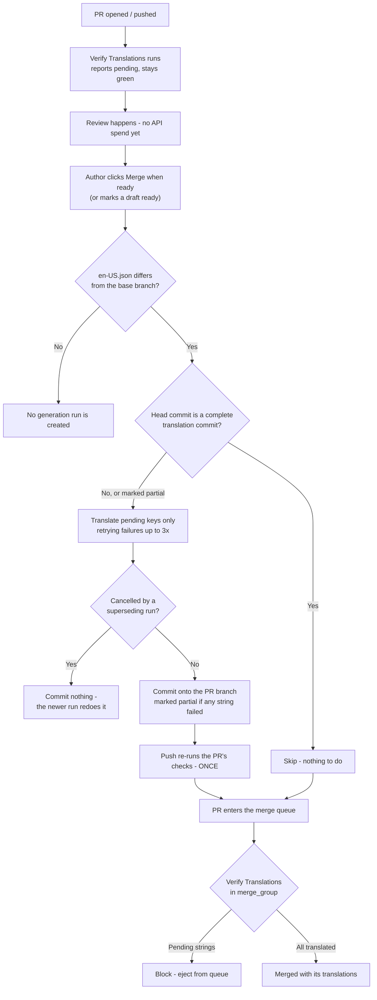

# Translation Management

Automated translation system for OpenObserve using DeepSeek (an LLM) via its
OpenAI-compatible API.

## Overview

This system automatically translates the English locale file (`en-US.json`) into multiple languages. It intelligently preserves existing translations and only translates new keys, making it safe to run repeatedly.

## 🚀 How It Works

**Translations are generated inside the PR that changes `en-US.json`:**

1. **Developer updates `en-US.json`** on a branch and opens a PR
2. **The PR is reviewed as normal.** No translation run happens yet — see
   [When the run fires](#when-the-run-fires) for why
3. **The author clicks "Merge when ready"** (or marks a draft ready for review)
4. **Translation script runs** using DeepSeek to update all language files
5. **A commit is pushed back onto the PR's own branch** (`chore(i18n): update translations from en-US.json`)
6. **The PR merges as a unit** — English strings and their translations land together
7. **The merge queue double-checks** via the separate **Verify Translations** workflow,
   which blocks the merge if any string is still untranslated

This means **translations are always up-to-date** without any manual intervention,
and they are reviewed by the person who added the English strings — no ownerless
follow-up PR to chase.

### When the run fires

The generation workflow triggers on the `auto_merge_enabled` and `ready_for_review`
pull-request types, **not** on every push.

It used to run on every push that changed `en-US.json`. The problem was not the
translation job itself — that is cheap — but its commit: pushing to the PR branch
re-runs the PR's *entire* check suite (playwright, unit-tests, api-testing, …) on the
new head SHA. On a PR where you iterate on English strings five times, that is five
extra full CI cycles, and then the merge queue runs everything a sixth time. Firing
once, at the point you signal the PR is finished, collapses that to one.

**Why not run it in the merge queue itself?** That is the obvious idea and it cannot
work. Merge-queue branches (`gh-readonly-queue/*`) are read-only, and the commits in a
queue entry are frozen — the entire point of a merge queue is that what gets tested is
exactly what gets merged. A `merge_group` run has nowhere to put the translation
commit. Pushing to the *PR's* branch from a `merge_group` run is worse: it ejects the
PR from the queue, so everything behind it waits while it re-queues.

So the queue gets a *check* instead of a generator — `Verify Translations`, which
compares `en-US.json` against the locale files and `.translation_state.json`. It makes
no API calls, needs no API key, and installs nothing, so it costs a few seconds.

## Supported Languages

The list lives in `LANGUAGE_NAMES` in `translator.py` — that dict is the single
source of truth for both the locale codes and the language names used in the prompt.

- 🇹🇷 Turkish (tr-TR)
- 🇨🇳 Simplified Chinese (zh-CN)
- 🇹🇼 Traditional Chinese (zh-TW)
- 🇫🇷 French (fr-FR)
- 🇪🇸 Spanish (es-ES)
- 🇩🇪 German (de-DE)
- 🇮🇹 Italian (it-IT)
- 🇵🇹 Portuguese (pt-PT)
- 🇯🇵 Japanese (ja-JP)
- 🇰🇷 Korean (ko-KR)
- 🇳🇱 Dutch (nl-NL)
- 🇷🇺 Russian (ru-RU)
- 🇵🇱 Polish (pl-PL)
- 🇻🇳 Vietnamese (vi-VN)

RTL languages (Arabic, Persian) are deliberately excluded until the web app has
`dir="rtl"` support — see the note in `translator.py`.

## How It Works

1. **Source File**: All translations originate from `web/src/locales/languages/en-US.json`
2. **Translation**: New/changed keys are translated by DeepSeek, in batches, with
   interpolation placeholders (`{count}`, `%s`, `@:linked.key`) and vue-i18n
   literal escapes (`{'{'}`, `{'@'}`) validated per string
3. **Preservation**: Existing translations are never overwritten unless their English source changed
4. **Nested Support**: Handles nested JSON structures correctly

A translation is rejected (and retried on the next run) when it is empty, drops or
adds an interpolation token, changes the `|` plural-form count, or is something
vue-i18n cannot compile. That last check exists because vue-i18n compiles messages
just-in-time and a compile error is *thrown*, not warned: a model that helpfully
localises a placeholder name — `{identifier}` → `{标识符}` — blanks every page that
renders the string. `web/src/locales/localeMessages.spec.ts` re-checks the same
property against the committed locale files, so a bad string cannot reach `main`
even if it predates this validation.

## Local Development

### Prerequisites

1. **Python 3.11+**
2. **DeepSeek API key** exported as `DEEPSEEK_API_KEY`

### Setup

```bash
cd scripts/translations
pip3 install -r requirements.txt
```

### Configure the API key for Local Development

```bash
export DEEPSEEK_API_KEY=your_api_key
# optional overrides:
export DEEPSEEK_MODEL=deepseek-v4-flash        # model id
export DEEPSEEK_BASE_URL=https://api.deepseek.com
export TRANSLATION_BATCH_SIZE=50               # strings per API call
export TRANSLATION_CONCURRENCY=4               # batches in flight per locale (1 = serial)
```

### Running Translations

Translate all languages:
```bash
cd scripts/translations
python3 main.py
```

Translate specific languages:
```bash
cd scripts/translations
python3 main.py fr-FR es-ES de-DE
```

See what is pending without translating anything — no API key, no dependencies, no
cost. This is exactly what the merge-queue gate runs:
```bash
cd scripts/translations
python3 main.py --check          # exits 2 if anything is pending, 0 if clean
```

## GitHub Actions Workflow

There are two workflows, with different jobs.

#### `update-translations.yml` — generates

- **Trigger**: a pull request whose `web/src/locales/languages/en-US.json` differs from
  the base branch, on the `auto_merge_enabled` and `ready_for_review` types only — i.e.
  when you click **Merge when ready** or take a draft out of draft. Plus manual
  `workflow_dispatch` from a feature branch.
- **Branches**: the PR's own head branch. Same-repo PRs only — see [Fork PRs](#fork-prs).
- **Secrets**: `DEEPSEEK_API_KEY` and the push PAT.
- **Action**:
  1. Runs the Python translation script (retrying failed strings in-process)
  2. Updates all language JSON files
  3. Commits them onto the PR branch as `chore(i18n): update translations from en-US.json`

#### `verify-translations.yml` — gates

- **Trigger**: every pull request *and* every `merge_group` entry. No `paths:` filter —
  a required check that gets filtered out sits at "Expected — waiting for status"
  forever and blocks the PR.
- **Secrets**: none, deliberately. It runs for fork PRs, so it holds nothing worth
  stealing.
- **Action**: runs `main.py --check`, which is a pure file comparison — no API calls, no
  API key, no `pip install` (the `openai` import is lazy). A few seconds, zero tokens.
- **Result**: on a PR it reports and stays green (pending strings are normal
  mid-review). **In the merge queue it fails**, ejecting the entry rather than letting
  English-only strings reach `main`.

> Make **Verify translations are up to date** a required status check on `main`.
> Nothing about this design guarantees anything until you do — that is the single
> configuration step this PR depends on.

### Run lifecycle guarantees

These properties of the workflow matter when you are reading a run:

- **A superseding run cancels the one in flight, and the cancelled run commits
  nothing.** The concurrency group is keyed on the PR number with
  `cancel-in-progress: true`, and the commit steps are gated on `!cancelled()` —
  deliberately *not* `always()`, which would include cancellation and let the
  superseded run race the newer one to push partially-written locale files. The
  surviving run re-derives the full pending set from `.translation_state.json`, so a
  cancelled run loses spend, never progress.
- **Failed strings are retried inside the same run**, up to three attempts. Each
  attempt re-derives what is pending from state, so it only re-sends the strings that
  actually failed — a retry after a near-complete run is nearly free. This has to
  happen in-process now: the workflow no longer fires on `synchronize`, so its own
  commit does not bring it back for another go.
- **Partial progress is still shipped.** Locale files are written atomically, one
  locale at a time. A run that is still incomplete after three attempts commits the
  locales it finished and marks the commit `Translation-Run: partial`, so a later
  re-run picks the rest up instead of being short-circuited by the skip-guard. The
  merge-queue gate is what stops that PR merging in the meantime.
- **The push re-runs the PR's checks.** The commit is pushed with a user PAT rather
  than `GITHUB_TOKEN`, because GitHub deliberately does not trigger workflows for
  `GITHUB_TOKEN` pushes — the new head SHA would carry no status checks and required
  checks could never pass.
- **A deleted head branch is never recreated.** If the PR merges mid-run, the job
  checks that the branch still exists on origin before pushing and bails with a
  warning rather than resurrecting it as a stray. Those strings stay pending for the
  next PR that touches `en-US.json`.

### Setup Requirements

The workflow needs two repository secrets:

| Secret | Value | Why |
|--------|-------|-----|
| `DEEPSEEK_API_KEY` | Your DeepSeek API key | Authenticates the translation calls |
| `TRANSLATIONS_APPROVE_TOKEN` | **Fine-grained** PAT for a real user account, scoped to *this repository only* with `Contents: read and write` | Pushes the translation commit so the PR's checks re-run |

Set them under **Settings → Secrets and variables → Actions → New repository secret**
(or via `gh secret set …`). The workflow fails fast with a clear error if
`DEEPSEEK_API_KEY` is missing; if `TRANSLATIONS_APPROVE_TOKEN` is missing it falls
back to `GITHUB_TOKEN`, which still commits the translations but leaves the PR's
checks unre-run on the new head SHA.

#### Why the PAT must be fine-grained

This workflow triggers on `pull_request`, which runs from the PR's **merge ref** — so
`requirements.txt`, `main.py`, `translator.py` *and this workflow file itself* come
from the PR, not from `main`. (That is the difference from `pull_request_target`,
which always uses the base branch's workflow definition.) A same-repo PR can therefore
change anything about what runs in this job. Fork PRs are skipped and
would not receive secrets in any case, so the blast radius is "anyone with push
access" — but a classic `repo`-scope PAT belonging to a human account grants far more
than that, across every repository they can reach. Scope it down.

Three things in the workflow narrow the exposure. None of them is a boundary — a PR
that edits the workflow file can undo all three — but they mean an *accidental*
leak (a dependency that phones home, a stack trace with the environment in it) has
much less to reach:

- `actions/checkout` runs with `persist-credentials: false`, so the push token is not
  sitting in `.git/config` while PR-authored Python runs.
- The token is a **step-level** `env:` on the commit step only — nothing above it,
  including `pip install` and `python3 main.py`, has it in the environment.
- `requirements.txt` carries an upper version bound so a major release cannot land
  unreviewed. (Full hash pinning via `pip install --require-hashes` is the stronger
  form and is still worth doing.)

The only real boundary is a `workflow_run` split: this workflow produces the locale
files as an artifact and holds no secrets that survive it, and a second workflow —
which `workflow_run` always runs from `main`'s definition, never the PR's — holds the
push token and does the commit. Until that lands, **the security model here is "every
account with push access to this repo is trusted with both secrets"**, and the
fine-grained PAT is what keeps that from meaning "trusted with a human's whole GitHub
account".

### Fork PRs

A fork PR's branch lives in the contributor's repository, which no token in this
workflow can push to, so the job is skipped for fork PRs. Handle those by running
the workflow manually (`workflow_dispatch`) once the branch is available locally, or
by letting the next same-repo PR that touches `en-US.json` pick the keys up — the
state file makes it translate everything still pending, not just that PR's strings.

### Workflow Behavior


```mermaid
graph TD
    A[PR opened / pushed] --> V[Verify Translations runs<br/>reports pending, stays green]
    V --> P[Review happens - no API spend yet]
    P --> A2["Author clicks Merge when ready<br/>(or marks a draft ready)"]
    A2 --> C{en-US.json differs<br/>from the base branch?}
    C -->|No| E[No generation run is created]
    C -->|Yes| B{Head commit is a complete<br/>translation commit?}
    B -->|Yes| G2[Skip - nothing to do]
    B -->|No, or marked partial| D[Translate pending keys only<br/>retrying failures up to 3x]
    D --> L{Cancelled by a<br/>superseding run?}
    L -->|Yes| M[Commit nothing -<br/>the newer run redoes it]
    L -->|No| I[Commit onto the PR branch<br/>marked partial if any string failed]
    I --> J[Push re-runs the PR's checks - ONCE]
    J --> Q[PR enters the merge queue]
    G2 --> Q
    Q --> R{Verify Translations<br/>in merge_group}
    R -->|Pending strings| S[Block - eject from queue]
    R -->|All translated| K[Merged with its translations]
```

**Workflow Execution Order:**

1. **PR opened / pushed** → `Verify Translations` reports what is pending. Green either
   way; no generation, no API spend
2. **Author signals the PR is done** → GitHub's `paths:` filter decides whether a
   generation run is created
3. Script reconciles `en-US.json` against `.translation_state.json`
   - New / changed keys: translated
   - Everything else: kept, never re-sent to the API
4. **If any file changed** → one commit pushed onto the PR's head branch, which
   re-runs the PR's checks exactly once
5. **Merge queue** → `Verify Translations` blocks if anything is still untranslated
6. **The PR merges** carrying both the English strings and their translations

**Key Features:**
- ✅ **Cheap trigger** - a PR without `en-US.json` changes creates no generation run
- ✅ **One extra CI cycle per PR** - not one per edit to `en-US.json`
- ✅ **Free gate** - the merge-queue check makes no API calls and installs nothing
- ✅ **Smart detection** - only new or modified keys are translated
- ✅ **Owned and reviewed** - translations land in the author's PR, not an ownerless follow-up PR
- ✅ **`main` is never missing translations** - enforced by the merge-queue gate, once
  you make it a required check
- ✅ **Crash safe** - failed strings are retried in-process; whatever completes is
  still committed
- ✅ **Cancel safe** - a superseded run commits nothing, so it can never overwrite the
  newer run's work; the next run re-derives everything still pending
- ✅ **No re-billing across branches** - the committed state file means each string is
  translated once, on whichever branch first introduces it

### Manual Workflow Trigger

You can also run translations manually:

1. Go to **Actions** tab in GitHub
2. Select **Update Translations** workflow
3. Choose the **feature branch** to run against (not `main` — the workflow commits to
   the branch it runs on and refuses to target `main`)
4. (Optional) Specify specific languages: `fr-FR es-ES de-DE`
5. Translations are committed directly to the branch you ran it from

> Note: a subset run (specific languages) intentionally does **not** advance
> `.translation_state.json` — see [Change detection](#change-detection-translation_statejson).
> Use it to unblock or backfill one language; run all languages to persist state.

## File Structure

```
scripts/translations/
├── README.md           # This file
├── main.py            # Entry point for translation script
├── translator.py      # Core translation logic
└── requirements.txt   # Python dependencies

web/src/locales/languages/
├── en-US.json           # Source file (English)
├── tr-TR.json           # Turkish translations
├── zh-CN.json           # Chinese translations
├── fr-FR.json           # French translations
├── es-ES.json           # Spanish translations
├── de-DE.json           # German translations
├── it-IT.json           # Italian translations
├── pt-PT.json           # Portuguese translations
├── ja-JP.json           # Japanese translations
├── ko-KR.json           # Korean translations
├── nl-NL.json           # Dutch translations
├── zh-TW.json           # Traditional Chinese translations
├── ru-RU.json           # Russian translations
├── pl-PL.json           # Polish translations
└── vi-VN.json           # Vietnamese translations
```

## Adding New Languages

1. Add the locale code and language name to `LANGUAGE_NAMES` in `translator.py`
   (`get_supported_languages()` is derived from it)
2. Wire the locale into the web app's locale registry (`web/src/locales/`)
3. Update the README to reflect the new language
4. Run the translation script

## Troubleshooting

### No Run Was Created for My en-US.json Change

**Symptom:** You changed `en-US.json` but no **Update Translations** run appears.

**Most likely this is working as intended.** Generation no longer fires on push — it
waits until you click **Merge when ready** or mark a draft ready for review. See
[When the run fires](#when-the-run-fires). The `Verify Translations` check will show
you what is pending in the meantime.

If you want the translations now, without merging, trigger it by hand: **Actions →
Update Translations → Run workflow**, selecting your branch.

Otherwise check, in order:

```bash
# 1. Does the PR's diff really touch the source file?
git diff --name-only origin/main...HEAD | grep en-US.json

# 2. Is the PR from a fork? Fork PRs are skipped — see "Fork PRs" above.
gh pr view --json headRepositoryOwner,isCrossRepository

# 3. What does the workflow think is pending? (free, no API key needed)
cd scripts/translations && python3 main.py --check
```

If a run exists but produced no commit, the keys were already recorded in
`.translation_state.json` — nothing was pending, and `--check` will agree.

### My PR Got Ejected From the Merge Queue

**Symptom:** you clicked **Merge when ready**, the PR queued, then fell out with "the
head branch was updated".

Any push to a queued PR's branch ejects it, and the translation commit is such a push.
Clicking **Merge when ready** is exactly what starts the translation run, so if all your
other checks were already green the PR can enter the queue before the translation
commit lands, and the commit then knocks it out.

**This is self-healing — do nothing.** Auto-merge stays enabled through the eject, so
once the checks re-run on the translation commit the PR re-queues by itself. You pay
one extra queue pass, not a manual re-queue.

To avoid it entirely on a PR you know touches `en-US.json`, run **Actions → Update
Translations** on your branch first, then click Merge when ready once the `chore(i18n)`
commit is on the branch. The generation run is then a no-op.

### I Force-Pushed and It Re-Translated Everything

A rebase or amend that drops the translation commit also drops the
`.translation_state.json` update that came with it. The next run sees those keys as
pending again and pays for them a second time.

**Solution:** when rebasing, keep the `chore(i18n)` commit (it is a normal commit —
`git rebase` preserves it unless you explicitly drop or squash it away). If you did
lose it, nothing breaks; the run simply re-bills those strings.

### Two PRs Conflict in the Generated Locale Files

**Symptom:** two open PRs both changed `en-US.json`; the second to merge has conflicts
in the 14 locale files and in `.translation_state.json`.

This is inherent to generating in each PR rather than in one serialised bot PR. Both
branches rewrote the same generated files. Generating at merge time rather than on
every push makes it much rarer — the two runs have to overlap, instead of both PRs
carrying translation commits for their whole review — but it is still possible when
two PRs are queued close together.

**Solution:** do not hand-resolve generated JSON. Take the base branch's copies of the
generated files, keep your own `en-US.json`, and let the workflow regenerate the rest.

```bash
git fetch origin main
git rebase origin/main
```

When the rebase stops on the conflict (note the inversion: during a rebase `--ours` is
the branch you are rebasing *onto*, `--theirs` is your commit being replayed):

```bash
# Generated files: take main's copies.
git checkout --ours -- web/src/locales/languages/ scripts/translations/.translation_state.json
# If en-US.json is also conflicted, keep YOUR English strings instead.
git checkout --theirs -- web/src/locales/languages/en-US.json
git add -- web/src/locales/languages/ scripts/translations/.translation_state.json
git rebase --continue
git push --force-with-lease
```

The push does **not** re-fire generation (it only fires on Merge when ready), so click
**Merge when ready** again — or run the workflow by hand. Either way it re-derives
exactly the keys still pending: both your PR's strings and any the other PR left
undone. `python3 main.py --check` tells you what that will be before you spend
anything.

### The PR Merged Before Its Translations Landed

**This should not happen once `Verify translations are up to date` is a required check**
— that is the whole point of it. The queue entry fails and the PR is ejected before it
can merge untranslated.

If it does happen (the check is not required yet, or someone merged with admin
override), the branch is gone by the time the job pushes. The job detects this and
**does not** recreate the branch as a stray; the run's Summary says so, and the strings
stay pending in `.translation_state.json` for the next PR that touches `en-US.json` (or
a manual `workflow_dispatch` on a fresh branch). Nothing is lost, `main` is just
briefly English-only for those keys.

### API Key Error
```
DEEPSEEK_API_KEY is not set — cannot reach the translation service.
```
**Solution**: Set the `DEEPSEEK_API_KEY` secret (CI) or environment variable (local).

### Import Error
```
ModuleNotFoundError: No module named 'openai'
```
**Solution**: Run `pip3 install -r requirements.txt` from `scripts/translations`

### Translation Quality Issues
- Machine translations are not perfect
- Review translations before merging PRs
- Consider manual review for critical UI text
- Native speakers should review translations

### Build Has Old Translations

**Symptom:** Build doesn't have the latest translations

**Solution:** Translations reach `main` inside the PR that changed `en-US.json`, so
check that PR:
1. Go to **Actions** → find the **Update Translations** run for that PR → read its Summary
2. Confirm the `chore(i18n): update translations from en-US.json` commit is on the
   branch. If the run finished after the PR merged, the strings missed the train —
   they will be picked up by the next PR that touches `en-US.json`, or by a manual
   `workflow_dispatch` run on a fresh branch
3. Builds started before that PR merged will still carry the old strings

## Workflow Example

### Scenario: Adding New UI Text

1. **Developer adds new text to `en-US.json`:**
   ```json
   {
     "dashboard": {
       "newFeature": "This is a new feature"
     }
   }
   ```

2. **Push the `en-US.json` change and open a PR:**
   ```bash
   git add web/src/locales/languages/en-US.json
   git commit -m "feat: add new dashboard feature text"
   git push -u origin feat/new-dashboard-text
   gh pr create
   ```

3. **Get it reviewed.** No translation run yet — `Verify Translations` shows the new
   keys as pending and stays green. Push as many times as you like; none of it costs
   API spend or an extra CI cycle.

4. **Click "Merge when ready".** Now the workflow:
   - Triggers, because `en-US.json` differs from the base branch
   - Translates only the **new or modified** keys to all 14 languages
   - Pushes `fr-FR.json`, `es-ES.json`, etc. plus `.translation_state.json` onto your branch
   - That one push re-runs your PR's checks; then it queues and merges

5. **Afterwards:**
   - `git pull` to pick up the translation commit before your next push
   - Review the generated strings alongside your own change

> **Why in the PR, and not on `main`?** Re-translation across branches is already
> prevented by the committed state file, not by the trigger: a string is translated
> once, on whichever branch first introduces it. Generating on `main` instead meant a
> separate `chore/update-translations` PR that nobody was assigned to review, and a
> window where `main` carried English strings with no translations.

## Change detection (`.translation_state.json`)

`scripts/translations/.translation_state.json` records, per locale, a hash of the
English source each translated value was derived from. On every run the script:

- **Translates** a key only when it is new, missing in a target file, or its English
  source text changed since the last run (so editing an existing label re-translates it).
- **Keeps** already-translated text whose source is unchanged — it is never re-sent to
  the API, and English is never "translated" to English.
- **Prunes** keys that were removed from `en-US.json`.
- **Bootstraps** safely: a key that already has a translation but no recorded hash is
  adopted as-is (no costly full re-translation, no overwriting manual fixes). This is
  also what lets a partially-completed run heal: once its locale files merge, those
  new keys are adopted rather than translated again.

State is only rewritten on a **full run** (every supported language), because a key's
hash is recorded only when the translation is present in *every* locale. A subset run
(`python3 main.py fr-FR`) translates correctly but deliberately leaves state untouched.

Commit `.translation_state.json` together with the translation files — it is the
source of truth that keeps subsequent runs incremental.

## Best Practices

1. **Review Commits**: Check auto-generated translation commits for accuracy
2. **Test in UI**: Verify translations display correctly in the application
3. **Manual Fixes**: Manual edits to a key are preserved until its English source changes
4. **Context Matters**: Some terms may need manual translation for proper context
5. **Pull before you push**: the workflow commits to your branch, so `git pull` after
   a translation run to avoid a rejected push
6. **Check before you merge**: `python3 main.py --check` costs nothing and tells you
   exactly what the merge-queue gate will see

## Cost Considerations

Translation is billed per token by DeepSeek. The whole `en-US.json` is ~10,700
strings; a full 14-language rebuild is a one-time cost, and day-to-day runs only
translate the handful of new/changed keys in a given PR.

### Cost Optimization:
- ✅ Only **new or modified** keys are translated (unchanged text is never re-sent)
- ✅ Strings are sent in **batches** (`TRANSLATION_BATCH_SIZE`, default 50) to cut request overhead
- ✅ Runs only when a PR **changes `en-US.json`**; the committed state file stops the
  same string being re-translated on another branch or after a rebase
- ✅ Runs **once per PR, at merge time** — not once per push. Iterating on English
  strings during review costs nothing, and the PR pays for one translation run and one
  extra CI cycle no matter how many times you edit `en-US.json`
- ✅ The merge-queue gate is **free**: pure file comparison, no API calls, no API key,
  no `pip install`
- ✅ Batches run **concurrently** (`TRANSLATION_CONCURRENCY`, default 4) so a run finishes
  well within a normal PR review cycle
- ✅ Failed strings are retried **inside the same run**, and each retry re-derives what
  is pending, so only the strings that actually failed are re-sent
- ⚠️ A superseded run is cancelled before it commits, so its spend **is** lost and the
  surviving run re-translates those keys. That is the deliberate trade: letting a
  cancelled run commit would race the newer run and regress locale files, which costs
  more to untangle than the tokens do. Rare now that generation fires once per PR.
- ✅ Partial progress from a run that **finished with failures** is still committed —
  work already paid for is never discarded

## Alternative Translation Services

To use a different backend, modify `translate_batch()` in `translator.py`. It uses
the OpenAI-compatible chat-completions API, so any provider exposing that interface
(OpenAI, DeepSeek, or a self-hosted model) drops in by changing `DEEPSEEK_BASE_URL`
and `DEEPSEEK_MODEL`.

## Support

For issues or questions:
1. Check this README first
2. Review existing GitHub issues
3. Create a new issue with the `translations` label
