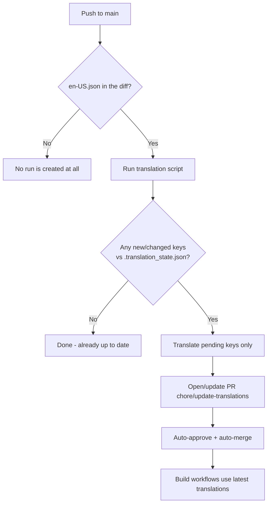

# Translation Management

Automated translation system for OpenObserve using DeepSeek (an LLM) via its
OpenAI-compatible API.

## Overview

This system automatically translates the English locale file (`en-US.json`) into multiple languages. It intelligently preserves existing translations and only translates new keys, making it safe to run repeatedly.

## 🚀 How It Works

**Automatic workflow triggered when `en-US.json` lands on `main`:**

1. **Developer updates `en-US.json`** and merges the change to `main`
2. **GitHub Actions detects it** via the workflow's `paths:` filter — pushes that don't touch `en-US.json` never start a run at all
3. **Translation script runs** using DeepSeek to update all language files
4. **A PR is opened** (`chore/update-translations`), auto-approved and set to auto-merge
5. **Build workflows use updated files** - all subsequent builds have fresh translations

This means **translations are always up-to-date** without any manual intervention!

## Supported Languages

The list lives in `LANGUAGE_NAMES` in `translator.py` — that dict is the single
source of truth for both the locale codes and the language names used in the prompt.

- 🇹🇷 Turkish (tr-TR)
- 🇨🇳 Simplified Chinese (zh-CN)
- 🇹🇼 Traditional Chinese (zh-TW)
- 🇫🇷 French (fr-FR)
- 🇪🇸 Spanish (es-ES)
- 🇩🇪 German (de-DE)
- 🇮🇹 Italian (it-IT)
- 🇵🇹 Portuguese (pt-PT)
- 🇯🇵 Japanese (ja-JP)
- 🇰🇷 Korean (ko-KR)
- 🇳🇱 Dutch (nl-NL)
- 🇷🇺 Russian (ru-RU)
- 🇵🇱 Polish (pl-PL)
- 🇻🇳 Vietnamese (vi-VN)

RTL languages (Arabic, Persian) are deliberately excluded until the web app has
`dir="rtl"` support — see the note in `translator.py`.

## How It Works

1. **Source File**: All translations originate from `web/src/locales/languages/en-US.json`
2. **Translation**: New/changed keys are translated by DeepSeek, in batches, with
   interpolation placeholders (`{count}`, `%s`, `@:linked.key`) validated per string
3. **Preservation**: Existing translations are never overwritten unless their English source changed
4. **Nested Support**: Handles nested JSON structures correctly

## Local Development

### Prerequisites

1. **Python 3.11+**
2. **DeepSeek API key** exported as `DEEPSEEK_API_KEY`

### Setup

```bash
# From the web directory
npm run translate:setup
```

Or manually:

```bash
cd scripts/translations
pip3 install -r requirements.txt
```

### Configure the API key for Local Development

```bash
export DEEPSEEK_API_KEY=your_api_key
# optional overrides:
export DEEPSEEK_MODEL=deepseek-v4-flash        # model id
export DEEPSEEK_BASE_URL=https://api.deepseek.com
export TRANSLATION_BATCH_SIZE=50               # strings per API call
export TRANSLATION_CONCURRENCY=4               # batches in flight per locale (1 = serial)
```

### Running Translations

Translate all languages:
```bash
# From the web directory
npm run translate

# Or directly
cd scripts/translations
python3 main.py
```

Translate specific languages:
```bash
cd scripts/translations
python3 main.py fr-FR es-ES de-DE
```

## GitHub Actions Workflow

### Automatic Translation Updates

The workflow (`.github/workflows/update-translations.yml`) automatically runs when:

- **Trigger**: A push to `main` that modifies `web/src/locales/languages/en-US.json`
- **Branches**: **`main` only** (plus manual `workflow_dispatch`)
- **Action**:
  1. Runs Python translation script
  2. Updates all language JSON files
  3. Opens PR `chore/update-translations`, approves it, enables auto-merge
  4. Subsequent builds use the updated files once that PR merges

### Run lifecycle guarantees

Two properties of the workflow matter when you are reading a run:

- **Runs are never cancelled by a newer push.** The concurrency group uses
  `cancel-in-progress: false`, so at most one run works at a time and at most one
  waits. A queued run checks out the branch *tip*, so it picks up whatever its
  predecessor already merged instead of redoing it.
- **Partial progress is always shipped.** Locale files are written atomically, one
  locale at a time, and the PR steps run under `if: always()`. A run that fails
  validation on some strings — or is cancelled manually — still opens a PR with the
  locales it finished. Anything unfinished simply stays pending for the next run.

### Setup Requirements

The workflow authenticates to DeepSeek with an API key stored as a repository secret.

#### GitHub Repository Setup

Add one repository secret:

| Secret | Value |
|--------|-------|
| `DEEPSEEK_API_KEY` | Your DeepSeek API key |

Set it under **Settings → Secrets and variables → Actions → New repository secret**
(or via `gh secret set DEEPSEEK_API_KEY`). The workflow fails fast with a clear
error if this secret is missing.

### Workflow Behavior


```mermaid
graph TD
    A[Push to main] --> C{en-US.json in the diff?}
    C -->|No| E[No run is created at all]
    C -->|Yes| D[Run translation script]
    D --> F{Any new/changed keys<br/>vs .translation_state.json?}
    F -->|No| G[Done - already up to date]
    F -->|Yes| H[Translate pending keys only]
    H --> I[Open/update PR chore/update-translations]
    I --> J[Auto-approve + auto-merge]
    J --> K[Build workflows use latest translations]
```

**Workflow Execution Order:**

1. **Merge to `main`** → GitHub's `paths:` filter decides whether a run is created
2. Script reconciles `en-US.json` against `.translation_state.json`
   - New / changed keys: translated
   - Everything else: kept, never re-sent to the API
3. **If any file changed** → PR opened, approved, auto-merged
4. **Build workflows** pick up the translations once that PR lands

**Key Features:**
- ✅ **Cheap trigger** - a push without `en-US.json` changes creates no run at all
- ✅ **Smart detection** - only new or modified keys are translated
- ✅ **Never re-billed per branch** - runs on `main` only, so each string is translated once, when it lands
- ✅ **Crash/cancel safe** - completed locales are still shipped in a PR
- ✅ **Reviewable** - lands as a normal PR rather than a direct push to a protected branch

### Manual Workflow Trigger

You can also run translations manually:

1. Go to **Actions** tab in GitHub
2. Select **Update Translations** workflow
3. Click **Run workflow**
4. (Optional) Specify specific languages: `fr-FR es-ES de-DE`
5. Translations are opened as a PR against the branch you ran it from

> Note: a subset run (specific languages) intentionally does **not** advance
> `.translation_state.json` — see [Change detection](#change-detection-translation_statejson).
> Use it to unblock or backfill one language; run all languages to persist state.

## File Structure

```
scripts/translations/
├── README.md           # This file
├── main.py            # Entry point for translation script
├── translator.py      # Core translation logic
└── requirements.txt   # Python dependencies

web/src/locales/languages/
├── en-US.json           # Source file (English)
├── tr-TR.json           # Turkish translations
├── zh-CN.json           # Chinese translations
├── fr-FR.json           # French translations
├── es-ES.json           # Spanish translations
├── de-DE.json           # German translations
├── it-IT.json           # Italian translations
├── pt-PT.json           # Portuguese translations
├── ja-JP.json           # Japanese translations
├── ko-KR.json           # Korean translations
├── nl-NL.json           # Dutch translations
├── zh-TW.json           # Traditional Chinese translations
├── ru-RU.json           # Russian translations
├── pl-PL.json           # Polish translations
└── vi-VN.json           # Vietnamese translations
```

## Adding New Languages

1. Add the locale code and language name to `LANGUAGE_NAMES` in `translator.py`
   (`get_supported_languages()` is derived from it)
2. Wire the locale into the web app's locale registry (`web/src/locales/`)
3. Update the README to reflect the new language
4. Run the translation script

## Troubleshooting

### No Run Was Created for My en-US.json Change

**Symptom:** You changed `en-US.json` but no **Update Translations** run appears.

The trigger is a `paths:` filter on **pushes to `main`** — GitHub evaluates it
before any job exists, so a non-matching push produces no run at all (this is
intended: it is what stops feature branches from re-translating the same strings).

Check, in order:

```bash
# 1. Is your change actually on main yet? The workflow does not run on branches.
git log origin/main --oneline -1 -- web/src/locales/languages/en-US.json

# 2. Did the merged commit really touch the source file?
git show --name-only --pretty="" <sha> | grep en-US.json
```

If the file is on `main` and a run exists but produced no PR, the keys were already
recorded in `.translation_state.json` — nothing was pending. Confirm with a local
run: `python3 main.py` prints `Translating: <locale> (N strings pending)`.

### API Key Error
```
DEEPSEEK_API_KEY is not set — cannot reach the translation service.
```
**Solution**: Set the `DEEPSEEK_API_KEY` secret (CI) or environment variable (local).

### Import Error
```
ModuleNotFoundError: No module named 'openai'
```
**Solution**: Run `npm run translate:setup` or `pip3 install -r requirements.txt`

### Translation Quality Issues
- Machine translations are not perfect
- Review translations before merging PRs
- Consider manual review for critical UI text
- Native speakers should review translations

### Build Has Old Translations

**Symptom:** Build doesn't have the latest translations

**Solution:** Translations reach `main` through a PR, not a direct push — so check
that the PR actually merged:
1. Go to **Actions** → find the latest **Update Translations** run → read its Summary
2. If it opened a PR, check that `chore/update-translations` merged (auto-merge can
   stall on a failing required check, leaving the translations sitting in the PR)
3. Builds started before that PR merged will still carry the old strings

## Workflow Example

### Scenario: Adding New UI Text

1. **Developer adds new text to `en-US.json`:**
   ```json
   {
     "dashboard": {
       "newFeature": "This is a new feature"
     }
   }
   ```

2. **Merge the `en-US.json` change to `main`:**
   ```bash
   git add web/src/locales/languages/en-US.json
   git commit -m "feat: add new dashboard feature text"
   # open a PR and merge to main
   ```

3. **Workflow automatically (on `main` only):**
   - Triggers because `web/src/locales/languages/en-US.json` changed
   - Runs translation script
   - Translates only the **new or modified** keys to all 14 languages
   - Commits updated `fr-FR.json`, `es-ES.json`, etc. plus `.translation_state.json`

4. **Build workflows:**
   - Use the newly updated translation files
   - No additional steps needed

> **Why `main` only?** Running on every feature branch re-translated the same
> strings repeatedly (per branch, per rebase, again on merge). Gating to `main`
> translates each string once, when it actually lands.

## Change detection (`.translation_state.json`)

`scripts/translations/.translation_state.json` records, per locale, a hash of the
English source each translated value was derived from. On every run the script:

- **Translates** a key only when it is new, missing in a target file, or its English
  source text changed since the last run (so editing an existing label re-translates it).
- **Keeps** already-translated text whose source is unchanged — it is never re-sent to
  the API, and English is never "translated" to English.
- **Prunes** keys that were removed from `en-US.json`.
- **Bootstraps** safely: a key that already has a translation but no recorded hash is
  adopted as-is (no costly full re-translation, no overwriting manual fixes). This is
  also what lets a partially-completed run heal: once its locale files merge, those
  new keys are adopted rather than translated again.

State is only rewritten on a **full run** (every supported language), because a key's
hash is recorded only when the translation is present in *every* locale. A subset run
(`python3 main.py fr-FR`) translates correctly but deliberately leaves state untouched.

Commit `.translation_state.json` together with the translation files — it is the
source of truth that keeps subsequent runs incremental.

## Best Practices

1. **Review Commits**: Check auto-generated translation commits for accuracy
2. **Test in UI**: Verify translations display correctly in the application
3. **Manual Fixes**: Manual edits to a key are preserved until its English source changes
4. **Context Matters**: Some terms may need manual translation for proper context
5. **Land on `main`**: Translations are generated when `en-US.json` is merged to `main`

## Cost Considerations

Translation is billed per token by DeepSeek. The whole `en-US.json` is ~10,700
strings; a full 14-language rebuild is a one-time cost, and day-to-day runs only
translate the handful of new/changed keys per `en-US.json` merge.

### Cost Optimization:
- ✅ Only **new or modified** keys are translated (unchanged text is never re-sent)
- ✅ Strings are sent in **batches** (`TRANSLATION_BATCH_SIZE`, default 50) to cut request overhead
- ✅ Runs on **`main` only**, and only when `en-US.json` changes (no per-branch re-billing)
- ✅ Batches run **concurrently** (`TRANSLATION_CONCURRENCY`, default 4) so a run finishes
  and records its state instead of being overtaken by the next merge
- ✅ Runs are **never cancelled mid-flight**, and partial progress is committed — work
  already paid for is never discarded
- ✅ Failed API calls / placeholder-mismatched outputs are retried next run, not silently kept

## Alternative Translation Services

To use a different backend, modify `translate_batch()` in `translator.py`. It uses
the OpenAI-compatible chat-completions API, so any provider exposing that interface
(OpenAI, DeepSeek, or a self-hosted model) drops in by changing `DEEPSEEK_BASE_URL`
and `DEEPSEEK_MODEL`.

## Support

For issues or questions:
1. Check this README first
2. Review existing GitHub issues
3. Create a new issue with the `translations` label
