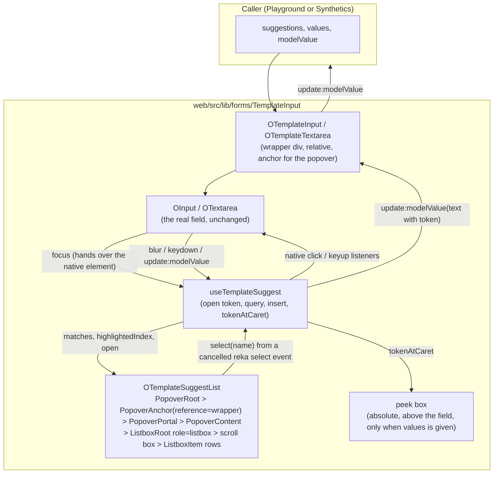
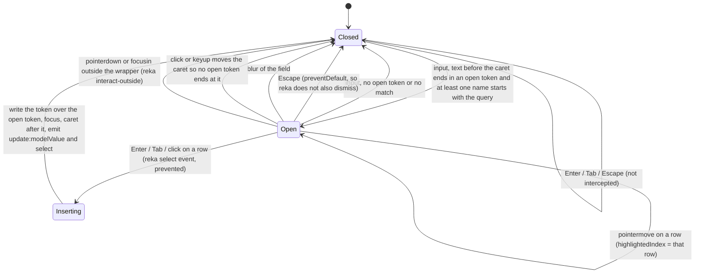
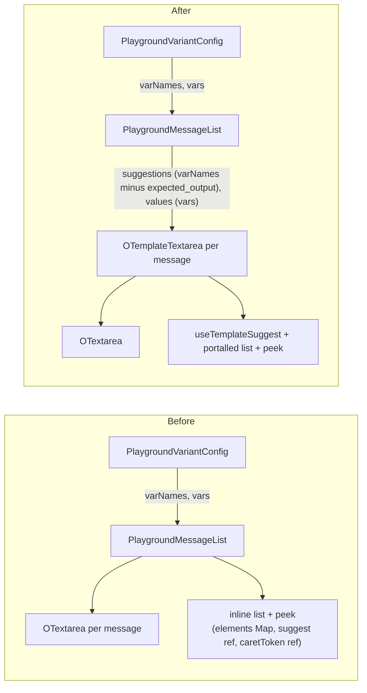
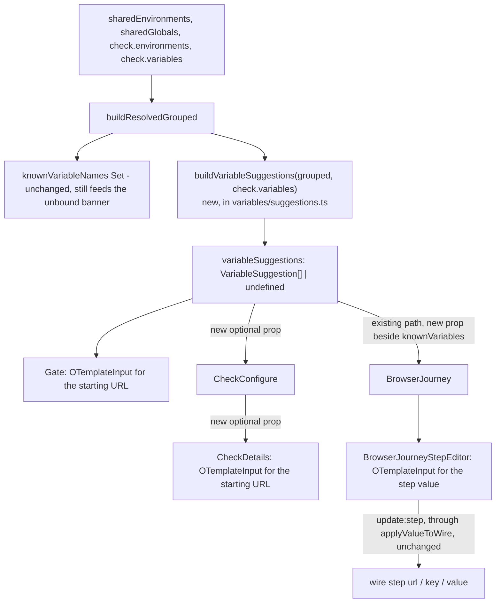
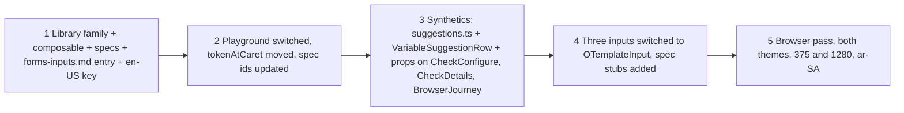

# Variable suggestions in text fields: one library component for the LLM Playground and Synthetics

Date: 2026-09-22 (revision 4, after five cold reviews)
Branch: `feat/synthetics-shared-variables` in `openobserve`
Fulfils: rank 11 in `synthetics-shared-variables-issue-review.md` ("Variable picker on `{{`"), design §9.5 in `2026-08-27-shared-variables-and-environments-design.md`
Source of the pattern: `PlaygroundMessageList.vue` in the LLM Playground

## 1. What this document is

1. This document designs one component family in `web/src/lib/` that offers variable suggestions when the user types `{{` in a text field.
2. The LLM Playground already has this behaviour, written inline in one component. The design moves that behaviour into the library so Synthetics can use it too.
3. Every place where the new component changes what the Playground or Synthetics does today is marked with **DIVERGENCE** and a number. Section 9 lists them all in one table.
4. Terms used below:
   - A "token" is the text `{{NAME}}` inside a field.
   - An "open token" is `{{` followed by optional spaces and zero or more name characters, with no closing `}}` yet, ending at the caret.
   - The "caret" is the text cursor position inside the field.
   - A "suggestion" is one name the list offers.
   - The "peek" is the small box that shows a variable's value when the caret sits inside its token.
   - The "native element" is the real `<input>` or `<textarea>` inside `OInput` or `OTextarea`.

## 2. What exists today

### 2.1 LLM Playground

1. The `{{` list lives inline in [PlaygroundMessageList.vue:156](../web/src/enterprise/components/AIObservability/PlaygroundMessageList.vue#L156) (template) and [PlaygroundMessageList.vue:400](../web/src/enterprise/components/AIObservability/PlaygroundMessageList.vue#L400) (script). One block serves the system row and every user, assistant, and tool row.
2. The field is `OTextarea`. It emits `focus`, `blur`, and `keydown` from the native element ([OTextarea.vue:176](../web/src/lib/forms/Input/OTextarea.vue#L176)). It does not emit `click` or `keyup`. It has no `defineExpose`, so the list code takes the native element from the `focus` event target and adds native `click` and `keyup` listeners to it once ([PlaygroundMessageList.vue:488](../web/src/enterprise/components/AIObservability/PlaygroundMessageList.vue#L488)). Those listeners are never removed.
3. The behaviour, in order:
   - On input, take the text before the caret. If it matches `/\{\{([A-Za-z0-9_]*)$/`, the list opens with the captured text as the query. Otherwise the list closes.
   - The list shows names that start with the query, case-insensitive. The name `expected_output` is never offered.
   - ArrowDown and ArrowUp move the active row, and wrap around.
   - Enter or Tab inserts `{{NAME}}` in place of the open token, closes the list, calls `focus()` on the native element, and puts the caret after the token with `setSelectionRange` inside `requestAnimationFrame`.
   - Escape closes the list. Blur closes the list.
   - A mouse click on a row inserts the same way. The click uses `mousedown.prevent`, so the field keeps focus.
4. A second overlay, the peek, shows the value of the token the caret sits inside. Its triggers are input, focus, native click, and native keyup. It waits 300 ms before it shows. It stays while the caret moves inside the same token, and hides at once when the token name changes or the caret leaves every token. It shows `—` for a known name with an empty value and nothing for an unknown name. It renders above the field, the list renders below. Both literals (`—` and `{{name}}`) pass through `raw()` so the i18n literal lint accepts them.
5. The helper `tokenAtCaret` lives in [playgroundDraft.ts:217](../web/src/enterprise/views/AIObservability/playgroundDraft.ts#L217). It runs on the module-private `VARIABLE_PATTERN`, which `renderTemplate` and `extractVars` also use. Its tests are in `playgroundDraft.spec.ts`.
6. The list and the peek use native `<div>` and `<button>` elements with the `dropdown-*` tokens ([component.css:148](../web/src/lib/styles/tokens/component.css#L148)). There is no library component for them.
7. The parent passes `varNames` (names to offer) and `vars` (values for the peek) ([PlaygroundVariantConfig.vue:12](../web/src/enterprise/components/AIObservability/PlaygroundVariantConfig.vue#L12)).
8. Tests: `PlaygroundMessageList.spec.ts` covers the peek (delay, outside a token, unknown name, blur, cancel, unmount). It mounts the real `OTextarea` and finds the native element by `data-test="...-field"`. Its first test (tool-result layout) stubs `OTextarea` by name.

### 2.2 Synthetics

1. For a browser check, variables are substituted at run time in four places, and only there:
   - The starting URL, on the server ([job_api.rs:1163](../src/synthetics/src/job_api.rs#L1163)).
   - A step's `value`, `url`, and `key`, on the probe (`synthetics-browser-probe/src/runner.ts:44`).
2. In the web app those four places are three inputs, all `OInput`:
   - The starting URL on the gate screen ([CreateBrowserTest.vue:1023](../web/src/views/synthetics/CreateBrowserTest.vue#L1023)). It uses the `prefix` slot for a link icon and `@blur="validateGateUrl"`.
   - The starting URL on Configure > Details ([CheckDetails.vue:150](../web/src/components/synthetics/configure/CheckDetails.vue#L150)).
   - The step value input ([BrowserJourneyStepEditor.vue:458](../web/src/components/synthetics/journey/BrowserJourneyStepEditor.vue#L458)). It uses the `tooltip` slot.
3. The step value input renders for the seven actions in `VALUE_ACTIONS` ([synthetics.ts:89](../web/src/constants/synthetics.ts#L89)), but only four of them reach a substituted field. `v2Value` in [buildV2Steps.ts:101](../web/src/utils/synthetics/buildV2Steps.ts#L101) maps `navigate` to `url`, `press` to `key`, `type` and `select` to `value`, and `upload` to `files`. The probe does not substitute `files`. `scroll` and `wait` are in `RETIRED_ACTIONS` ([synthetics.ts:121](../web/src/constants/synthetics.ts#L121)) and store no value.
4. `applyValueToWire` in [mapRecordedStep.ts:102](../web/src/utils/synthetics/mapRecordedStep.ts#L102) spreads the editor's one value into `url`, `key`, `text`, `files`, `options`, or `value` by action. The replay path through the recorder extension is a separate substitution surface in `playwright-crx` and is not covered by this design.
5. For a browser check, assertion `expected`, headers, cookies, auth, the step name, and the check's name, description, folder, and tags are never substituted. The server only validates them ([synthetics.rs:1542](../src/config/src/meta/synthetics.rs#L1542)) and the probe never reads them. They must not get the list. On Configure > Details only the starting URL qualifies. An HTTP check substitutes its target on the server through the same path. HTTP checks are out of scope here.
6. `OInput` emits `focus`, `blur`, and `keydown` the same way `OTextarea` does ([OInput.types.ts:108](../web/src/lib/forms/Input/OInput.types.ts#L108)). It also emits `clear`, `keyup`, `keypress`, and `paste`. It exposes only `focus()`.
7. Both `OInput` and `OTextarea` set `inheritAttrs: false`, bind every attribute except `tabindex` onto their root `<div>`, and append `-field` to the consumer's `data-test` on the native element ([OInput.vue:324](../web/src/lib/forms/Input/OInput.vue#L324), [OTextarea.vue:165](../web/src/lib/forms/Input/OTextarea.vue#L165)). An `aria-*` attribute passed from outside lands on the root `<div>`, not on the native element.
8. The known-name set exists already. `knownVariableNames` in [CreateBrowserTest.vue:944](../web/src/views/synthetics/CreateBrowserTest.vue#L944) builds it from `buildResolvedGrouped`. It is `undefined` until the shared tiers load. The set travels as `knownVariables` from [CreateBrowserTest.vue:1182](../web/src/views/synthetics/CreateBrowserTest.vue#L1182) to `BrowserJourney` to `BrowserJourneyStepEditor`, where `unboundPlaceholders` drives the warning banner. `CheckConfigure` and `CheckDetails` receive no variable prop today.
9. `inheritedUnion(grouped, localNames)` in `resolved.ts` returns, per shared name: the environment names, whether it is global, whether it is a secret, and whether a check-tier row of the same name overrides it. `buildResolvedGrouped` maps every check-tier row to `kind: "plain"` ([resolved.ts:148](../web/src/components/synthetics/variables/resolved.ts#L148)), but the check-tier data has a `secure` flag ([synthetics.ts:661](../web/src/types/synthetics.ts#L661)) that `CheckVariablesPanel.vue` sets.
10. `SyntheticsInheritedVariables.vue` draws a shared row as four parts. The icon is `public` when `row.global && !row.envs.length`, else `layers`. The name is in mono, struck through when overridden. A `warning` icon shows when `coverageGaps` reports the name missing in a selected environment. A `lock` icon shows for a secret.
11. Both tiers store the name as typed. Commit `15dadbbe3e` on this branch removed the server and form upper-casing that rank 4 of the review doc described. Matching is exact and case-sensitive on both sides ([placeholders.ts:26](../web/src/components/synthetics/variables/placeholders.ts#L26), `runner.ts:43`). A user who types `{{baseUrl}}` for a stored `BaseUrl` gets the literal text at run time.
12. Existing specs stub `OInput` by name: `CreateBrowserTest.spec.ts` (a hand-rolled stub that emits `update:modelValue` and `blur`) and `BrowserJourney.spec.ts` (`OInputStub`). They find the gate URL by `[data-test="synthetics-create-url-input"]`.

### 2.3 Why the Playground code cannot be imported as it is

1. It lives under `web/src/enterprise/`. OSS code such as `web/src/components/synthetics/` does not import from there. No eslint rule enforces this. It is a build convention.
2. It is not a composable and not a component. It is state and handlers inside a 543-line component.
3. It is keyed by `messageId` in a `Map` of native elements, because one block serves many fields. A single field does not need the map.


### 2.4 Why `OCombobox` is not extended

1. The ui-architect catalog (`forms-inputs.md`) names `OCombobox` as the component for typed text with a suggestion list, and `creating-components.md` §9.1 requires this check before a new component. The check was done, and the answer is a separate family, for four reasons.
2. `OCombobox` is list first. Its list opens on focus and on click ([OCombobox.vue:213](../web/src/lib/forms/Combobox/OCombobox.vue#L213)). Here the field is first and the list is short-lived. It must open only while an open `{{` sits under the caret.
3. Its input is reka's `ComboboxInput`, not `OInput` or `OTextarea`. The Playground needs a multi-line field with `autogrow` and `maxRows`, and the Synthetics gate needs the `prefix` slot. Swapping the field would change how all four inputs look and behave, and change their `data-test` suffix.
4. Its `onSelect` replaces the whole text ([OCombobox.vue:147](../web/src/lib/forms/Combobox/OCombobox.vue#L147)). Insertion here replaces only the open token at the caret and keeps the rest of the text.
5. It has no peek. Reka's raw `ComboboxRoot` has the same first three limits, so it is not used either.
6. `forms-inputs.md` gets a "Don't use for" line on both components pointing at the other.

## 3. Goals and non-goals

1. Goals:
   - One library component family that any text field can use to offer `{{NAME}}` suggestions.
   - The Playground keeps every behaviour in section 2.1, including the peek and its tests.
   - Synthetics gets the list on the three inputs in section 2.2, with the scope and secret decoration that design §9.5 asks for.
   - No app logic in the library: no store, no router, no synthetics or playground types, no app i18n keys. A `components.*` key for the library's own accessible name is the lib convention (78 lib files use `useI18nTyped`, including `OCombobox` and `OInput`), not app logic.
2. Non-goals:
   - Replacing recorded literals with a variable (review doc, rank 12).
   - A peek for Synthetics. A value differs per environment and a secret has none. Section 8 lists it as a follow-up.
   - Any change to `OInput` or `OTextarea`. This rules out ARIA on the native element (see §4.7.8).
   - HTTP checks and the recorder extension's replay substitution.

## 4. The component family

### 4.1 Location and files

```
web/src/lib/forms/TemplateInput/
├── OTemplateInput.vue            # single line, wraps OInput
├── OTemplateInput.types.ts       # owns TemplateSuggestion, re-exports the sub-component types
├── OTemplateInput.spec.ts
├── OTemplateTextarea.vue         # multi line, wraps OTextarea
├── OTemplateTextarea.types.ts
├── OTemplateTextarea.spec.ts
├── OTemplateOverlay.vue          # the peek box and the list together, rendered by both wrappers
├── OTemplateOverlay.types.ts
├── OTemplateSuggestList.vue      # the popover, listbox, and rows, shared by both
├── OTemplateSuggestList.types.ts
├── OTemplateSuggestList.spec.ts
├── useTemplateSuggest.ts         # open-token detection, insertion, token grammar, tokenAtCaret, tokenFor
└── useTemplateSuggest.spec.ts
```

1. Both wrappers ship together. The family rule forbids shipping one without the other.
2. `OTemplateSuggestList` is a sub-component. Callers do not use it alone. It owns the reka `PopoverRoot`, so it mounts on its own in a spec. `OTemplateOverlay` is the second sub-component: it holds the peek box and the list, so the two wrappers render `<OTemplateOverlay :suggest :boundary :data-test>` instead of repeating both blocks. It adds no element of its own and changes no `data-test`.
3. `tokenFor(name)` lives with the two token regexes and `tokenAtCaret` in `useTemplateSuggest.ts`. One token grammar, one file: the list, the peek, and the insertion cannot drift apart.
4. `TemplateSuggestion` lives in the root member's types file, `OTemplateInput.types.ts`, and the other two import it, per the folder contract.
5. The composable and its spec are co-located, as `useToast.ts` and `useToast.spec.ts` are in `lib/feedback/Toast/`.
6. Styling matches the current library files, which use bare Tailwind classes (see `OCombobox.vue`). The `o2-component-create` skill text says `tw:` prefix. The code is the ground truth, so no prefix.
7. Positioning and alignment use logical properties (start and end instead of left and right, so right-to-left locales mirror them), as the library does: `start-0`, `text-start`, `ps-*`, `pe-*`.
8. The family is registered in the ui-architect catalog, `.claude/skills/ui-architect/references/forms-inputs.md`, in the same PR (`creating-components.md` §11). The `o2-component-usage` catalog outside the repo is a follow-up.

### 4.2 Structure



### 4.3 Props (shared by both wrappers)

| Prop | Type | Meaning |
| --- | --- | --- |
| `modelValue` | `string` | The field text. Narrower than `OInput`'s `string \| number`. |
| `suggestions` | `TemplateSuggestion[]` | Names to offer. Order is the display order. When `undefined` or empty, the wrapper behaves as a plain field. |
| `values` | `Record<string, string>` (optional) | Values for the peek. Present turns the peek on. Absent means no peek. There is no separate `showPeek` flag. |
| field props | passthrough | `OTemplateInput` re-binds every `InputProps` member except the ones in item 4. `OTemplateTextarea` re-binds every `TextareaProps` member. |

1. `TemplateSuggestion` is `{ name: string }`. `name` is an identifier, not copy, so it is a plain `string`. The caller may attach any extra fields. The list hands the whole object to the `suggestion` slot, so the caller draws its own decoration without the library knowing what a scope or a secret is.
2. There is no `exclude` prop. A caller that must hide a name filters `suggestions` before it passes them. The Playground does this for `expected_output`. **DIVERGENCE 1**, see section 9.
3. Forwarding pattern: the wrapper sets `defineOptions({ inheritAttrs: false })`, its `.types.ts` extends the field's props type with `Omit` for the keys in item 4, and the template re-binds each prop by name (including `id`, which is a declared prop on both fields), the way `OFormInput.vue` does. `$attrs` is bound onto the field, so `data-test`, `class`, and any listener the wrapper does not declare (for example `@keyup`, `@paste`, `@clear`) land on the field root and nowhere else. The wrapper root carries only `relative min-w-0`.
4. Unsupported on `OTemplateInput`: `debounce`, `mask`, `modelModifiers`, `revealable`, and any `type` other than `text` and `url`. The list opens from `update:modelValue` and inserts at `selectionStart`. A debounced or rewritten emit desynchronises the caret from the text, and `selectionStart` is `null` on a number input. The types file omits these keys. None of the three Synthetics inputs and no Playground field use them.
5. The three prop categories the library allows are size, variant, and state. `suggestions` and `values` are data props, like `items` on `OCombobox`. They do not change any CSS value.

### 4.4 Emits

| Emit | When |
| --- | --- |
| `update:modelValue` | On every keystroke (the wrapped field emits without debounce), and once more on accept with the token inserted. |
| `select` | `[name]`, after a suggestion is inserted. |
| `focus`, `blur`, `keydown` | Declared and re-emitted, so the gate URL keeps `@blur="validateGateUrl"`. |
| every other field emit | Not declared. `clear`, `keyup`, `keypress`, `paste` reach the field through `$attrs`. |

### 4.5 Slots

| Wrapper | Forwarded slots |
| --- | --- |
| `OTemplateInput` | `icon-left`, `icon-right`, `prefix`, `suffix`, `tooltip`, `append` (the full `InputSlots`). The gate keeps its `#prefix` link icon, the step editor keeps its `#tooltip`. |
| `OTemplateTextarea` | `tooltip`, `append` (the full `TextareaSlots`). |
| both | `suggestion`, scoped, receives `{ suggestion, active }`. Default renders `{{name}}` in mono through `raw()`, as the Playground does. All three components are generic (`generic="T extends TemplateSuggestion"`), so a caller that passes `VariableSuggestion[]` gets `VariableSuggestion` in the slot without a cast. |

Neither wrapped field has a `label` slot. `label` is a prop.

### 4.6 `useTemplateSuggest`

1. The wrapper obtains the native element from the `focus` event target, as the Playground does, because neither field exposes it. On the first focus it adds native `click` and `keyup` listeners, whether or not `values` is given. On unmount it removes them and clears the peek timer. The Playground never removed its listeners. **DIVERGENCE 3** covers this.
2. The `click` and `keyup` listeners re-run the open-token check against `selectionStart`. If the caret has moved so that the text before it no longer ends in an open token (ArrowLeft past the `{{`, a click elsewhere in the text), the list closes. The Playground re-checks only on input, so today a caret moved left of the `{{` leaves a stale start and an accept duplicates text. **DIVERGENCE 14**.
3. State: `open` (`{ query, start } | null`), `highlightedIndex`, `matches` (computed), `peekName`, `peekTimer`.
4. Return shape, `UseTemplateSuggestReturn` in `OTemplateInput.types.ts`: the refs above plus `onFocus(event)`, `onInput(text)`, `onCaretMove()`, `onKeydown(event)`, `onBlur()`, `accept(name)`, `close()`. The composable takes the wrapper's `emit` so `accept` can emit `update:modelValue` and `select` itself.
5. Token grammar, owned by the library and exported:
   - `TEMPLATE_TOKEN = /\{\{\s*([A-Za-z_]\w*)\s*\}\}/g` for a closed token. It accepts inner spaces, like the Synthetics probe and `placeholders.ts`, and requires a name that starts with a letter or underscore, like the Playground's `VARIABLE_PATTERN`.
   - `OPEN_TOKEN = /\{\{\s*([A-Za-z0-9_]*)$/` for the text before the caret. The Playground's regex has no `\s*`. **DIVERGENCE 10**.
   - `tokenAtCaret(text, caret)` moves here, on `TEMPLATE_TOKEN`. The Playground's `renderTemplate` and `extractVars` keep their own `VARIABLE_PATTERN` and do not change.
   - One caveat for the URL fields: the server rejects a starting URL that contains `{{` together with whitespace ([synthetics.rs:1401](../src/config/src/meta/synthetics.rs#L1401)). Insertion writes `{{NAME}}` with no spaces, so the list never produces a rejected URL.
6. The matcher is `startsWith` on lower-cased text, on both sides, as today.
7. `accept` reads the text from the native element, not from the prop, writes `text.slice(0, open.start) + "{{NAME}}" + text.slice(caret)`, emits, closes, then inside `requestAnimationFrame` calls `focus()` and `setSelectionRange` on the native element.

### 4.7 The list, built the `OSelect` way

The list copies the structure `OSelect` uses for its listbox mode ([OSelect.vue:1309](../web/src/lib/forms/Select/OSelect.vue#L1309) onward), with the changes a field-first list needs. Every item below was verified against reka-ui 2.10.1.

1. Structure: `PopoverRoot`, `PopoverAnchor`, `PopoverPortal`, `PopoverContent`, then `ListboxRoot`, then a scroll box, then one `ListboxItem` per match. `OTemplateSuggestList` owns the `PopoverRoot`. Its `open` prop is `open !== null && matches.length > 0`, and it listens to `@update:open` and calls `close()` when reka reports `false`. This matters because reka's dismiss (outside click, focus leaving, its own Escape) only emits `update:open` when `open` is bound ([PopoverRoot.js:32](../web/node_modules/reka-ui/dist/Popover/PopoverRoot.js#L32)). Without the listener the list would stay rendered after an outside click and the next Enter would still insert. `close()` is the single sink for Escape, blur, caret movement, and reka dismiss. `PopoverAnchor` renders as an empty sibling `div` with `:reference` set to the native element, so the list docks under the input box itself, not under the field's help or error row, and the peek sits above the box. No lib component uses `PopoverAnchor` today. `OCombobox`'s `ComboboxAnchor` is the nearest existing example.
2. `PopoverContent` props, copied from `OSelect` with three additions: `align="start"`, `:side-offset="4"`, `:hide-when-detached="true"`, `:disable-outside-pointer-events="false"`, and new `@open-auto-focus.prevent`, `@interact-outside` guarded, `:collision-padding="lgUp ? 0 : 8"`. Reasons:
   - `@open-auto-focus.prevent` is mandatory. `PopoverContent` wraps its children in a `FocusScope` that focuses the first tabbable row on open unless the mount event is prevented ([FocusScope.js:96](../web/node_modules/reka-ui/dist/FocusScope/FocusScope.js#L96)). Without it the list steals focus from the field and then dismisses itself when focus returns. `OSelect` does not need it because it wants focus in its own search input.
   - `@interact-outside` calls `preventDefault()` when the event target is inside the wrapper div. A non-modal popover with no `PopoverTrigger` has no outside-click exemption ([PopoverContentNonModal.js:138](../web/node_modules/reka-ui/dist/Popover/PopoverContentNonModal.js#L138)), so a click into the field to move the caret would close the list.
   - `collision-padding` of 8 below `lg` is the `responsive.md` viewport margin. `OSelect`'s listbox branch omits it. Do not copy that gap.
   - Non-modal is not what keeps focus in the field. The two handlers above are.
3. Rows are reka `ListboxItem` (`<div role="option">` with an `id`, `aria-selected`, `data-state`). Each row has `@mousedown.prevent` (rows carry a `tabindex`, so a plain mousedown would focus them) and `@select` bound to a handler that calls `event.preventDefault()` and then `accept(name)`. reka's `handleSelect` returns before `onValueChange` and `changeHighlight` when the event is prevented ([ListboxItem.js:47](../web/node_modules/reka-ui/dist/Listbox/ListboxItem.js#L47)), so the row is never focused and the root's toggle behaviour never fires. The `ListboxRoot` is uncontrolled: no `model-value`, ever. A controlled model change calls `changeHighlight` with focus and steals focus from the field.
4. Highlight is our own `highlightedIndex`, as in `OSelect`. The wrapper forwards the field's `keydown` to the handler: ArrowDown and ArrowUp move with wrap-around, Enter and Tab insert the highlighted name, Escape closes. After every arrow move the list calls `virtualizer.scrollToIndex(highlightedIndex, { align: "auto" })`, the way `OSelect`'s `scrollHighlightedIntoView` does ([OSelect.vue:702](../web/src/lib/forms/Select/OSelect.vue#L702)), because reka never scrolls a row this design highlights. Row `pointermove` sets the index, so hovering changes what Enter inserts. The Playground rows have no hover handler today. **DIVERGENCE 15**. Leaving the list does not clear the index, so Enter always inserts while the list is open. The highlight class is `bg-select-item-hover-bg` when `index === highlightedIndex`. Never style `data-highlighted:`. reka marks the first row highlighted on mount on its own, regardless of our index.
5. reka does not wrap at the ends, clears its own highlight on pointer leave, and toggles a repeated selection to `undefined`. None of that reaches the user, because the list never uses reka's highlight or model. This is why the design copies `OSelect` instead of a context bridge (a small component that reaches into reka's root state to drive its highlight).
6. Tokens and classes: content `z-10001 w-56 flex flex-col overflow-hidden rounded-default shadow-md bg-select-content-bg border border-select-content-border`, scroll box `overflow-y-auto p-1`, row `flex items-center gap-2 px-2 py-1 text-xs font-mono text-start rounded-default text-select-item-text cursor-pointer select-none outline-none`, active row adds `bg-select-item-hover-bg`. `shadow-md` is the Playground's shadow, kept so the look does not change (`OSelect` uses `shadow-lg`). The border uses the select family's own token, `border-select-content-border`, rather than `OSelect`'s mixed `border-dropdown-border`. The colour tokens resolve to the same values as the Playground's `dropdown-*` ones. `w-56` (14 rem) is narrower than any verified viewport, so no `min()` form is needed. The width is not bound to the field, so the Playground keeps its 14 rem list. The height is capped once, on the content: `min(18rem, var(--reka-popover-content-available-height, 18rem))`, as `OSelect` does, so the list shrinks before it flips.
7. ARIA, stated honestly. `ListboxRoot` renders no role of its own ([ListboxRoot.js:307](../web/node_modules/reka-ui/dist/Listbox/ListboxRoot.js#L307)), so the list sets `role="listbox"` and an `aria-label` from `t("components.templateInput.suggestions")` on it. reka's `aria-selected` on a row reflects the root's model, which is never set, so it is always `false`. The active row is visual only until field-side `aria-activedescendant` exists (§8.4). `PopoverContent` adds `role="dialog"` with an empty `aria-labelledby`, because there is no trigger.
8. No ARIA is set on the native element, because `OInput` and `OTextarea` would put it on their root `<div>` (§2.2.7) and this design does not change them.
9. Virtualisation, always on. The scroll box renders rows through `useVirtualizer` from `@tanstack/vue-virtual` (already a dependency through `OSelect`) with `measureElement` on each row, because the `suggestion` slot can make rows taller than a fixed estimate. One render path, not two. The list can grow: `inheritedUnion` unions names across every selected environment and nothing truncates it (`RESOLVED_VARIABLE_CAP` only drives a hint in `CheckVariablesPanel.vue`). In jsdom the virtualizer renders nothing when the scroll element has no size ([virtual-core index.js:724](../web/node_modules/@tanstack/virtual-core/dist/esm/index.js#L724)), so the lib specs stub `Element.prototype.getBoundingClientRect` the way `OTable.spec.ts` does. The virtual rows need `:style` bindings for the spacer height and each row's transform, as `OSelect` has. That is the one sanctioned inline style, a JS-computed length.
10. Popper flip. `sideFlip` and `avoidCollisions` default on, so near the bottom of the viewport the list flips above the field, where the peek sits. The peek hides while the list is open. **DIVERGENCE 12**.
11. Escape. The field's `keydown` handler calls `preventDefault()` on Escape only while the list is open, which also suppresses reka's window-level dismiss. While the list is closed Escape passes through, so an enclosing `ODialog` or `ODrawer` still closes. reka's highest-layer rule keeps the dialog open when the list consumes Escape.
12. RTL: `App.vue` wraps the app in reka's `ConfigProvider` with the layout direction, so `align="start"` flips with the locale. Test with `ar-SA`.

### 4.8 The peek

1. Renders only when `values` is given, and never while the list is open.
2. Same rules as today: triggers are input, focus, native click, native keyup. 300 ms delay before show. Stays while the caret moves inside the same token. Hides at once when the token name changes or the caret leaves every token. `—` for a known name with an empty value, nothing for an unknown name. Cleared on blur and on unmount.
3. It is an absolute box above the field: `absolute bottom-full start-0 z-10 mb-1 max-w-72 border px-2 py-1.5 shadow-md rounded-default bg-select-content-bg border-select-content-border`. This is the one place the design keeps floating UI outside a portal, against `responsive.md`. The peek is passive, short, never takes focus or keys, and today only the Playground renders it, inside a column that does not clip above its first field. The exception is stated and scoped to that.
4. The `—` text and the `{{name}}` label pass through `raw()`, as the Playground does, so the i18n literal lint accepts them.

### 4.9 `data-test` contract

1. The wrapper forwards the consumer's `data-test` to the field through `$attrs`. Both fields append `-field` for the native element. The wrapper root itself carries no `data-test`, so `[data-test="synthetics-create-url-input"]` still resolves to one element, the field root, and the existing spec selectors keep working.
2. The list appends `-suggest` on the `PopoverContent`, `-suggest-item-{name}` on each row with the name as stored, and `-peek` on the peek. The name keeps its case because matching is case-sensitive and `Foo` and `foo` can both exist. This is the one place the id is not kebab-case, as in the Playground today. `data-test` on a `ListboxItem` lands on the option div. Rows live in a portal, so specs query `document.body`, not the wrapper.

## 5. Keystroke flow



1. Enter and Tab are intercepted only while the list is open with at least one match. Otherwise they reach the field as normal.
2. A pointerdown inside the wrapper (moving the caret in the field) does not close the list. The `@interact-outside` guard exempts it.
3. The insert reads the text from the native element, not from the prop. The prop only catches up after the parent flushes the keystroke that opened the list. This is the rule the Playground follows today.

## 6. How each caller uses it

### 6.1 LLM Playground



1. `PlaygroundMessageList.vue` replaces `OTextarea` with `OTemplateTextarea` for the message content field and passes the same props as today (`rows`, `maxRows`, `size`, `autogrow`, `placeholder`, `data-test`).
2. The `suggest`, `activeIndex`, `elements`, `caretToken`, `caretTokenTimer` state, the handlers `onInput`, `accept`, `onKeydown`, `onFocus`, `onBlur`, `updateCaretToken`, `clearCaretTokenTimer`, the `caretTokenValue` computed, and the `tokenAtCaret` import are deleted from the component. About 145 lines leave the file (lines 400 to 542 plus the imports). The multi-line comments in that block are not carried over. The project rule is one line, why only.
3. The tool-arguments field (`toolArguments`) stays `OTextarea`. It has no list today.
4. `tokenAtCaret` is deleted from `playgroundDraft.ts`. Its tests move from `playgroundDraft.spec.ts` to `useTemplateSuggest.spec.ts`. `renderTemplate`, `extractVars`, and `VARIABLE_PATTERN` stay where they are.
5. **DIVERGENCE 1**: the `expected_output` exclusion moves from `matches` inside the component to the `suggestions` computed in `PlaygroundMessageList.vue`. The list offers the same names as before.
6. **DIVERGENCE 2**: the `data-test` ids change. `ai-playground-var-suggest-{id}` becomes `ai-playground-message-input-{id}-suggest`, `ai-playground-var-suggest-item-{name}` becomes `ai-playground-message-input-{id}-suggest-item-{name}`, and `ai-playground-var-value-{id}` becomes `ai-playground-message-input-{id}-peek`. Only `PlaygroundMessageList.spec.ts` references the old ids. No end-to-end test does.
7. **DIVERGENCE 3**: today one `suggest` ref is shared by every message, so an open list in message A closes when the user types in message B. After, each field owns its list. The user must blur A to type in B, and blur closes A's list. The visible result is the same. Two side effects: the native listeners are now removed on unmount, and a message field that is re-created for the same id gets listeners again. Today the `elements.has()` guard skipped it.
8. **DIVERGENCE 4**: the wrapper `<div class="relative min-w-0">` that positions the peek moves inside the library component. The caller keeps its own wrapper for the `@min-[28rem]/variant:col-span-2` grid class, so the DOM gains one nesting level. No visual change is expected. Confirm in the browser.
9. **DIVERGENCE 5**: the list gains `role="listbox"` with an accessible name, and rows are `role="option"`. The native element gets no ARIA, and `aria-selected` on rows is always `false` (§4.7.7). Screen readers announce the list and its rows, not the active one.
10. **DIVERGENCE 10**: `{{ ` followed by a space keeps the list open. Today it closes it. This matches the closed-token grammar, which already accepts spaces.
11. **DIVERGENCE 11**: the list is in a portal with popper positioning instead of an absolute box. It is no longer clipped by a column's scroll area, and it flips above the field near the bottom of the viewport. Same 14 rem width, same tokens (`select-*` resolve to the same values as `dropdown-*`), so the look does not change. Confirm in the browser.
12. **DIVERGENCE 12**: the peek hides while the list is open. Today both can show at once (the Playground comment at line 177 describes that case).
13. **DIVERGENCE 13**: a row inserts on `click` (reka) instead of `mousedown`. The user sees no difference. The spec wording changes.

### 6.2 Synthetics



1. New constant in `constants/synthetics.ts`, next to `VALUE_ACTIONS`: `SUBSTITUTED_VALUE_ACTIONS: readonly StepAction[] = ["navigate", "type", "select", "press"]`. These are the actions whose value reaches `url`, `key`, or `value` (§2.2.3).
2. New file `web/src/components/synthetics/variables/suggestions.ts`:
   - `interface VariableSuggestion extends TemplateSuggestion { envs: string[]; global: boolean; secret: boolean; gap: string[] }`.
   - `buildVariableSuggestions(grouped, checkVariables)`:
     1. `localNames = new Set(checkVariables.map((v) => v.name.trim()))`.
     2. Check-tier rows first, from `checkVariables` directly, alphabetical: `{ name: v.name, envs: [], global: false, secret: Boolean(v.secure), gap: [] }`. The name is carried as stored, untrimmed, because `buildResolvedGrouped` keeps it untrimmed too ([resolved.ts:148](../web/src/components/synthetics/variables/resolved.ts#L148)) and the invariant below compares the two. They come from the raw data, not from `buildResolvedGrouped`, because that helper drops the `secure` flag (§2.2.9).
     3. Then `inheritedUnion(grouped, localNames).filter((r) => !r.overridden)`, alphabetical, with `gap` from `coverageGaps(grouped)`.
   - Invariant, asserted in a spec: every suggestion name is in `knownVariableNames`. The unbound banner in the step editor reads the set, and it must never warn about a name the list just inserted.
3. `CreateBrowserTest.vue` adds one computed, `variableSuggestions`, next to `knownVariableNames`. It is `undefined` until `sharedVariablesLoaded`, like the set, and `buildVariableSuggestions(grouped, check.value.variables ?? [])` after. `CheckVariablesPanel.vue` builds a similar union from its own fetch. It stays as it is. The computed lives in `CreateBrowserTest.vue` only.
4. Threading:
   - Gate: the computed is in scope already.
   - `CheckConfigure` and `CheckDetails` each gain an optional prop `variableSuggestions?: VariableSuggestion[]`. `CreateBrowserTest` passes it to `CheckConfigure`, which passes it to `CheckDetails`. `CreateProtocolCheck.vue` shares `CheckConfigure` and passes nothing, so the HTTP target field stays a plain input (§3.2).
   - `BrowserJourney` gains the same optional prop beside `knownVariables` and passes it to `BrowserJourneyStepEditor`. `BrowserJourneyStep.vue` also renders the editor and passes nothing, so it gets a plain input.
5. The three inputs in §2.2.2 change from `OInput` to `OTemplateInput`. Every existing prop, slot, `data-test`, and event handler stays. The step editor passes `:suggestions="SUBSTITUTED_VALUE_ACTIONS.includes(step.action) ? variableSuggestions : undefined"`, so an `upload`, `scroll`, or `wait` value input behaves as a plain field.
6. The step editor renders inside `OTable` (`BrowserJourney.vue` fills `JourneySteps`' expansion slot, which `JourneySteps.vue:386` forwards to `OTable`). `OTable`'s root is `overflow-hidden` and its scroll area is `overflow-y-auto` ([OTable.vue:1234](../web/src/lib/core/Table/OTable.vue#L1234)). A non-portalled list on the last step row would sit in the table's scroll overflow. The portal in §4.7 is what makes the list usable there.
7. The write path does not change: `valueComputed` to `update()` to `applyValueToWire` to the wire step. Replay and recording read the wire step as before.
8. Each Synthetics caller fills the `suggestion` slot with a new component, `VariableSuggestionRow.vue` in `web/src/components/synthetics/variables/`, props `{ suggestion: VariableSuggestion; active: boolean }`. It draws one line:
   - Scope icon with the exact rule from `SyntheticsInheritedVariables.vue`: `public` when `global && !envs.length`, else `layers`, with the `aria-label` following the same either/or: `synthetics.variables.global` when `global && !envs.length`, else the environment names, and absent when there are none.
   - The name in mono.
   - The environment names in secondary text, truncated. Open question 1 in §10.
   - A `warning` icon with the `coverageGaps` tooltip when `gap` is not empty. A name with a gap resolves to literal text in one environment, which is the failure the list exists to prevent.
   - A `lock` icon with `synthetics.variablesPanel.secretTooltip` when `secret`.
   - No new Synthetics i18n keys. Every string above exists for the inherited panel. The one new key in this work is the library's `components.templateInput.suggestions`.
9. No `values` prop is passed. Synthetics gets no peek.
10. **DIVERGENCE 6** (from the review doc, rank 11): that section proposed a composable inside `components/synthetics/variables/`. This design puts the shared part in the library instead, because the Playground needs the same thing. The visible behaviour is what rank 11 asked for.
11. **DIVERGENCE 7**: accepting a suggestion writes the stored spelling of the name, so a case typo is impossible when the user picks from the list. A user who ignores the list can still type a wrong case. Rank 4 of the review doc asked for the upper-casing to be visible. Commit `15dadbbe3e` removed the upper-casing instead, so that item is closed and this design does not depend on it.
12. **DIVERGENCE 8**: Tab in a Synthetics input inserts the active row while the list is open, instead of moving focus. This is the Playground rule and is new for these inputs. Escape then Tab moves focus as before.
13. **DIVERGENCE 9**: the list hides an overridden shared row and offers the check-tier row of the same name instead. `SyntheticsInheritedVariables.vue` shows the overridden row struck through. The two surfaces disagree on purpose. A struck row in a completion list is a row the user must not pick.
14. Known limit on the gate: for a new check, `commitGate` writes only `url` and `name` ([CreateBrowserTest.vue:541](../web/src/views/synthetics/CreateBrowserTest.vue#L541)), so `check.environments` and `check.variables` are empty there and the gate list holds global rows only. An edited check does not pass through the gate. Rank 3b in the review doc (environment picker on the gate) lifts this limit. The `variablesHint` string under the gate URL is owned by rank 4, which already rewrites it. This design does not change it.

## 7. Tests

Two seams (the boundaries where tests drive the code), agreed on 2026-09-22: the wrapper component mounted with the real field inside, and the pure `buildVariableSuggestions`. Callers get wiring-only specs.

1. `useTemplateSuggest.spec.ts`: opens on `{{`, opens on `{{ba` with query `ba`, opens on `{{ ba` (DIVERGENCE 10), stays closed on `{{NAME}}` (closed token), closes when the caret moves before the `{{`, filters case-insensitively, wraps on ArrowDown and ArrowUp, inserts at the caret and not at the end, places the caret after the token, does not intercept Enter or Escape when closed, closes on Escape and on blur, removes the native listeners on unmount. The `tokenAtCaret` tests from `playgroundDraft.spec.ts` move here.
2. `OTemplateTextarea.spec.ts`: mounts with `attachTo: document.body`, drives the native element found by `-field`, and queries rows on `document.body` because they are in a portal (pattern: `OSelect.spec.ts`). The peek tests move here from `PlaygroundMessageList.spec.ts` with the new `data-test` ids, unchanged in substance (delay, outside a token, unknown name, blur, cancel, unmount, stays inside the same token). Add: no peek renders when `values` is absent, and the peek hides while the list is open.
3. `OTemplateInput.spec.ts`: the list opens and inserts in a single-line field. The `prefix` and `tooltip` slots render. `blur` reaches the caller. The consumer's `data-test` lands on the field root and `-field` on the native element, with no duplicate on the wrapper root. A pointerdown inside the wrapper does not close the list.
4. `OTemplateSuggestList.spec.ts`: the default row renders `{{name}}`. The `suggestion` slot receives `suggestion` and `active`. A row click emits `select`; the insertion it causes, and `document.activeElement` still being the field afterwards, are covered end to end in `OTemplateInput.spec.ts`. `role="listbox"` with an `aria-label` and `role="option"` rows are present. The virtual spacer and row transforms render. The spec stubs `Element.prototype.getBoundingClientRect` so the virtualizer renders rows, the way `OTable.spec.ts` does, and `Element.prototype.scrollIntoView`, which jsdom lacks and no global setup provides (several specs stub it locally, for example `BrowserJourney.spec.ts`).
5. `PlaygroundMessageList.spec.ts`: keep the tool-result layout test and add `OTemplateTextarea` to its stubs, because the test stubs `OTextarea` by name and the real wrapper would otherwise mount. Replace the peek tests with one test that the message field is an `OTemplateTextarea` and receives `suggestions` without `expected_output` and `values` with it.
6. `suggestions.spec.ts`: check rows first, a secure check row has `secret: true`, an overridden shared row is absent, `gap` is filled, and every name is in `knownVariableNames` built from the same inputs. Prior art: `resolved.spec.ts`.
7. `BrowserJourneyStepEditor.spec.ts`: the value input receives `suggestions` for `type` and `undefined` for `upload`. Accepting a suggestion writes `{{NAME}}` into `step.value` and through `applyValueToWire` into the wire step.
8. `CreateBrowserTest.spec.ts` and `BrowserJourney.spec.ts`: add an `OTemplateInput` stub with the same shape as the existing `OInput` stub (forwards `data-test`, emits `update:modelValue` and `blur`). Without it the real library component mounts and the gate tests exercise un-stubbed code. `CreateBrowserTest.spec.ts` also asserts `variableSuggestions` is `undefined` before load and holds check-tier rows first after.
9. `CheckDetails.spec.ts`: the URL field renders with and without the new prop.
10. Manual, in the browser, light and dark, and at 375 and 1280: Playground list and peek unchanged in look, list flips above the field near the bottom and the peek hides, Synthetics rows readable at rest, the list on the last step row floats over the table, the gate link icon and the step editor tooltip present, a tap on a row on iOS keeps the field focused, `ar-SA` aligns the list to the start edge.

## 8. Order of work



1. Steps 1 and 2 go in one PR. The Playground is the proof that the library component carries every behaviour, and its spec is the regression net.
2. Steps 3 and 4 go in a second PR on `feat/synthetics-shared-variables`.
3. The library folder is OSS. The Playground is enterprise. The first PR touches both `web/src/lib/` and `web/src/enterprise/` in this repo, which is allowed. No o2-enterprise repo change is needed.
4. Each PR passes `npm run lint`, `npm run type-check:app`, `npm run format:check`, and `npm run test:unit` from `web/` before the `ready-for-ci` label goes on. The PR titles start with `feat:`, so the first line of each description is `Design at: #<issue>`.
5. Follow-ups, not in this design:
   - Field-side ARIA. The wrapper already holds the native element, so it could set `aria-autocomplete`, `aria-expanded`, and `aria-activedescendant` (reka rows have ids) imperatively without an `OInput`/`OTextarea` change. Deferred by choice, to keep the first PR a behaviour-preserving port. Controlling the `ListboxRoot` model to get a real `aria-selected` is not an option: it focuses the row.
   - A Synthetics peek that shows the replay environment's plain value, and "secret" for a secret.
   - Replace recorded literals with a variable (review doc, rank 12).
   - The list on the HTTP check target, which the server substitutes too.
   - Add the family to the `o2-component-usage` catalog outside the repo. `OCombobox` is missing from that catalog too.

## 9. All divergences in one table

| # | Side | What changes | Visible to the user | Where it is handled |
| --- | --- | --- | --- | --- |
| 1 | Playground | `expected_output` is filtered by the caller, not inside the list | No | §6.1.5 |
| 2 | Playground | `data-test` ids of the list and the peek | No, spec only | §6.1.6 |
| 3 | Playground | One list state per field, native listeners removed on unmount, re-created fields get listeners again | No | §4.6.1, §6.1.7 |
| 4 | Playground | One extra wrapper element around each message field | No, confirm in browser | §6.1.8 |
| 5 | Playground | `role="listbox"` with a name and `role="option"` rows, no ARIA on the field, `aria-selected` always false | Screen readers only | §6.1.9, §4.7.7 |
| 6 | Synthetics | Shared code lives in `web/src/lib/`, not in `components/synthetics/variables/` as rank 11 proposed | No | §6.2.10 |
| 7 | Synthetics | Accepting a suggestion writes the stored spelling of the name | Yes, no case typos from the list | §6.2.11 |
| 8 | Synthetics | Tab inserts while the list is open | Yes, new | §6.2.12 |
| 9 | Synthetics | Overridden shared rows are hidden from the list, struck through in the inherited panel | Yes, minor | §6.2.13 |
| 10 | Playground | `{{ ` with a space keeps the list open | Yes, minor | §4.6.4, §6.1.10 |
| 11 | Playground | List is portalled and popper-positioned: not clipped by a column, flips above the field near the viewport bottom | Yes, minor, confirm in browser | §4.7.1, §6.1.11 |
| 12 | Playground | Peek hides while the list is open | Yes, minor | §4.7.10, §4.8.1, §6.1.12 |
| 13 | Playground | Row inserts on click, not mousedown | No | §4.7.3, §6.1.13 |
| 14 | Both | Caret movement by click or arrow key re-checks the open token and closes the list; the Playground re-checks on input only | Yes, fixes a stale-insert bug | §4.6.2 |
| 15 | Playground | Hovering a row moves the highlight, so Enter inserts the hovered row | Yes, minor | §4.7.4 |

Deviations from the skill text, not from current behaviour:

| # | What | Where |
| --- | --- | --- |
| S1 | No `tw:` prefix, against the `o2-component-create` text, with the current library files | §4.1.5 |
| S2 | The peek stays an absolute box outside a portal, against `responsive.md` | §4.8.3 |
| S3 | One new library i18n key, `components.templateInput.suggestions`, and `useBreakpoint` imported from `@/composables` for `lgUp`, both against "no app logic in lib" and both with precedent (`OCombobox`, `OSelect`) | §3.1, §4.7.2, §4.7.7 |

## 10. Open questions

1. Should the Synthetics row show the environment names inline, or only the scope icon with the names in a tooltip? The design shows the names in secondary text, because the list is 14 rem wide (`w-56`) and a name is short. If a check has five environments, the row truncates.
2. Should the gate list open at all before rank 3b lands, given it can only offer global rows for a new check? The design says yes, because a global `BASE_URL` is the common case.
