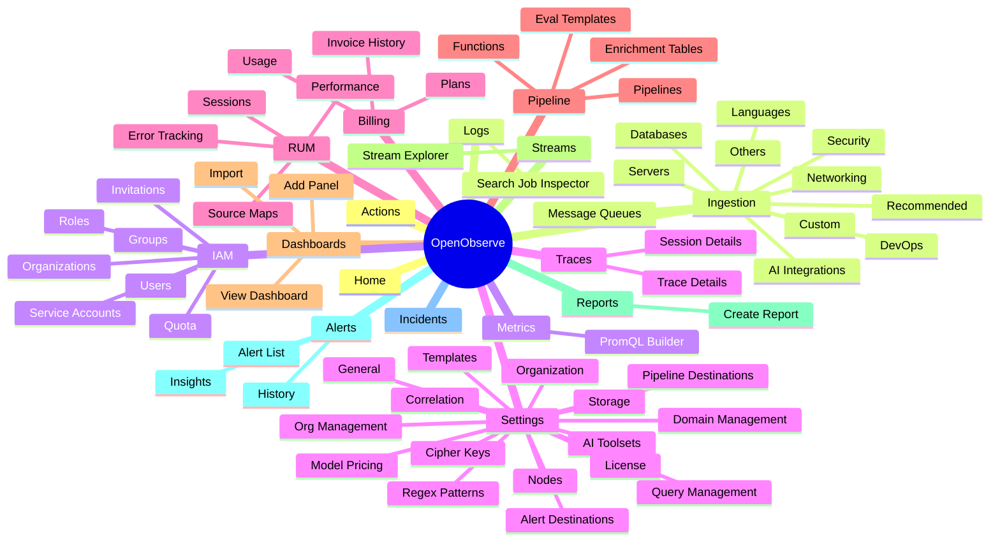

# OpenObserve — Full Routing Map & Navigation Inventory

A factual reference for the web app's routing and how each area is navigated today.
No redesign is proposed here — this is the map to decide a direction from.

Sources read: `web/src/router/index.ts`, `web/src/composables/router.ts`,
`web/src/composables/shared/router.ts`, `…/useManagementRoutes.ts`,
`…/useEnterpriseRoutes.ts`, `…/useIngestionRoutes.ts`,
`web/src/enterprise/composables/router.ts`, plus `layouts/MainLayout.vue`,
`components/Header.vue`, `lib/core/Navbar/ONavbar.vue`, `components/MenuLink.vue`,
`mixins/mainLayout.mixin.ts`, and the per‑module view components.

---

## Visual map of all pages

### Mindmap — module → section
*(Renders as a mindmap on GitHub / VS Code with Mermaid. Edition gating is noted in §4; detail/leaf pages — e.g. every ingestion provider — are in the full tree below.)*



### Full tree — every page
Legend: `(ent)` enterprise · `(cloud)` cloud · `(oss)` self‑host · `(admin)` admin role · `→` detail/child pages.

```text
OpenObserve
│
├─ ⟨standalone — no app shell⟩
│   ├─ /login
│   ├─ /cb              (login callback)
│   ├─ /logout          (redirect → /login)
│   ├─ /marketplace/aws/setup        (ent/cloud)
│   ├─ /marketplace/azure/register   (ent/cloud)
│   └─ *  → 404
│
└─ / ⟨app shell — MainLayout⟩
    ├─ Home                       /
    │
    ├─ Logs                       /logs
    │   └─ Search Job Inspector   /logs/inspector
    │
    ├─ Metrics                    /metrics
    │   └─ PromQL Builder         /promql-builder
    │
    ├─ Traces                     /traces
    │   ├─ Trace Details          /traces/trace-details
    │   └─ Session Details        /traces/session-details
    │
    ├─ RUM                        /rum
    │   ├─ Performance            /rum/performance   → Overview · Web Vitals · Errors · APIs
    │   ├─ Sessions               /rum/sessions      → Session Viewer  /rum/sessions/view/:id
    │   ├─ Error Tracking         /rum/errors        → Error Viewer    /rum/errors/view/:id
    │   └─ Source Maps            /rum/source-maps   → Upload Source Maps  /rum/upload-source-maps
    │
    ├─ Pipeline                   /pipeline   (→ defaults to Pipelines)
    │   ├─ Pipelines              /pipeline/pipelines   → Add · Edit · Import · History · Backfill
    │   ├─ Functions              /pipeline/functions
    │   ├─ Enrichment Tables      /pipeline/enrichment-tables
    │   └─ Eval Templates (ent)   /pipeline/eval-templates   → Add · Edit
    │
    ├─ Dashboards                 /dashboards
    │   ├─ View Dashboard         /dashboards/view
    │   ├─ Add / Edit Panel       /dashboards/add_panel
    │   └─ Import                 /dashboards/import
    │
    ├─ Streams                    /streams
    │   └─ Stream Explorer        /streams/stream-explore
    │
    ├─ Reports (oss)              /reports
    │   └─ Create Report          /reports/create
    │
    ├─ Alerts                     /alerts
    │   ├─ Add Alert              /alerts/add
    │   ├─ Anomaly Detection (ent/cloud)  → Add /alerts/anomaly/add · Edit /alerts/anomaly/edit/:id
    │   ├─ History                /alerts/history
    │   ├─ Insights (ent/cloud)   /alerts/insights
    │   └─ Import Semantic Groups /alerts/import-semantic-groups
    │
    ├─ Incidents (ent/cloud)      /incidents   → Detail  /incidents/:id
    ├─ Actions   (ent/cloud)      /actions
    │
    ├─ Ingestion                  /ingestion
    │   ├─ Recommended      → kubernetes · windows · linux · aws · gcp · azure · traces · frontend-monitoring
    │   ├─ Custom
    │   │   ├─ Logs        → curl · fluentbit · fluentd · vector · filebeat · otel · logstash · syslogng
    │   │   ├─ Metrics     → prometheus · otelcollector · telegraf · cloudwatch
    │   │   └─ Traces      → opentelemetry · otel
    │   ├─ Databases       → sqlserver · postgres · mongodb · redis · couchdb · elasticsearch · mysql ·
    │   │                     oracle · saphana · snowflake · zookeeper · cassandra · aerospike · dynamodb · databricks
    │   ├─ Security        → falco · osquery · okta · jumpcloud · openvpn · office365 · google-workspace
    │   ├─ DevOps          → jenkins · ansible · terraform · github-actions
    │   ├─ Networking      → netflow
    │   ├─ Servers         → nginx · apache · iis
    │   ├─ Message Queues  → rabbitmq · kafka · nats
    │   ├─ Languages       → python · dotnet-tracing · dotnet-logs · nodejs · java · go · rust · fastapi
    │   ├─ AI Integrations → ⟨dynamic provider list from aiCategories⟩
    │   └─ Others          → airflow · airbyte · cribl · vercel · heroku
    │
    ├─ IAM (admin)                /iam
    │   ├─ Users                  /iam/users
    │   ├─ Service Accounts       /iam/serviceAccounts
    │   ├─ Organizations          /iam/organizations
    │   ├─ Groups (ent/cloud)     /iam/groups        → Edit  /iam/groups/edit/:group_name
    │   ├─ Roles  (ent/cloud)     /iam/roles         → Edit  /iam/roles/edit/:role_name
    │   ├─ Quota  (ent/cloud)     /iam/quota
    │   └─ Invitations (cloud)    /iam/invitations
    │
    ├─ Settings                   /settings
    │   ├─ General                /settings/general
    │   ├─ Organization           /settings/organization
    │   ├─ Alert Destinations     /settings/alert_destinations
    │   ├─ Templates              /settings/templates
    │   ├─ Model Pricing          /settings/model_pricing   → Editor  /settings/model_pricing/edit
    │   ├─ Query Management (ent)  /settings/query_management
    │   ├─ Nodes (ent)            /settings/nodes
    │   ├─ Pipeline Destinations (ent)  /settings/pipeline_destinations
    │   ├─ Storage Settings (ent) /settings/storage_settings
    │   ├─ Cipher Keys (ent)      /settings/cipher_keys
    │   ├─ AI Toolsets (ent)      /settings/ai_toolsets
    │   ├─ Regex Patterns (ent)   /settings/regex_patterns
    │   ├─ Domain Management (ent) /settings/domain_management
    │   ├─ Correlation (ent)      /settings/correlation/:tab?
    │   ├─ License (ent)          /settings/license
    │   └─ Org Management (cloud) /settings/organization_management
    │
    ├─ Billing (ent/cloud)        /billings   → Usage · Plans · Invoice History
    │
    └─ ⟨utility — not in sidebar⟩
        ├─ About                  /about
        ├─ Member Subscription    /member_subscription
        └─ Short URL              /short/:id
```

---

## 1. How the route table is assembled

`web/src/router/index.ts` merges routes at runtime:

```
parentRoutes        ⨁ envRoutes.parentRoutes        → standalone pages (no app shell)
homeChildRoutes     ⨁ envRoutes.homeChildRoutes     → children of "/" under MainLayout.vue
                       (mergeRoutes de-dupes by path; enterprise pipelineChildren
                        are merged under /pipeline)
catchAll (/:catchAll(.*)*)                           → 404, appended last
```

- `composables/shared/router.ts` — most of `homeChildRoutes` + `parentRoutes` (login/cb/logout).
- `composables/shared/useManagementRoutes.ts` — `/settings/*`.
- `composables/shared/useEnterpriseRoutes.ts` — `/iam/*`, `/incidents`, `/actions`.
- `composables/shared/useIngestionRoutes.ts` — `/ingestion/*` (deep wizard tree).
- `composables/router.ts` (OSS) vs `enterprise/composables/router.ts` (cloud/ent) — env split;
  the enterprise file adds `/billings/*`, marketplace pages, and pipeline eval‑templates.

Almost every authenticated route is a **child of `/`** rendered by `layouts/MainLayout.vue`.
Auth/guarding is per‑route via `beforeEnter: routeGuard`.
`config.isCloud` / `config.isEnterprise` and the user's org role fork the tree, so the same
path space differs per edition.

---

## 2. The chrome today (what the shell renders around every page)

- **Top bar** (`components/Header.vue`, height 40px): logo (left) + a large empty middle + org
  selector, edition badge, AI toggle (ent), theme, Slack, help, settings gear, profile (right).
- **Left sidebar** (`lib/core/Navbar/ONavbar.vue` + `components/MenuLink.vue`, width ~84px): a
  **flat vertical icon rail**. Each item = icon above a small label, active item tinted. Order is
  built in `MainLayout.vue` (`linksList`) then mutated: the cloud/OSS mixin `splice`s **Pipeline**
  in at index 5; `MainLayout` `splice`s **Reports** at 7 (non‑cloud); enterprise injects
  **Incidents**/**Actions** after Alerts. Visibility honors `custom_hide_menus`, admin role, and
  edition.
- **Content card**: a single rounded/bordered white panel; the routed page renders inside it.
- **Right panel**: the AI chat drawer (`O2AIChat`), toggled.

The sidebar (`linksList`) is the single source of which **modules** are shown. Final OSS order:
`Home · Logs · Metrics · Traces · RUM · Pipeline · Dashboards · Streams · Reports · Alerts ·
Ingestion · IAM` (+ Incidents/Actions in ent/cloud when enabled). Settings and Billing are **not**
in the sidebar — Settings is reached via the header gear; Billing via cloud flows.

---

## 3. Standalone routes (no app shell, no nav)

| Path | Name | Component | Notes |
|------|------|-----------|-------|
| `/login` | — | `Login.vue` | |
| `/cb` | `callback` | `Login.vue` | OAuth callback |
| `/logout` | — | (beforeEnter) | clears auth → `/login` |
| `/marketplace/aws/setup` | `awsMarketplaceSetup` | `AwsMarketplaceSetup.vue` | cloud/ent |
| `/marketplace/azure/register` | `azureMarketplaceRegister` | `AzureMarketplaceSetup.vue` | cloud/ent |
| `/:catchAll(.*)*` | — | `Error404.vue` | 404 |

---

## 4. The app‑shell tree (children of `/`)

Notation: `path` → `name` · `Component` · **level** · _(edition/guard)_.
**Nav/Header today** = how that area is currently navigated and what it draws at its own top.

### 4.0 Home
- `""` → `home` · `HomeView.vue` · **L1**
  - Nav/Header today: no title bar; a small draggable tab strip (ai / overview / usage).

### 4.1 Logs
- `logs` → `logs` · `plugins/logs/Index.vue` · **L1**
  - `logs/inspector` → `searchJobInspector` · **L3**
  - Nav/Header today: a full `SearchBar` (stream picker, query editor, histogram, date‑time,
    refresh) ~240px tall. No title, no breadcrumb.

### 4.2 Metrics
- `metrics` → `metrics` · `plugins/metrics/Index.vue` · **L1**
  - `promql-builder` → `promqlBuilder` · **L3**
  - Nav/Header today: a 48px header row — "Metrics" title + syntax guide + date‑time + auto‑refresh
    + Run.

### 4.3 Traces
- `traces` → `traces` · `plugins/traces/Index.vue` · **L1**
  - `traces/trace-details` → `traceDetails` · **L3**
  - `traces/session-details` → `sessionDetails` · **L3**
  - `service-graph` → redirect → `/traces`
  - Nav/Header today: a `SearchBar` + an internal toggle (search / service‑graph / catalog / llm /
    sessions) ~240px.

### 4.4 RUM
- `rum` → `RUM` · `RUM/RealUserMonitoring.vue` · **L1** (renders `OTabs` + `<router-view>`)
  - `rum/performance` → `RumPerformance` · **L2** → `overview` · `web-vitals` · `errors` · `apis` (**L3** tabs)
  - `rum/sessions` → `Sessions` · **L2** → `rum/sessions/view/:id` → `SessionViewer` **L3**
  - `rum/errors` → `ErrorTracking` · **L2** → `rum/errors/view/:id` → `ErrorViewer` **L3**
  - `rum/source-maps` → `SourceMaps` · **L2** → `rum/upload-source-maps` → `UploadSourceMaps` **L3**
  - Nav/Header today: its own `OTabs` row for the L2 sections (or a "Get Started" card when disabled).

### 4.5 Pipeline _(shell = `Functions.vue`)_
- `pipeline` → `pipeline` (shell); index redirects to `pipelines`
  - `pipeline/pipelines` → `pipelines` · `PipelinesList.vue` · **L2**
    - `…/add` → `createPipeline` · **L3** · `…/edit` → `pipelineEditor` · **L3**
    - `…/import` → `importPipeline` · **L3** · `…/history` → `pipelineHistory` · **L3**
    - `…/backfill` → `pipelineBackfill` · **L3**
  - `pipeline/functions` → `functionList` · **L2**
  - `pipeline/enrichment-tables` → `enrichmentTables` · **L2**
  - `pipeline/eval-templates` → `evalTemplates` · **L2** _(ent)_ → `add` / `:id/edit` **L3**
  - Nav/Header today: `AppPageHeader` with an `OTabs` row for the L2 sections, a detail
    `AppBreadcrumb`, and a `#o2-page-actions` teleport target that L3 sub‑pages fill.

### 4.6 Dashboards
- `dashboards` → `dashboards` · `Dashboards/Dashboards.vue` · **L1**
  - `/dashboards/view` → `viewDashboard` · **L3**
  - `/dashboards/add_panel` → `addPanel` · **L3**
  - `/dashboards/import` → `importDashboard` · **L3**
  - Nav/Header today: `AppPageHeader` (icon, title, actions) + a folder‑tree sidebar on the list;
    detail views (`viewDashboard`/`addPanel`/`importDashboard`) render their own `AppBreadcrumb`
    (2–3 levels) inside `AppPageHeader`.

### 4.7 Streams
- `streams` → `logstreams` · `LogStream.vue` · **L1**
  - `streams/stream-explore` → `streamExplorer` · **L3**
  - Nav/Header today: a 68px header — "Streams" title + type toggle (logs/metrics/traces/metadata)
    + search + Refresh/Add.

### 4.8 Reports _(self‑host only)_
- `/reports` → `reports` · `ReportList.vue` · **L1** _(isCloud=false)_
  - `/reports/create` → `createReport` · **L3**
  - Nav/Header today: own list toolbar/title.

### 4.9 Alerts
- `alerts` → `alertList` · `AlertList.vue` · **L1**
  - `alerts/add` → `addAlert` · **L3**
  - `alerts/anomaly/add` → `addAnomalyDetection` · **L3** _(ent/cloud)_
  - `alerts/anomaly/edit/:anomaly_id` → `editAnomalyDetection` · **L3**
  - `alerts/history` → `alertHistory` · **L2**
  - `alerts/insights` → `alertInsights` · **L2** _(ent/cloud)_
  - `alerts/import-semantic-groups` → `importSemanticGroups` · **L3**
  - Nav/Header today: a 68px header — "Alerts" title + type toggle (all/scheduled/realTime/anomaly)
    + search + Import/Add + a folder sidebar.

### 4.10 Incidents / Actions _(ent/cloud)_
- `incidents` → `incidentList` · **L1** _(incidents_enabled)_ → `incidents/:id` → `incidentDetail` **L3**
- `actions` → `actionScripts` · **L1** _(actions_enabled)_

### 4.11 Ingestion _(shell)_
- `ingestion` → `ingestion` · `Ingestion.vue` · **L1** (renders header + `OTabs` + `<router-view>`)
  - 11 category sections (**L2**): `recommended` `custom` `databases` `security` `devops`
    `networking` `servers` `message-queues` `languages` `ai-integrations` `others`
  - each category → many provider pages (**L3**): e.g. `custom` → logs{curl,fluentbit,fluentd,
    vector,filebeat,otel,logstash,syslogng}, metrics{prometheus,otelcollector,telegraf,cloudwatch},
    traces{opentelemetry,otel}; `databases` → 15; `security` → 7; `languages` → 8; etc. (~70 leaves + dynamic AI providers)
  - Nav/Header today: own header ("Ingestion" title + token controls + search) + a horizontal
    `OTabs` category row.

### 4.12 IAM _(shell, admin)_
- `iam` → `iam` · `IdentityAccessManagement.vue` · **L1** (`AppPageHeader` + a `SecondaryNav` rail)
  - `users` `serviceAccounts` `organizations` (**L2**); `groups`→`editGroup`, `roles`→`editRole`,
    `quota` (**L2**, ent/cloud); `invitations` (**L2**, cloud)
  - Nav/Header today: `AppPageHeader` (title) + a vertical `SecondaryNav` of the sections.

### 4.13 Settings _(shell)_
- `settings` → `settings` · `components/settings/index.vue` · **L1** (`AppPageHeader` + `SecondaryNav` rail)
  - ~16 sections (**L2**): `general` `organization` `query_management`(ent) `nodes`(ent)
    `alert_destinations` `pipeline_destinations`(ent) `templates` `storage_settings`(ent)
    `model_pricing`→editor `cipher_keys`(ent) `ai_toolsets`(ent) `regex_patterns`(ent)
    `domain_management`(ent) `correlation`(ent) `license`(ent) `organization_management`(cloud)
  - Nav/Header today: `AppPageHeader` (title) + a vertical `SecondaryNav` rail of ~16 sections.

### 4.14 Billing _(ent/cloud)_
- `billings` → `billings` · `Billing.vue` · **L1** → `usage` · `plans` · `invoice_history` (**L2**)

### 4.15 Utility (no sidebar entry)
- `about` → `About.vue` · `member_subscription` → `MemberSubscription.vue` · `short/:id` → `ShortUrl.vue`

---

## 5. Two navigation/header families (factual)

Every L1 area falls into one of two patterns for the top of its content:

1. **Self‑headered pages** — Logs, Metrics, Traces, Streams, Alerts, Ingestion, RUM, Home, Reports,
   Dashboards (list). They draw their own title/toolbar/tabs; several are tall (240px search bars).
2. **`AppPageHeader` pages** — Dashboards (detail), Pipeline, IAM, Settings. They render a single
   page header that includes the title, the L2 section nav (horizontal `OTabs` or a vertical
   `SecondaryNav` rail), and — for detail views — an `AppBreadcrumb`.

L2 section navigation is expressed four different ways across the app today: horizontal tabs
(Ingestion, Pipeline, RUM), a vertical rail (Settings, IAM), an in‑page toggle group (Alerts,
Streams), or none.

---

## 6. Counts
- Standalone routes: **6** · L1 modules: **~20** · L2 sections: **~47** · L3+ detail/leaf: **~100**
  (ingestion ~70 of them). Total ≈ **190 routes** (plus a dynamic list of AI‑integration providers).

---

## 7. Facts that matter when choosing a navigation model (neutral)
- **~12 sidebar modules** are visible at once (more in ent/cloud), in a flat, splice‑built order.
- **Settings (~16) and Ingestion (11)** are the section‑heavy areas; their L2 nav is large.
- **Logs/Traces** own tall search UIs at the very top — little vertical room for an added header row.
- **Breadcrumbs exist only** in the `AppPageHeader` pages (Dashboards detail, Pipeline, and where
  added); most pages have none.
- **Section nav is inconsistent** (tabs vs rail vs toggle vs none) — the biggest consistency lever.
- **Settings/Billing aren't in the sidebar** today (reached via the gear / cloud flows).

---

## 8. Navigation design options — for 2+ level areas (L2 / L3)

How to present the **second level** (sections within a module) and **third+ level** (detail /
drill‑down) — given the primary nav is a fixed **left sidebar** and there is **one header per page**.
No implementation here; this is the menu to choose from.

**Three depth tiers (from §4):**
- **Flat** — Logs, Metrics, Traces, Dashboards (list), Streams, Reports, Home. No L2; a detail page
  is the only depth.
- **Few sections (≤5)** — RUM, Pipeline, Alerts, Billing.
- **Many sections (>5)** — Settings (~16), IAM (7), Ingestion (11 categories → many providers).

**One rule that prevents the "double header / two breadcrumbs" problem:** the page header's second
row shows **exactly one** of `{section tabs · breadcrumb · tagline}` — never two. The chrome (left
sidebar) never adds a title or breadcrumb.

### 8a. Building blocks (six archetypes)

**A1 — Inline header tabs** *(L2, few sections)* — sections as a horizontal tab strip in the page
header's second row; overflow scrolls (no flyout). On drill‑down the strip swaps to a breadcrumb.
*Already live in Pipeline/Functions.*
```text
┌────────┬──────────────────────────────────────────────────────────┐
│ ICON   │ ▦ RUM   Performance  Sessions  Errors  Source Maps   [⋯]  │ ← ONE header
│ RAIL   │         └ L2 tabs (row 2)                       [actions] │   row1: title+actions
│ (prim) ├──────────────────────────────────────────────────────────┤   row2: peer tabs
│ Home   │   CONTENT — router-view of the active section             │
│▸RUM    │                                                           │
└────────┴──────────────────────────────────────────────────────────┘
overflow → ‹ scroll arrows ›, never a flyout
```
*Best for:* RUM, Pipeline, Alerts, Billing. *Cons:* doesn't scale past ~6 short labels.

**A2 — Secondary section rail** *(L2, many sections)* — a second vertical column (~210px, resizable/
collapsible) of sections between the icon rail and the content; optional collapsible group headers.
*Already live in Settings.*
```text
┌──────┬──────────────────────┬───────────────────────────────────┐
│ ICON │ Settings             │ General                    [Save]  │ ← ONE header
│ RAIL │ (L2 rail, grouped)   ├───────────────────────────────────┤
│ Home │ GENERAL          ▾   │                                   │
│▸Set  │  ▸ General           │  org name  [______________]       │
│ IAM  │    Organization      │  timezone  [ UTC ▾ ]              │
│      │ SECURITY         ▾   │  (content scrolls independently)  │
│      │    Cipher Keys       │                                   │
│      │ DESTINATIONS     ▸   │  ← collapsed group                │
│      │ ADVANCED         ▾   │                                   │
└──────┴──────────────────────┴───────────────────────────────────┘
  ~84px       ~210px (drag-resize / collapse)
```
*Best for:* Settings, IAM. *Cons:* two left columns (~294px) tight on 1280px; can read as nested sidebars.

**A3 — Breadcrumb section switcher** *(L2, compact)* — the section is a clickable crumb with a
chevron (`Module › Section ▾`); a click‑to‑open menu (not hover) swaps sections. Most space‑efficient.
```text
┌────────┬──────────────────────────────────────────────────────────┐
│ ICON   │ ▦ RUM ›  Performance ▾    [time range] [refresh] [+]      │ ← ONE header line
│ RAIL   │          ┌────────────────┐                               │
│▸RUM    │          │ Performance  ✓ │ ← click-to-open (keyboard ok) │
│        │          │ Sessions       │                               │
│        │          │ Errors         │                               │
│        │          └────────────────┘                               │
│        │   CONTENT — active section                                │
└────────┴──────────────────────────────────────────────────────────┘
```
*Best for:* narrow‑viewport fallback; deep pages' sibling switch. *Cons:* sections hidden until clicked (lower discoverability).

**A4 — Drill / replace rail** *(L2+L3, Ingestion)* — one section column that "pushes" into a
category's children in place, led by a `‹ All categories` back row + per‑category search. iOS‑Settings model; never more than three panes.
```text
 categories                          inside “Databases” (pushed)
┌──────┬───────────────┐            ┌──────┬──────────────────┐
│ ICON │ Ingestion     │            │ ICON │ ‹ All categories │ ← ONE header
│ Home │ ▸ Recommended │            │ Home │ DATABASES        │
│▸Ingst│   Custom      │  click ▸    │▸Ingst│ [search…]        │
│      │   Databases ▸ │            │      │ ▸ SQL Server     │
│      │   Security    │   ‹ pop     │      │   Postgres       │
│      │   Languages   │            │      │   MySQL … (15)   │
└──────┴───────────────┘            └──────┴──────────────────┘
```
*Best for:* Ingestion. *Cons:* lose sight of sibling categories while inside one.

**A5 — In‑content sub‑nav** *(L3, nested only)* — a genuine third level rendered **inside** the
content (a slim segmented strip riding the section toolbar, or a searchable card grid of leaves) —
never a second header row. *RUM Performance ships this.*
```text
┌────────┬──────────────────────────────────────────────────────────┐
│ ICON   │ ▦ RUM   Performance  Sessions  Errors  Source Maps        │ ← ONE header (A1 tabs)
│ RAIL   ├──────────────────────────────────────────────────────────┤
│▸RUM    │ Perf summary          [date range ▾] [refresh] ⟳         │ section toolbar band
│        │ ( Overview │ Web Vitals │ Errors │ APIs )  ← L3 segmented │ inside CONTENT
│        │ ───────────────────────────────────────────────────────  │
│        │   sub-view content                                        │
└────────┴──────────────────────────────────────────────────────────┘
Ingestion leaf grid:  [search…]  [Postgres][MySQL][MongoDB][Redis]…
```
*Best for:* RUM Performance sub‑tabs, Ingestion provider catalogs. *Cons:* a nested device only — never the primary L2 nav.

**A6 — Master–detail** *(L2+L3, list→editor)* — a persistent list pane + a detail/editor pane;
selecting a row swaps the detail in place (no full‑page hop). A "peek" variant slides a panel over a
full‑width list for triage.
```text
┌──────┬──────────────────────────┬──────────────────────────────┐
│ ICON │ ☰ Alerts                 │ Alerts › High CPU usage  [+]  │ ← ONE header (breadcrumb @ L3)
│ Home ├──────────────────────────┼──────────────────────────────┤
│▸Alert│ [search…]                │ Name [High CPU usage       ] │
│ Pipe │ ▸ High CPU usage    ON   │ Stream [prod.metrics ▾] 5m   │
│ IAM  │   5xx error spike   OFF  │ Condition  cpu > 90 for 5m   │
│      │ [‹] collapse rail        │ [Test]      [Cancel] [Save]  │
└──────┴──────────────────────────┴──────────────────────────────┘
peek variant: full-width list + slide-in panel with its own ‹ Back
```
*Best for:* Alerts, Pipelines, IAM Roles/Groups, Dashboards, Streams. *Cons:* narrow editor — full‑bleed canvases (pipeline graph, dashboard panels) still go full‑page.

### 8b. Per‑module recommendation

| Module | Depth | Recommended | Notes |
|--------|-------|-------------|-------|
| Home, Logs, Metrics, Traces, Reports | flat | **none** | detail page → in‑header breadcrumb (routed) or back‑pill (overlay) |
| Dashboards | flat (+detail) | **A6** | folder/list rail already exists; immersive view/add‑panel open full‑page w/ breadcrumb |
| Streams | flat (+detail) | **A6** | list → explore (peek for quick look; full‑page when it needs width) |
| RUM | few | **A1** + **A5** | 4 tabs inline; Performance's 4 sub‑tabs as an in‑content strip |
| Pipeline | few | **A1** (+A6) | already inline tabs; editor drill → breadcrumb + teleported actions |
| Alerts | few | **A1** (+A6 peek) | retires the in‑page toggle; History/Insights suit peek |
| Billing | few | **A1** | 3 tabs; only "Invoice History" is long |
| Settings | many | **A2 grouped** | tame ~16 items with collapsible groups; editor drill → breadcrumb |
| IAM | many | **A2** (+A6) | converge RouteTabs onto the rail; Roles/Groups → master‑detail editors |
| Ingestion | many+deep | **A4 + A5** | drill rail for category→provider; searchable card grid for provider catalogs |

### 8c. One breadcrumb rule (app‑wide)
- **Module / section pages** show their L2 nav as the location indicator (A1 tabs, the active A2/A4
  rail item, or an A3 switcher crumb) — **not** a separate breadcrumb. A true sectionless landing
  shows a plain tagline.
- **Breadcrumbs appear only on L3+ routed detail/editor/leaf pages**, in the header's second row.
  Shape: `Root › … › Parent › Current`; beyond 3 inline the middle collapses into a clickable `…`
  menu so header height never changes. Ancestors are clickable; the terminal crumb is bold,
  non‑interactive, and truncates with a tooltip for long dynamic names.
- **Overlays / drawers / single reversible steps** use a leading **back‑pill** (`‹ Parent`) instead
  of a breadcrumb. Never show a back‑pill and a breadcrumb together; never tabs and a breadcrumb together.
- Decision is mechanical: *routed page with real ancestry → breadcrumb; overlay/one‑step → back‑pill;
  at the section level → the L2 nav itself.*

### 8d. Three end‑to‑end systems (pick one)

| Bundle | L2 | L3 | Trade‑off |
|--------|----|----|-----------|
| **1 — Shipped‑Path Standard** *(recommended)* | A1 tabs (few) · A2 grouped rail (Settings/IAM) · A4 drill rail (Ingestion) | in‑header breadcrumb / back‑pill · A5 sub‑nav · A6 for list→editor | Lowest risk — every piece already has a working precedent in‑tree; one header everywhere. Cost: three L2 mechanisms, so the per‑module rule must be documented. |
| **2 — Compact Single‑Line** | A3 breadcrumb switcher for few‑section + Ingestion categories; A2 only for Settings/IAM | A6 master‑detail everywhere; A3 sibling crumbs | Max vertical space, one "everything is a crumb" model. Cost: lower discoverability (sections hidden behind a click) — a real regression for exploration‑heavy Ingestion. |
| **3 — Hub + Rail Hybrid** | card‑grid "module home" for Settings & Ingestion; A1 tabs for few; A6 for lists | breadcrumb back to hub; A5 leaf grids; module‑scoped ⌘K accelerator | Most legible/onboarding‑friendly for the deepest modules. Cost: 2‑click section switching; the hub is net‑new (no in‑tree precedent). |

### 8e. My recommendation
**Bundle 1.** It kills the current four‑way L2 inconsistency using patterns that already exist in the
codebase (A1 in Pipeline, A2 in Settings, A5 in RUM Performance, breadcrumb/back‑pill in
AppPageHeader), so it's the lowest‑risk path to consistency. Borrow two accelerators from Bundle 3
selectively — a (module‑scoped) command palette for Ingestion's ~50 provider leaves, and a hub only
for Ingestion if push/pop tests poorly. Keep Bundle 2's A3 switcher strictly for narrow‑viewport fallback.

### 8f. Decisions for you
1. **Ingestion 3rd level:** push/pop drill rail (A4, narrowest) **vs** always‑visible grouped rail
   (A2, more discoverable, wider)?
2. **Settings rail:** flat 16‑item list **vs** grouped collapsible headers (who owns the grouping)?
3. **Few‑section modules:** keep always‑visible inline tabs (A1) **vs** make A3 switcher the default
   to maximize vertical space?
4. **List→editor modules** (Alerts/Pipelines/IAM/Dashboards): master‑detail (A6) wholesale **vs**
   only for triage (peek), heavy editors staying full‑page?
5. **Global command palette (⌘K)** as an accelerator — yes/no (and how to surface it)?
