# Dashboard Variables System - Comprehensive Design Document

## Table of Contents
1. [Overview](#overview)
2. [Architecture](#architecture)
3. [Variable Types](#variable-types)
4. [Dependency Management](#dependency-management)
5. [Variable Lifecycle](#variable-lifecycle)
6. [Panel Integration](#panel-integration)
7. [State Management](#state-management)
8. [Variable Value Propagation: The __global Mechanism](#variable-value-propagation-the-__global-mechanism)
9. [Loading Flow Diagram](#loading-flow-diagram)
10. [Critical Flows](#critical-flows)
11. [Performance Optimizations](#performance-optimizations)
12. [Key Files Reference](#key-files-reference)

---

## Overview

The OpenObserve dashboard variables system provides dynamic value management across dashboards and panels. It supports:
- **Multiple variable types** (query_values, custom, constant, textbox, dynamic_filters)
- **Cascading dependencies** with parent-child relationships
- **Real-time reactive updates** with watchers
- **Streaming data fetching** via HTTP2/WebSocket
- **Smart panel reload detection** to avoid unnecessary queries

### System Components

```
┌─────────────────────────────────────────────────────────────┐
│                    ViewDashboard.vue                         │
│  ┌──────────────────────────────────────────────────────┐   │
│  │     VariablesValueSelector.vue                        │   │
│  │  • Initialize variables                               │   │
│  │  • Build dependency graph                             │   │
│  │  • Load variable values                               │   │
│  │  • Emit updates                                       │   │
│  └────────────────┬─────────────────────────────────────┘   │
│                   │                                          │
│                   ▼                                          │
│  ┌──────────────────────────────────────────────────────┐   │
│  │     RenderDashboardCharts.vue                         │   │
│  │  • Receive variable updates                           │   │
│  │  • Distribute to panels                               │   │
│  │  • Track loading states                               │   │
│  └────────────────┬─────────────────────────────────────┘   │
│                   │                                          │
│                   ▼                                          │
│  ┌──────────────────────────────────────────────────────┐   │
│  │     PanelContainer.vue                                │   │
│  │  ┌──────────────────────────────────────────────┐    │   │
│  │  │  PanelSchemaRenderer.vue                      │    │   │
│  │  │  • Replace variables in queries               │    │   │
│  │  │  • Detect variable changes                    │    │   │
│  │  │  • Trigger panel reload                       │    │   │
│  │  └──────────────────────────────────────────────┘    │   │
│  └──────────────────────────────────────────────────────┘   │
└─────────────────────────────────────────────────────────────┘
```

---

## Architecture

### Core Files

| Component | Location | Responsibility |
|-----------|----------|---------------|
| **Variable Dependency Utils** | [web/src/utils/dashboard/variables/variablesDependencyUtils.ts](web/src/utils/dashboard/variables/variablesDependencyUtils.ts) | Dependency graph, cycle detection |
| **Variable Utils** | [web/src/utils/dashboard/variables/variablesUtils.ts](web/src/utils/dashboard/variables/variablesUtils.ts) | Placeholder substitution |
| **Variables Selector** | [web/src/components/dashboards/VariablesValueSelector.vue](web/src/components/dashboards/VariablesValueSelector.vue) | Main variable loading logic |
| **Variable Settings** | [web/src/components/dashboards/settings/VariableSettings.vue](web/src/components/dashboards/settings/VariableSettings.vue) | Variable configuration UI |
| **Add Variable** | [web/src/components/dashboards/settings/AddSettingVariable.vue](web/src/components/dashboards/settings/AddSettingVariable.vue) | Variable creation form |
| **Panel Container** | [web/src/components/dashboards/PanelContainer.vue](web/src/components/dashboards/PanelContainer.vue) | Panel-variable integration |
| **Panel Schema Renderer** | [web/src/components/dashboards/PanelSchemaRenderer.vue](web/src/components/dashboards/PanelSchemaRenderer.vue) | Query variable substitution |
| **View Dashboard** | [web/src/views/Dashboards/ViewDashboard.vue](web/src/views/Dashboards/ViewDashboard.vue) | Global state management |
| **Render Charts** | [web/src/views/Dashboards/RenderDashboardCharts.vue](web/src/views/Dashboards/RenderDashboardCharts.vue) | Variable distribution |

---

## Variable Types

### Supported Types

#### 1. query_values
**Purpose**: Fetch values dynamically from database streams

**Configuration**:
```typescript
{
  name: "region",
  type: "query_values",
  query_data: {
    stream_type: "logs",
    stream: "default",
    field: "kubernetes_region_name",
    filter: [
      {
        type: "list",
        values: [],
        filterType: "condition",
        filter: "country='$country'"  // Can depend on other variables
      }
    ],
    max_record_size: 100
  },
  multiSelect: true,
  value: []
}
```

**Loading Process**:
1. Build SELECT query with filters
2. Replace parent variable placeholders ($variableName)
3. Base64 encode query
4. Fetch via HTTP2/WebSocket streaming
5. Extract unique field values
6. Populate options array

**File**: [VariablesValueSelector.vue:1313-1382](web/src/components/dashboards/VariablesValueSelector.vue#L1313-L1382)

#### 2. custom
**Purpose**: Predefined static values

**Configuration**:
```typescript
{
  name: "status",
  type: "custom",
  value: ["active", "inactive", "pending"],
  multiSelect: false,
  value: "active"
}
```

No API calls required; values are defined in configuration.

#### 3. constant
**Purpose**: Fixed immutable value

**Configuration**:
```typescript
{
  name: "app_name",
  type: "constant",
  value: "openobserve"
}
```

Value cannot be changed by users.

#### 4. textbox
**Purpose**: User-editable text input

**Configuration**:
```typescript
{
  name: "search_term",
  type: "textbox",
  value: ""
}
```

Allows freeform text entry.

#### 5. dynamic_filters
**Purpose**: Ad-hoc filter conditions applied globally

**Configuration**:
```typescript
{
  name: "dynamic_filters",
  type: "dynamic_filters",
  value: [
    { name: "status", operator: "=", value: "200" },
    { name: "method", operator: "IN", value: ["GET", "POST"] }
  ]
}
```

Applied to all panels unless explicitly excluded.

---

## Dependency Management

### Dependency Graph Structure

**File**: [variablesDependencyUtils.ts:34-80](web/src/utils/dashboard/variables/variablesDependencyUtils.ts#L34-L80)

The system builds a bidirectional dependency graph:

```typescript
type DependencyGraph = {
  [variableName: string]: {
    parentVariables: string[];   // Variables this depends on
    childVariables: string[];    // Variables that depend on this
  }
};
```

**Example**:
```
Variables:
  - country (no dependencies)
  - region (depends on $country)
  - city (depends on $region)

Graph:
{
  country: {
    parentVariables: [],
    childVariables: ["region"]
  },
  region: {
    parentVariables: ["country"],
    childVariables: ["city"]
  },
  city: {
    parentVariables: ["region"],
    childVariables: []
  }
}
```

### Dependency Detection Algorithm

**File**: [variablesDependencyUtils.ts:7-25](web/src/utils/dashboard/variables/variablesDependencyUtils.ts#L7-L25)

```typescript
function extractVariableNames(input: string, variableNames: Set<string>) {
  const regex = /\$([a-zA-Z0-9_-]+)/g;
  const matches = [];
  let match;

  while ((match = regex.exec(input)) !== null) {
    const variableName = match[1];
    if (variableNames.has(variableName)) {
      matches.push(variableName);
    }
  }

  return Array.from(new Set(matches));
}
```

**Pattern**: `/\$([a-zA-Z0-9_-]+)/g`
- Matches: `$variableName`, `$region`, `$status_code`
- Extracts variable name without `$` prefix

### Building the Graph

**File**: [variablesDependencyUtils.ts:34-80](web/src/utils/dashboard/variables/variablesDependencyUtils.ts#L34-L80)

```typescript
function buildVariablesDependencyGraph(variables: any[]) {
  const variableNames = new Set(variables.map(v => v.name));
  const graph: DependencyGraph = {};

  // Initialize all nodes
  variables.forEach(variable => {
    graph[variable.name] = {
      parentVariables: [],
      childVariables: []
    };
  });

  // Build edges for query_values type
  variables.forEach(variable => {
    if (variable.type === "query_values") {
      const filters = variable.query_data?.filter || [];
      filters.forEach(filter => {
        const dependencies = extractVariableNames(
          filter.filter || "",
          variableNames
        );

        dependencies.forEach(parentName => {
          // Add parent reference to current variable
          graph[variable.name].parentVariables.push(parentName);

          // Add current variable as child of parent
          graph[parentName].childVariables.push(variable.name);
        });
      });
    }
  });

  return graph;
}
```

### Cycle Detection

**File**: [variablesDependencyUtils.ts:92-161](web/src/utils/dashboard/variables/variablesDependencyUtils.ts#L92-L161)

Uses **Depth-First Search (DFS)** with recursion stack tracking:

```typescript
function isGraphHasCycle(graph: DependencyGraph): string[] | null {
  const visited = new Set<string>();
  const recStack = new Set<string>();

  for (const node of Object.keys(graph)) {
    if (!visited.has(node)) {
      const cyclePath = isGraphHasCycleUtil(
        node,
        graph,
        visited,
        recStack,
        []
      );

      if (cyclePath) {
        return cyclePath; // Return cycle path if found
      }
    }
  }

  return null; // No cycle
}

function isGraphHasCycleUtil(
  node: string,
  graph: DependencyGraph,
  visited: Set<string>,
  recStack: Set<string>,
  path: string[]
): string[] | null {
  visited.add(node);
  recStack.add(node);
  path.push(node);

  for (const child of graph[node].childVariables) {
    if (!visited.has(child)) {
      const cyclePath = isGraphHasCycleUtil(
        child,
        graph,
        visited,
        recStack,
        [...path]
      );
      if (cyclePath) return cyclePath;
    } else if (recStack.has(child)) {
      // Cycle detected
      return [...path, child];
    }
  }

  recStack.delete(node);
  return null;
}
```

**Example Cycle Detection**:
```
Variables:
  A depends on B
  B depends on C
  C depends on A  ← Cycle!

Detection:
  Start at A → Visit B → Visit C → Visit A (already in recStack)
  Cycle path: [A, B, C, A]
```

### Checking Parent Dependencies

**File**: [VariablesValueSelector.vue:1080-1096](web/src/components/dashboards/VariablesValueSelector.vue#L1080-L1096)

Before loading a variable, check if all parents are ready:

```typescript
const isDependentVariableLoading = (variableObject: any) => {
  const parentVariables =
    variablesDependencyGraph[variableObject.name]?.parentVariables || [];

  return parentVariables.some((parentName: string) => {
    const parentVariable = variablesData.values.find(
      (v: any) => v.name === parentName
    );

    return parentVariable?.isLoading ||
           parentVariable?.isVariableLoadingPending;
  });
};
```

**Logic**:
- If **any parent** is loading or pending → Cannot load child
- If **all parents** are ready → Proceed with loading

---

## Variable Lifecycle

### Phase 1: Initialization

**File**: [VariablesValueSelector.vue:639-768](web/src/components/dashboards/VariablesValueSelector.vue#L639-L768)

```typescript
function initializeVariablesData() {
  // 1. Clear existing data
  variablesData.values = [];

  if (!props.variablesConfig?.length) return;

  // 2. For each variable in config
  props.variablesConfig.forEach((variable: any) => {
    // 3. Get initial value from URL params or default
    const urlParamKey = `var-${variable.name}`;
    let initialValue = route.query[urlParamKey] || variable.value;

    // 4. Handle multiSelect conversion
    if (variable.multiSelect && !Array.isArray(initialValue)) {
      initialValue = initialValue ? [initialValue] : [];
    }

    // 5. Create variable data object
    const variableData = {
      ...variable,
      value: initialValue,
      isLoading: false,
      isVariableLoadingPending: false,
      isVariablePartialLoaded: true,
      options: []
    };

    // 6. Set custom options if needed
    if (variable.type === "custom") {
      if (variable.selectAllValueForMultiSelect === "custom") {
        variableData.options = variable.customAllValue
          ? [variable.customAllValue, ...variable.value]
          : variable.value;
      }
    }

    variablesData.values.push(variableData);
  });

  // 7. Build dependency graph
  variablesDependencyGraph = buildVariablesDependencyGraph(
    variablesData.values
  );

  // 8. Initialize dynamic filters if enabled
  if (props.showDynamicFilters) {
    // Add dynamic_filters variable
  }
}
```

**Execution**: Called in `onMounted()` lifecycle hook

**File**: [VariablesValueSelector.vue:782-794](web/src/components/dashboards/VariablesValueSelector.vue#L782-L794)

```typescript
onMounted(() => {
  initializeVariablesData();      // Step 1: Initialize from config
  rejectAllPromises();             // Step 2: Clean up old promises
  loadAllVariablesData(true);      // Step 3: Load all variables
});
```

### Phase 2: Loading All Variables

**File**: [VariablesValueSelector.vue:1720-1817](web/src/components/dashboards/VariablesValueSelector.vue#L1720-L1817)

```typescript
async function loadAllVariablesData(isInitialLoading = false) {
  // 1. Mark loading state
  isVariablesLoading.value = true;

  // 2. Validate date range
  if (!checkDateValidity()) {
    isVariablesLoading.value = false;
    return;
  }

  // 3. Mark all variables as pending
  variablesData.values.forEach((variable: any) => {
    variable.isVariableLoadingPending = true;
  });

  // 4. Find independent variables (no parent dependencies)
  const independentVariables = variablesData.values.filter(
    (variable: any) => {
      const parentVariables =
        variablesDependencyGraph[variable.name]?.parentVariables || [];
      return parentVariables.length === 0;
    }
  );

  // 5. Load independent variables in parallel
  const loadingPromises = independentVariables.map((variable: any) => {
    return loadSingleVariableDataByName(
      variable.name,
      isInitialLoading
    );
  });

  // 6. Wait for all to complete
  await Promise.all(loadingPromises);

  // Note: Dependent variables loaded by finalizePartialVariableLoading
}
```

**Key Points**:
- **Independent variables** load first in parallel
- **Dependent variables** load automatically via cascade
- Loading triggered by `finalizePartialVariableLoading()` callbacks

### Phase 3: Loading Single Variable

**File**: [VariablesValueSelector.vue:1141-1306](web/src/components/dashboards/VariablesValueSelector.vue#L1141-L1306)

```typescript
async function loadSingleVariableDataByName(
  variableName: string,
  isInitialLoading = false
) {
  return new Promise((resolve, reject) => {
    // 1. Cancel previous request for same variable
    if (currentlyExecutingPromises[variableName]?.reject) {
      currentlyExecutingPromises[variableName].reject();
    }

    // 2. Store reject function for cancellation
    currentlyExecutingPromises[variableName] = { reject };

    // 3. Get variable object
    const variableObject = variablesData.values.find(
      (v: any) => v.name === variableName
    );

    if (!variableObject) {
      reject("Variable not found");
      return;
    }

    // 4. Validate date range
    if (!checkDateValidity()) {
      reject("Invalid date range");
      return;
    }

    // 5. Check if parent dependencies are loading
    if (isDependentVariableLoading(variableObject)) {
      variableObject.isVariableLoadingPending = true;
      variableObject.isLoading = false;
      reject("Dependencies loading");
      return;
    }

    // 6. Check if parent has no data (empty result)
    const hasParentWithNoData = variablesDependencyGraph[
      variableName
    ]?.parentVariables?.some((parentName: string) => {
      const parent = variablesData.values.find(
        (v: any) => v.name === parentName
      );
      return parent?.options?.length === 0;
    });

    if (hasParentWithNoData) {
      // Reset child variable
      variableObject.value = variableObject.multiSelect ? [] : "";
      variableObject.options = [];
      variableObject.isVariableLoadingPending = false;
      variableObject.isLoading = false;
      resolve(null);
      return;
    }

    // 7. Mark as loading
    variableObject.isLoading = true;
    variableObject.isVariableLoadingPending = false;

    // 8. Handle different variable types
    handleVariableType(
      variableObject,
      isInitialLoading,
      resolve,
      reject
    );
  });
}
```

### Phase 4: Type-Specific Handling (query_values)

**File**: [VariablesValueSelector.vue:1313-1382](web/src/components/dashboards/VariablesValueSelector.vue#L1313-L1382)

```typescript
function handleVariableType(
  variableObject: any,
  isInitialLoading: boolean,
  resolve: Function,
  reject: Function
) {
  if (variableObject.type === "query_values") {
    // 1. Skip if initial load optimization applies
    if (isInitialLoading && shouldSkipInitialLoad(variableObject)) {
      finalizeVariableLoading(variableObject, true, resolve);
      return;
    }

    // 2. Build query context
    const queryContext = buildQueryContext(variableObject);

    // 3. Fetch field values via HTTP2/WebSocket
    fetchFieldValuesWithWebsocket(
      variableObject,
      queryContext,
      resolve,
      reject
    );
  } else {
    // Handle other types (custom, constant, textbox)
    finalizeVariableLoading(variableObject, true, resolve);
  }
}
```

### Phase 5: Building Query Context

**File**: [VariablesValueSelector.vue:1389-1447](web/src/components/dashboards/VariablesValueSelector.vue#L1389-L1447)

```typescript
function buildQueryContext(variableObject: any) {
  const { stream_type, stream, field, filter, max_record_size } =
    variableObject.query_data;

  // 1. Start with base SELECT statement
  let query = `SELECT ${field} FROM '${stream}'`;

  // 2. Add filter conditions
  const filterConditions = [];
  filter?.forEach((f: any) => {
    if (f.filter) {
      filterConditions.push(f.filter);
    }
  });

  if (filterConditions.length > 0) {
    query += ` WHERE ${filterConditions.join(" AND ")}`;
  }

  // 3. Replace parent variable placeholders
  const parentVariables =
    variablesDependencyGraph[variableObject.name]?.parentVariables || [];

  parentVariables.forEach(parentName => {
    const parent = variablesData.values.find(
      (v: any) => v.name === parentName
    );

    if (parent) {
      let replacementValue;

      if (Array.isArray(parent.value)) {
        // Join array with commas, escape quotes
        replacementValue = parent.value
          .map(v => `'${String(v).replace(/'/g, "\\'")}'`)
          .join(", ");
      } else {
        replacementValue = `'${String(parent.value).replace(/'/g, "\\'")}'`;
      }

      // Replace $variableName with actual value
      query = query.replace(
        new RegExp(`\\$${parentName}`, "g"),
        replacementValue
      );
    }
  });

  // 4. Add GROUP BY and LIMIT
  query += ` GROUP BY ${field} ORDER BY ${field}`;
  if (max_record_size) {
    query += ` LIMIT ${max_record_size}`;
  }

  // 5. Base64 encode
  const encodedQuery = btoa(query);

  return {
    query: encodedQuery,
    stream_type,
    stream,
    field
  };
}
```

**Example Query Building**:
```
Variable: city (depends on $country, $region)
country.value = "USA"
region.value = ["CA", "NY"]

Initial Query:
SELECT city FROM 'locations'
WHERE country='$country' AND region IN ($region)
GROUP BY city

After Substitution:
SELECT city FROM 'locations'
WHERE country='USA' AND region IN ('CA', 'NY')
GROUP BY city

Base64 Encoded: U0VMRUNUIGN...
```

### Phase 6: Streaming Response Handling

**File**: [VariablesValueSelector.vue:347-557](web/src/components/dashboards/VariablesValueSelector.vue#L347-L557)

```typescript
function handleSearchResponse(
  variableObject: any,
  responseData: any,
  resolve: Function,
  reject: Function
) {
  // 1. Check if request was cancelled
  if (!currentlyExecutingPromises[variableObject.name]) {
    reject("Request cancelled");
    return;
  }

  // 2. Handle different response types
  switch (responseData.type) {
    case "search_response":
    case "search_response_hits":
      // 3. Extract field values
      const hits = responseData.hits || [];
      const fieldName = variableObject.query_data.field;
      const newValues = hits.map((hit: any) => hit[fieldName]);

      // 4. Get currently selected values
      const selectedValues = Array.isArray(variableObject.value)
        ? variableObject.value
        : [variableObject.value];

      // 5. Merge with existing options
      const existingOptions = variableObject.options || [];
      const allOptions = [
        ...existingOptions,
        ...newValues,
        ...selectedValues
      ];

      // 6. Remove duplicates and sort
      variableObject.options = Array.from(new Set(allOptions)).sort();

      // 7. Check if value changed
      const oldValue = oldVariablesData[variableObject.name]?.value;
      const valueChanged = !isEqual(oldValue, variableObject.value);

      if (valueChanged) {
        finalizePartialVariableLoading(
          variableObject,
          true,
          resolve
        );
      }

      break;

    case "end":
      // Final response - complete loading
      finalizeVariableLoading(variableObject, true, resolve);
      break;

    case "error":
      finalizeVariableLoading(variableObject, false, reject);
      break;
  }

  // 8. Emit updated data
  emitVariablesData();
}
```

### Phase 7: Finalization and Cascade

**File**: [VariablesValueSelector.vue:1588-1687](web/src/components/dashboards/VariablesValueSelector.vue#L1588-L1687)

```typescript
function finalizeVariableLoading(
  variableObject: any,
  success: boolean,
  resolve: Function
) {
  // 1. Clear promise reference
  delete currentlyExecutingPromises[variableObject.name];

  // 2. Update loading states
  variableObject.isLoading = false;
  variableObject.isVariablePartialLoaded = success;

  // 3. Update global loading flag
  updateIsVariablesLoading();

  // 4. Emit updated data
  emitVariablesData();

  // 5. Resolve promise
  resolve(success);
}

function finalizePartialVariableLoading(
  variableObject: any,
  success: boolean,
  resolve: Function
) {
  // 1. Mark partial load complete
  variableObject.isVariablePartialLoaded = success;

  // 2. Get child variables from dependency graph
  const childVariables =
    variablesDependencyGraph[variableObject.name]?.childVariables || [];

  // 3. Load each child variable
  childVariables.forEach((childName: string) => {
    loadSingleVariableDataByName(childName, false);
  });

  // 4. Emit updated data
  emitVariablesData();

  // 5. Resolve promise
  resolve(success);
}
```

**Cascade Flow**:
```
country loads (independent)
   ↓
   finalizePartialVariableLoading()
   ↓
   Load child: region
   ↓
   region loads
   ↓
   finalizePartialVariableLoading()
   ↓
   Load child: city
   ↓
   city loads
   ↓
   finalizeVariableLoading()
   ↓
   All done!
```

### Phase 8: User Updates Variable Value

**File**: [VariablesValueSelector.vue:1852-1961](web/src/components/dashboards/VariablesValueSelector.vue#L1852-L1961)

```typescript
async function onVariablesValueUpdated(
  variableName: string,
  newValue: any
) {
  // 1. Get current variable
  const currentVariable = variablesData.values.find(
    (v: any) => v.name === variableName
  );

  if (!currentVariable) return;

  // 2. Filter invalid multi-select values
  if (currentVariable.multiSelect && Array.isArray(newValue)) {
    newValue = newValue.filter((v: any) =>
      currentVariable.options.includes(v)
    );
  }

  // 3. Store old value for change detection
  oldVariablesData[variableName] = {
    value: currentVariable.value
  };

  // 4. Update value
  currentVariable.value = newValue;

  // 5. Get child variables
  const childVariables =
    variablesDependencyGraph[variableName]?.childVariables || [];

  // 6. Mark children as loading pending
  childVariables.forEach((childName: string) => {
    const child = variablesData.values.find(
      (v: any) => v.name === childName
    );
    if (child) {
      child.isVariableLoadingPending = true;
      child.isLoading = true;
    }
  });

  // 7. Load each child variable
  for (const childName of childVariables) {
    await loadSingleVariableDataByName(childName, false);
  }

  // 8. Update URL query parameters
  const queryParams = { ...route.query };
  queryParams[`var-${variableName}`] =
    Array.isArray(newValue) ? newValue.join(",") : newValue;

  router.replace({ query: queryParams });

  // 9. Emit updated data
  emitVariablesData();
}
```

---

## Panel Integration

### How Panels Receive Variables

**File**: [PanelContainer.vue:366,480](web/src/components/dashboards/PanelContainer.vue#L366)

Props passed to PanelSchemaRenderer:

```vue
<PanelSchemaRenderer
  :variablesData="props.variablesData"
  :forceLoad="props.forceLoad"
  ...
/>
```

### Detecting Dependent Variables

**File**: [PanelContainer.vue:557-579](web/src/components/dashboards/PanelContainer.vue#L557-L579)

```typescript
const dependentAdHocVariable = computed(() => {
  // Check if any query uses dynamic_filters
  const adhocVariables = props.variablesData.values
    ?.filter((it: any) => it.type === "dynamic_filters")
    ?.map((it: any) => it?.value)
    .flat()
    ?.filter((it: any) =>
      it?.operator && it?.name && it?.value
    );

  return adhocVariables?.length > 0;
});
```

### Detecting Variable Value Changes

**File**: [PanelContainer.vue:838-874](web/src/components/dashboards/PanelContainer.vue#L838-L874)

```typescript
const getDependentVariablesData = () => {
  return props.variablesData?.values
    ?.filter((it: any) => it.type != "dynamic_filters")
    ?.filter((it: any) => {
      // Check if variable is used in panel queries
      const regexForVariable = createVariableRegex(it.name);
      return props.data.queries
        ?.map((q: any) => regexForVariable.test(q?.query))
        ?.includes(true);
    });
};

const variablesDataUpdated = computed(() => {
  const dependentVariables = getDependentVariablesData();

  return dependentVariables.some((dependentVariable) => {
    // Find current value from refreshed data
    const refreshedVariable = props.currentVariablesData.values.find(
      (varData: any) => varData.name === dependentVariable.name
    );

    // Deep compare values
    return !isEqual(
      dependentVariable.value,
      refreshedVariable.value
    );
  });
});
```

**Usage**:
- Shows **warning icon** on panel when variables changed without refresh
- Indicates panel data may be stale

### Variable Substitution in Queries

**File**: [PanelSchemaRenderer.vue:1392-1472](web/src/components/dashboards/PanelSchemaRenderer.vue#L1392-L1472)

```typescript
function replaceVariablesValue(
  query: string,
  variables: any[]
): string {
  variables.forEach((variable: any) => {
    const variableValue = Array.isArray(variable.value)
      ? variable.value
      : [variable.value];

    // Support multiple placeholder formats
    const possibleVariablesPlaceHolderTypes = [
      // Format: ${variableName:csv} → "value1,value2,value3"
      {
        placeHolder: `\${${variable.name}:csv}`,
        value: variableValue.join(",")
      },

      // Format: ${variableName:pipe} → "value1|value2|value3"
      {
        placeHolder: `\${${variable.name}:pipe}`,
        value: variableValue.join("|")
      },

      // Format: ${variableName:doublequote} → '"value1","value2","value3"'
      {
        placeHolder: `\${${variable.name}:doublequote}`,
        value: variableValue
          .map(v => `"${String(v).replace(/"/g, '\\"')}"`)
          .join(",")
      },

      // Format: ${variableName:singlequote} → "'value1','value2','value3'"
      {
        placeHolder: `\${${variable.name}:singlequote}`,
        value: variableValue
          .map(v => `'${String(v).replace(/'/g, "\\'")}'`)
          .join(",")
      },

      // Format: ${variableName} → Auto-detect array/single
      {
        placeHolder: `\${${variable.name}}`,
        value: variableValue.length > 1
          ? variableValue
              .map(v => `'${String(v).replace(/'/g, "\\'")}'`)
              .join(",")
          : String(variableValue[0])
      },

      // Format: $variableName → Simple substitution
      {
        placeHolder: `\$${variable.name}`,
        value: variableValue.length > 1
          ? variableValue
              .map(v => `'${String(v).replace(/'/g, "\\'")}'`)
              .join(",")
          : String(variableValue[0])
      }
    ];

    // Replace all occurrences
    possibleVariablesPlaceHolderTypes.forEach((placeHolderObj) => {
      query = query.replaceAll(
        placeHolderObj.placeHolder,
        placeHolderObj.value
      );
    });
  });

  return query;
}
```

**Example Substitution**:
```sql
Original Query:
SELECT * FROM logs
WHERE region IN (${region:doublequote})
  AND status = $status
  AND country = '${country}'

Variables:
  region = ["us-west", "us-east"]
  status = "200"
  country = "USA"

After Substitution:
SELECT * FROM logs
WHERE region IN ("us-west","us-east")
  AND status = 200
  AND country = 'USA'
```

### When Panels Reload

Panels reload when:

1. **User clicks Refresh button** in ViewDashboard
   - **File**: [ViewDashboard.vue:626-638](web/src/views/Dashboards/ViewDashboard.vue#L626-L638)
   - Copies `variablesData` to `refreshedVariablesData`
   - Triggers panel re-query with new variable values

2. **Time range changes** via date picker
   - **File**: [ViewDashboard.vue:640-661](web/src/views/Dashboards/ViewDashboard.vue#L640-L661)
   - Updates time range
   - Triggers dashboard refresh

3. **Auto-refresh interval** triggers
   - **File**: [ViewDashboard.vue:715-727](web/src/views/Dashboards/ViewDashboard.vue#L715-L727)
   - Set up via `setInterval()`
   - Calls `refreshDashboard()` automatically

4. **forceLoad prop** changes
   - Passed from parent components
   - Forces immediate panel data reload

**Note**: Panels do **NOT** automatically reload when variables change. Users must click **Refresh** button. This prevents excessive API calls during variable selection.

---

## State Management

### Reactive State Structure

#### VariablesValueSelector.vue

**File**: [VariablesValueSelector.vue:115-138](web/src/components/dashboards/VariablesValueSelector.vue#L115-L138)

```typescript
// Main variables data
const variablesData: {
  values: VariableData[];
} = reactive({
  values: []
});

type VariableData = {
  name: string;
  label: string;
  type: "query_values" | "custom" | "constant" | "textbox" | "dynamic_filters";
  value: any;
  multiSelect: boolean;
  isLoading: boolean;
  isVariableLoadingPending: boolean;
  isVariablePartialLoaded: boolean;
  options: any[];
  query_data?: QueryDataConfig;
};

// Old values for change detection
const oldVariablesData: {
  [variableName: string]: {
    value: any;
  };
} = {};

// Promise management for cancellation
const currentlyExecutingPromises: {
  [variableName: string]: {
    reject: Function;
  };
} = {};

// Dependency graph
let variablesDependencyGraph: DependencyGraph = {};

// Global loading flag
const isVariablesLoading = ref(false);
```

### Key State Flags

Each variable tracks **5 state flags**:

| Flag | Type | Purpose |
|------|------|---------|
| `value` | `any` | Current selected value(s) |
| `isLoading` | `boolean` | API call in progress |
| `isVariableLoadingPending` | `boolean` | Waiting for user interaction or dependency |
| `isVariablePartialLoaded` | `boolean` | Has received at least one response |
| `options` | `any[]` | Available values for selection |

**State Transitions**:
```
Initial:
  isLoading = false
  isVariableLoadingPending = false
  isVariablePartialLoaded = true (from initialization)

Loading Starts:
  isLoading = true
  isVariableLoadingPending = false

Partial Response Received:
  isVariablePartialLoaded = true
  (isLoading still true)

Loading Complete:
  isLoading = false
  isVariablePartialLoaded = true

Waiting for Dependency:
  isLoading = false
  isVariableLoadingPending = true
```

### Watchers

**File**: [VariablesValueSelector.vue:804-849](web/src/components/dashboards/VariablesValueSelector.vue#L804-L849)

```typescript
// Watch 1: Config changes → Full reload
watch(
  () => props.variablesConfig,
  () => {
    initializeVariablesData();
    rejectAllPromises();
    loadAllVariablesData(true);
  }
);

// Watch 2: Variable state changes → Emit updates
watch(
  () => JSON.stringify({
    values: variablesData.values.map(v => ({
      name: v.name,
      value: v.value,
      type: v.type,
      isLoading: v.isLoading,
      isVariableLoadingPending: v.isVariableLoadingPending,
    }))
  }),
  () => {
    emitVariablesData();
  }
);
```

### Data Flow Between Components

```
ViewDashboard.vue
  ├─ variablesData (reactive)
  ├─ refreshedVariablesData (reactive)
  └─ isVariablesChanged (computed)
      │
      ▼
VariablesValueSelector.vue
  ├─ Emit: @variables-data-updated
  └─ Emit: @variables-loading
      │
      ▼
RenderDashboardCharts.vue
  ├─ variablesData.value
  ├─ currentVariablesDataRef
  └─ variablesAndPanelsDataLoadingState
      │
      ▼
PanelContainer.vue
  ├─ Props: variablesData
  ├─ Props: currentVariablesData
  └─ Computed: variablesDataUpdated
      │
      ▼
PanelSchemaRenderer.vue
  ├─ Props: variablesData
  └─ Function: replaceVariablesValue()
```

### URL Synchronization

**File**: [ViewDashboard.vue:562-595](web/src/views/Dashboards/ViewDashboard.vue#L562-L595)

```typescript
const variablesDataUpdated = (data: any) => {
  Object.assign(variablesData, data);

  // Build URL query params
  const variableObj: any = {};

  data.values
    ?.filter((item: any) => item.type !== "dynamic_filters")
    ?.forEach((item: any) => {
      const key = `var-${item.name}`;
      variableObj[key] = Array.isArray(item.value)
        ? item.value.join(",")
        : item.value;
    });

  // Update URL without navigation
  router.replace({
    query: {
      ...route.query,
      ...variableObj
    }
  });
};
```

**URL Format**:
```
/dashboards/view/dashboard-id?
  var-region=us-west,us-east&
  var-status=200&
  var-environment=production
```

**Benefits**:
- Shareable dashboard URLs with pre-selected variables
- Browser back/forward support
- Bookmark specific variable combinations

---

## Variable Value Propagation: The __global Mechanism

### Overview

The dashboard uses a sophisticated **two-tier variable propagation system** to manage when panels receive updated variable values:

1. **`__global`**: Dashboard-wide variable snapshot used by all panels
2. **`[panelId]`**: Panel-specific variable snapshot for individual refreshes

This mechanism ensures that:
- Variable changes don't immediately trigger panel reloads (prevents excessive API calls)
- Users explicitly control when panels refresh with new variable values
- Individual panels can be refreshed independently without affecting others

### Key Data Structures

**File**: [RenderDashboardCharts.vue:336](web/src/views/Dashboards/RenderDashboardCharts.vue#L336)

```typescript
// Two separate variable tracking objects
const variablesData = ref({});                    // Current "live" variables (updates immediately)
const currentVariablesDataRef = ref({            // "Committed" variables (used by panels)
  __global: {}                                   // Global snapshot for all panels
});
```

**Structure of `currentVariablesDataRef`**:
```typescript
{
  __global: {                    // Used by all panels by default
    values: [
      { name: "country", value: "USA", ... },
      { name: "region", value: ["CA", "NY"], ... }
    ]
  },
  "panel-123": {                 // Panel-specific override (if panel refreshed individually)
    values: [
      { name: "country", value: "USA", ... },
      { name: "region", value: ["CA", "NY"], ... }
    ]
  },
  "panel-456": { ... }           // Another panel-specific override
}
```

### How Panels Receive Variables

**File**: [RenderDashboardCharts.vue:132-135](web/src/views/Dashboards/RenderDashboardCharts.vue#L132-L135)

```vue
<PanelContainer
  :variablesData="
    currentVariablesDataRef?.[item?.id] ||
    currentVariablesDataRef['__global']
  "
  :currentVariablesData="variablesData"
/>
```

**Logic**:
1. **First check**: `currentVariablesDataRef[panelId]` - Does this panel have its own snapshot?
2. **Fallback**: `currentVariablesDataRef['__global']` - Use global snapshot if no panel-specific one exists

**Two variable props**:
- `variablesData`: The "committed" variables that panel should use for queries
- `currentVariablesData`: The "live" current variables (used for change detection/warning icons)

---

### Dashboard-Wide Refresh (All Panels)

**Trigger**: User clicks dashboard-level **Refresh** button

**File**: [ViewDashboard.vue:803-808](web/src/views/Dashboards/ViewDashboard.vue#L803-L808)

```typescript
// When user changes date or clicks refresh
currentTimeObjPerPanel.value = {
  __global: {
    start_time: new Date(date.startTime),
    end_time: new Date(date.endTime),
  },
};
```

**File**: [RenderDashboardCharts.vue:376-382](web/src/views/Dashboards/RenderDashboardCharts.vue#L376-L382)

```typescript
// Watch for __global time change (indicates dashboard refresh)
watch(
  () => props?.currentTimeObj?.__global,
  () => {
    // REPLACE entire currentVariablesDataRef with ONLY __global
    // This removes all panel-specific overrides
    currentVariablesDataRef.value = {
      __global: JSON.parse(JSON.stringify(variablesData.value)),
    };
  },
);
```

**Effect**:
1. `currentTimeObj.__global` changes
2. Watcher triggers
3. **Replaces** entire `currentVariablesDataRef` with **only** `__global`
4. **All panel-specific entries are removed**
5. All panels now use the same global variable snapshot
6. Time range change also propagates to all panels

**Flow Diagram**:
```
User clicks Dashboard Refresh
         ↓
ViewDashboard updates currentTimeObjPerPanel.__global
         ↓
RenderDashboardCharts watcher triggers
         ↓
currentVariablesDataRef = { __global: <current variables> }
         ↓ (panel-specific entries removed)
All panels receive __global variables
         ↓
All panels reload with new variable values
```

---

### Panel-Specific Refresh (Single Panel)

**Trigger**: User clicks individual panel's **Refresh** icon

**File**: [RenderDashboardCharts.vue:820-830](web/src/views/Dashboards/RenderDashboardCharts.vue#L820-L830)

```typescript
const refreshPanelRequest = (
  panelId,
  shouldRefreshWithoutCache = false
) => {
  emit("refreshPanelRequest", panelId, shouldRefreshWithoutCache);

  // ADD panel-specific entry while keeping __global and other panels
  currentVariablesDataRef.value = {
    ...currentVariablesDataRef.value,   // Keep existing __global and other panels
    [panelId]: variablesData.value,      // Add/update this panel's snapshot
  };
};
```

**Effect**:
1. **Preserves** `__global` and other panel entries
2. **Adds/updates** `[panelId]` entry with current variables
3. Only this specific panel reloads
4. Other panels continue using their existing variable snapshots

**Flow Diagram**:
```
User clicks Panel Refresh Icon
         ↓
PanelContainer emits refreshPanelRequest(panelId)
         ↓
RenderDashboardCharts.refreshPanelRequest()
         ↓
currentVariablesDataRef[panelId] = <current variables>
         ↓ (__global unchanged, other panels unchanged)
Only this panel receives updated variables
         ↓
Only this panel reloads
```

**Example State**:
```typescript
// Before any panel refresh
currentVariablesDataRef = {
  __global: { values: [{ name: "region", value: "us-west" }] }
};

// User changes region to "us-east" and refreshes Panel-A only
currentVariablesDataRef = {
  __global: { values: [{ name: "region", value: "us-west" }] },
  "panel-A": { values: [{ name: "region", value: "us-east" }] }
};
// Panel-A uses "us-east", all other panels still use "us-west"

// User now clicks Dashboard Refresh
currentVariablesDataRef = {
  __global: { values: [{ name: "region", value: "us-east" }] }
};
// panel-A entry removed, all panels now use "us-east"
```

---

### Special Case: Drilldown

**File**: [RenderDashboardCharts.vue:807-817](web/src/views/Dashboards/RenderDashboardCharts.vue#L807-L817)

```typescript
const updateInitialVariableValues = async (...args) => {
  refreshDashboard(true);

  // Update variable values based on drilldown
  await variablesValueSelectorRef.value.changeInitialVariableValues(...args);

  // Auto-refresh panels without requiring user to click refresh
  // This is an exception to the normal "user must refresh" rule
  currentVariablesDataRef.value = {
    __global: JSON.parse(JSON.stringify(variablesData.value)),
  };
};
```

**Drilldown Exception**:
- When user clicks a drilldown link in a chart
- Variables are automatically updated **AND** committed to `__global`
- Panels refresh automatically **without** user clicking refresh button
- This is the **only** scenario where variables auto-propagate to panels

---

### Change Detection and Visual Indicators

**File**: [ViewDashboard.vue:600-624](web/src/views/Dashboards/ViewDashboard.vue#L600-L624)

```typescript
const variablesData = reactive({});              // Live variables
const refreshedVariablesData = reactive({});     // Last committed variables

const isVariablesChanged = computed(() => {
  const normalizedCurrent = normalizeVariables(variablesData);
  const normalizedRefreshed = normalizeVariables(refreshedVariablesData);
  return !isEqual(normalizedCurrent, normalizedRefreshed);
});
```

**Visual Indicators**:
1. **Refresh Button Color**: Changes when `isVariablesChanged === true`
2. **Panel Warning Icons**: Shown when panel's `variablesData` differs from `currentVariablesData`

**File**: [PanelContainer.vue:838-874](web/src/components/dashboards/PanelContainer.vue#L838-L874)

```typescript
const variablesDataUpdated = computed(() => {
  const dependentVariables = getDependentVariablesData();

  return dependentVariables.some((dependentVariable) => {
    const refreshedVariable = props.currentVariablesData.values.find(
      (varData: any) => varData.name === dependentVariable.name
    );

    // Compare committed variables (variablesData) vs live variables (currentVariablesData)
    return !isEqual(
      dependentVariable.value,
      refreshedVariable.value
    );
  });
});
```

**Panel State Display**:
- If `variablesDataUpdated === true`: Show ⚠️ warning icon
- Tooltip: "Variables have changed. Click refresh to update."

---

### Complete Variable Update Flow

```
┌─────────────────────────────────────────────────────────────────┐
│  User Changes Variable Value (e.g., region: "US" → "EU")        │
└────────────────────┬────────────────────────────────────────────┘
                     │
                     ▼
     ┌───────────────────────────────────────┐
     │  variablesData updates immediately     │
     │  (Live variables)                      │
     └────────────────┬──────────────────────┘
                      │
                      ▼
     ┌───────────────────────────────────────┐
     │  currentVariablesDataRef.__global      │
     │  DOES NOT CHANGE                       │
     │  (Panels still use old value)          │
     └────────────────┬──────────────────────┘
                      │
                      ▼
     ┌───────────────────────────────────────┐
     │  isVariablesChanged = true             │
     │  • Refresh button changes color        │
     │  • Panel warning icons appear          │
     └────────────────┬──────────────────────┘
                      │
         ┌────────────┴──────────────┐
         │                           │
         ▼                           ▼
┌────────────────────┐    ┌────────────────────────┐
│ User clicks        │    │ User clicks            │
│ Dashboard Refresh  │    │ Panel Refresh          │
└────────┬───────────┘    └───────────┬────────────┘
         │                            │
         ▼                            ▼
┌────────────────────┐    ┌────────────────────────┐
│ Update __global    │    │ Update [panelId]       │
│ Remove all panel   │    │ Keep __global          │
│ overrides          │    │ Keep other panels      │
└────────┬───────────┘    └───────────┬────────────┘
         │                            │
         ▼                            ▼
┌────────────────────┐    ┌────────────────────────┐
│ All panels reload  │    │ Only this panel        │
│ with new values    │    │ reloads                │
└────────────────────┘    └────────────────────────┘
```

---

### Why This Design?

**Benefits**:

1. **Performance**: Prevents excessive API calls from cascading variable changes
   - User can adjust multiple variables before triggering reload
   - Only one refresh needed for multiple variable changes

2. **User Control**: Explicit refresh gives users control
   - Can see what will change before committing
   - Can adjust multiple variables in sequence
   - Visual feedback shows when refresh is needed

3. **Independent Panel Refresh**: Useful for debugging/comparison
   - Can refresh one panel with new variables while comparing to old
   - Can test variable changes on a single panel before applying globally

4. **Drilldown Optimization**: Auto-refresh for drilldown is seamless
   - User expects immediate response when clicking chart elements
   - Exception to explicit refresh rule makes sense for this UX

**Trade-offs**:
- **Requires user action**: Variables don't automatically propagate (except drilldown)
- **Potential confusion**: Users must understand refresh button purpose
- **State complexity**: Two-tier system (live vs committed) adds complexity

---

### Key Takeaways

1. **Two Variable Objects**:
   - `variablesData`: Live, updates immediately
   - `currentVariablesDataRef`: Committed, only updates on explicit refresh

2. **Two Refresh Modes**:
   - **Dashboard Refresh**: Updates `__global`, all panels use same values
   - **Panel Refresh**: Updates `[panelId]`, only that panel updates

3. **Explicit User Action Required**:
   - Variable changes do **NOT** auto-refresh panels
   - User **must** click refresh button (dashboard or panel level)
   - Exception: Drilldown auto-refreshes for better UX

4. **Visual Feedback**:
   - Refresh button color changes when variables modified
   - Panel warning icons show when panel data is stale
   - Clear indication that action is needed

5. **State Reset on Dashboard Refresh**:
   - Dashboard refresh **removes** all panel-specific overrides
   - All panels return to using `__global`
   - Clean slate for all panels

---

## Loading Flow Diagram

### Full System Loading Sequence

```mermaid
sequenceDiagram
    participant User
    participant ViewDashboard
    participant VariablesSelector
    participant DependencyGraph
    participant API
    participant RenderCharts
    participant Panel

    Note over User,Panel: INITIALIZATION PHASE

    User->>ViewDashboard: Open Dashboard
    ViewDashboard->>VariablesSelector: Mount + Pass Config

    VariablesSelector->>VariablesSelector: initializeVariablesData()
    Note right of VariablesSelector: Read URL params<br/>Set initial values<br/>Create variable objects

    VariablesSelector->>DependencyGraph: buildVariablesDependencyGraph()
    DependencyGraph->>DependencyGraph: Extract $variable references
    DependencyGraph->>DependencyGraph: Build parent-child map
    DependencyGraph->>DependencyGraph: Detect cycles (DFS)
    DependencyGraph-->>VariablesSelector: Return graph

    VariablesSelector->>VariablesSelector: loadAllVariablesData(true)

    Note over VariablesSelector,API: INDEPENDENT VARIABLES LOADING

    VariablesSelector->>VariablesSelector: Find independent variables<br/>(no parents)

    par Load Independent Variables in Parallel
        VariablesSelector->>API: Load Variable "country"
        VariablesSelector->>API: Load Variable "environment"
        VariablesSelector->>API: Load Variable "status"
    end

    API-->>VariablesSelector: country options
    VariablesSelector->>VariablesSelector: finalizePartialVariableLoading(country)

    Note over VariablesSelector,API: CASCADE: DEPENDENT VARIABLES LOADING

    VariablesSelector->>DependencyGraph: Get children of "country"
    DependencyGraph-->>VariablesSelector: ["region"]

    VariablesSelector->>VariablesSelector: loadSingleVariableDataByName(region)
    VariablesSelector->>VariablesSelector: Check: isDependentVariableLoading(region)
    VariablesSelector->>VariablesSelector: ✓ All parents ready

    VariablesSelector->>VariablesSelector: buildQueryContext(region)
    Note right of VariablesSelector: Query: SELECT region<br/>WHERE country='$country'<br/>Replace: $country → 'USA'<br/>Base64 encode

    VariablesSelector->>API: Fetch region values (HTTP2/WebSocket)

    API-->>VariablesSelector: Streaming response #1
    VariablesSelector->>VariablesSelector: handleSearchResponse()
    Note right of VariablesSelector: Extract field values<br/>Merge with options<br/>Remove duplicates

    API-->>VariablesSelector: Streaming response #2
    VariablesSelector->>VariablesSelector: Update options array

    API-->>VariablesSelector: End response
    VariablesSelector->>VariablesSelector: finalizeVariableLoading(region)
    VariablesSelector->>VariablesSelector: finalizePartialVariableLoading(region)

    VariablesSelector->>DependencyGraph: Get children of "region"
    DependencyGraph-->>VariablesSelector: ["city"]

    VariablesSelector->>VariablesSelector: loadSingleVariableDataByName(city)
    VariablesSelector->>API: Fetch city values
    API-->>VariablesSelector: city options

    VariablesSelector->>VariablesSelector: finalizeVariableLoading(city)
    Note right of VariablesSelector: No more children<br/>Loading complete!

    VariablesSelector->>VariablesSelector: isVariablesLoading = false
    VariablesSelector->>ViewDashboard: Emit variables-data-updated

    Note over ViewDashboard,Panel: PANEL LOADING PHASE

    ViewDashboard->>ViewDashboard: variablesDataUpdated(data)
    ViewDashboard->>ViewDashboard: Update URL with var-* params

    ViewDashboard->>RenderCharts: Pass variablesData
    RenderCharts->>RenderCharts: currentVariablesDataRef.value = data

    RenderCharts->>Panel: Pass variablesData prop
    Panel->>Panel: replaceVariablesValue(query, variables)
    Note right of Panel: Replace $country → 'USA'<br/>Replace ${region:csv} → 'CA,NY'<br/>Replace $status → '200'

    Panel->>API: Execute query with substituted values
    API-->>Panel: Query results
    Panel->>Panel: Render chart/table

    Panel->>User: Display dashboard

    Note over User,Panel: USER CHANGES VARIABLE

    User->>VariablesSelector: Select new country value
    VariablesSelector->>VariablesSelector: onVariablesValueUpdated(country, newValue)

    VariablesSelector->>VariablesSelector: Store old value in oldVariablesData
    VariablesSelector->>VariablesSelector: Update country.value = newValue

    VariablesSelector->>DependencyGraph: Get children of "country"
    DependencyGraph-->>VariablesSelector: ["region"]

    VariablesSelector->>VariablesSelector: region.isVariableLoadingPending = true
    VariablesSelector->>VariablesSelector: region.isLoading = true

    VariablesSelector->>VariablesSelector: loadSingleVariableDataByName(region)
    Note right of VariablesSelector: Uses NEW country value<br/>in query substitution

    VariablesSelector->>API: Fetch region (with new country)
    API-->>VariablesSelector: New region options

    VariablesSelector->>VariablesSelector: finalizePartialVariableLoading(region)
    VariablesSelector->>DependencyGraph: Get children of "region"
    DependencyGraph-->>VariablesSelector: ["city"]

    VariablesSelector->>VariablesSelector: loadSingleVariableDataByName(city)
    VariablesSelector->>API: Fetch city (with new region)
    API-->>VariablesSelector: New city options

    VariablesSelector->>ViewDashboard: Emit variables-data-updated
    ViewDashboard->>ViewDashboard: Update variablesData
    ViewDashboard->>ViewDashboard: isVariablesChanged = true

    ViewDashboard->>User: Show "Refresh" button highlighted

    Panel->>Panel: variablesDataUpdated = true
    Panel->>User: Show warning icon (stale data)

    Note over User,Panel: USER REFRESHES DASHBOARD

    User->>ViewDashboard: Click Refresh button
    ViewDashboard->>ViewDashboard: refreshedVariablesData = variablesData
    ViewDashboard->>RenderCharts: Update currentTimeObj

    RenderCharts->>Panel: forceLoad = true
    Panel->>Panel: replaceVariablesValue() with NEW values
    Panel->>API: Execute query
    API-->>Panel: New results
    Panel->>User: Display updated data

    ViewDashboard->>ViewDashboard: isVariablesChanged = false
    Panel->>Panel: variablesDataUpdated = false
    Panel->>User: Remove warning icon
```



### Simplified Loading Flow

```
┌─────────────────────────────────────────────────────────────┐
│                    DASHBOARD LOADS                           │
└────────────────────────┬────────────────────────────────────┘
                         │
                         ▼
         ┌───────────────────────────────┐
         │  Initialize Variables Data     │
         │  • Read URL params             │
         │  • Set default values          │
         │  • Create variable objects     │
         └───────────┬───────────────────┘
                     │
                     ▼
         ┌───────────────────────────────┐
         │  Build Dependency Graph        │
         │  • Extract $variable refs      │
         │  • Map parent-child            │
         │  • Detect cycles (DFS)         │
         └───────────┬───────────────────┘
                     │
                     ▼
         ┌───────────────────────────────┐
         │  Load Independent Variables    │
         │  (Parallel Execution)          │
         │  • country                     │
         │  • environment                 │
         │  • status                      │
         └───────────┬───────────────────┘
                     │
                     ▼
         ┌───────────────────────────────┐
         │  Variable "country" Completes  │
         │  ↓                             │
         │  finalizePartialVariable()     │
         │  ↓                             │
         │  Trigger children: ["region"]  │
         └───────────┬───────────────────┘
                     │
                     ▼
         ┌───────────────────────────────┐
         │  Load "region"                 │
         │  • Check parent ready          │
         │  • Build query with $country   │
         │  • Replace $country → 'USA'    │
         │  • Fetch via HTTP2/WebSocket   │
         └───────────┬───────────────────┘
                     │
                     ▼
         ┌───────────────────────────────┐
         │  "region" Completes            │
         │  ↓                             │
         │  Trigger children: ["city"]    │
         └───────────┬───────────────────┘
                     │
                     ▼
         ┌───────────────────────────────┐
         │  Load "city"                   │
         │  • Build query with $region    │
         │  • Fetch values                │
         └───────────┬───────────────────┘
                     │
                     ▼
         ┌───────────────────────────────┐
         │  All Variables Loaded          │
         │  isVariablesLoading = false    │
         └───────────┬───────────────────┘
                     │
                     ▼
         ┌───────────────────────────────┐
         │  Emit to ViewDashboard         │
         └───────────┬───────────────────┘
                     │
                     ▼
         ┌───────────────────────────────┐
         │  Pass to Panels                │
         │  • Replace variables in query  │
         │  • Execute panel queries       │
         │  • Render visualizations       │
         └───────────────────────────────┘
```

### Variable Value Change Flow

```
┌──────────────────────────────────────────────────┐
│  User Selects New Value for "country"            │
│  Old: USA  →  New: Canada                        │
└────────────────┬─────────────────────────────────┘
                 │
                 ▼
     ┌───────────────────────────┐
     │  onVariablesValueUpdated() │
     │  • Store old value         │
     │  • Update country.value    │
     └───────────┬───────────────┘
                 │
                 ▼
     ┌───────────────────────────┐
     │  Get Children: ["region"]  │
     │  • Mark as loading         │
     └───────────┬───────────────┘
                 │
                 ▼
     ┌───────────────────────────┐
     │  Load "region"             │
     │  • Build query             │
     │  • Replace $country        │
     │    with "Canada"           │
     │  • Fetch new options       │
     └───────────┬───────────────┘
                 │
                 ▼
     ┌───────────────────────────┐
     │  "region" Options Updated  │
     │  • Cascade to "city"       │
     └───────────┬───────────────┘
                 │
                 ▼
     ┌───────────────────────────┐
     │  Emit to ViewDashboard     │
     │  • isVariablesChanged      │
     │    = true                  │
     └───────────┬───────────────┘
                 │
                 ▼
     ┌───────────────────────────┐
     │  UI Updates:               │
     │  • Refresh button          │
     │    highlighted             │
     │  • Panel warning icon      │
     │    shown                   │
     └───────────┬───────────────┘
                 │
                 ▼
     ┌───────────────────────────┐
     │  User Clicks Refresh       │
     └───────────┬───────────────┘
                 │
                 ▼
     ┌───────────────────────────┐
     │  Panels Reload             │
     │  • Replace variables       │
     │  • Execute queries         │
     │  • Display new data        │
     └───────────────────────────┘
```

---

## Critical Flows

### Flow 1: Dashboard Initialization

**Trigger**: User opens dashboard page

**Steps**:
1. `ViewDashboard.vue` mounts
2. Renders `VariablesValueSelector` with config
3. `VariablesValueSelector` `onMounted()` fires:
   - `initializeVariablesData()`: Read URL params, set defaults
   - `buildVariablesDependencyGraph()`: Create parent-child map
   - `loadAllVariablesData(true)`: Start loading
4. Load independent variables in parallel via `Promise.all()`
5. Each variable completion triggers `finalizePartialVariableLoading()`
6. Children load recursively (cascade)
7. When all done: `isVariablesLoading = false`
8. Emit to `ViewDashboard`
9. Pass to `RenderDashboardCharts`
10. Distribute to panels
11. Panels replace variables in queries
12. Execute panel queries
13. Render dashboard

**Files Involved**:
- [ViewDashboard.vue:468-543](web/src/views/Dashboards/ViewDashboard.vue#L468-L543)
- [VariablesValueSelector.vue:782-794](web/src/components/dashboards/VariablesValueSelector.vue#L782-L794)
- [variablesDependencyUtils.ts:34-80](web/src/utils/dashboard/variables/variablesDependencyUtils.ts#L34-L80)

### Flow 2: User Changes Variable Value

**Trigger**: User selects new value in dropdown

**Steps**:
1. `onVariablesValueUpdated(variableName, newValue)` called
2. Store old value in `oldVariablesData` for comparison
3. Update `variable.value = newValue`
4. Get child variables from dependency graph
5. Mark all children as `isVariableLoadingPending = true`
6. Load each child: `await loadSingleVariableDataByName(child)`
   - Child builds query with **new parent value**
   - Fetches fresh options from API
7. Recursive cascade through entire dependency tree
8. Update URL query params with new values
9. Emit `variables-data-updated` to parent
10. `ViewDashboard` receives update
11. `isVariablesChanged` computed detects difference
12. Refresh button changes color (highlighted)
13. Panels show warning icon (stale data)
14. **User must click Refresh** to reload panels

**Files Involved**:
- [VariablesValueSelector.vue:1852-1961](web/src/components/dashboards/VariablesValueSelector.vue#L1852-L1961)
- [ViewDashboard.vue:600-624](web/src/views/Dashboards/ViewDashboard.vue#L600-L624)
- [PanelContainer.vue:838-874](web/src/components/dashboards/PanelContainer.vue#L838-L874)

### Flow 3: User Refreshes Dashboard

**Trigger**: User clicks "Refresh" button

**Steps**:
1. `refreshDashboard()` called in `ViewDashboard`
2. Copy `variablesData` to `refreshedVariablesData`
3. Update `currentTimeObj` (triggers watcher)
4. `RenderDashboardCharts` receives update
5. Updates `currentVariablesDataRef.value`
6. Passes to panels with `forceLoad = true`
7. Each panel:
   - Calls `replaceVariablesValue(query, variables)`
   - Substitutes all `$variableName` placeholders
   - Executes query with new values
8. Panels display updated data
9. `isVariablesChanged` becomes `false`
10. Warning icons removed
11. Refresh button returns to normal color

**Files Involved**:
- [ViewDashboard.vue:626-638](web/src/views/Dashboards/ViewDashboard.vue#L626-L638)
- [RenderDashboardCharts.vue:375-393](web/src/views/Dashboards/RenderDashboardCharts.vue#L375-L393)
- [PanelSchemaRenderer.vue:1392-1472](web/src/components/dashboards/PanelSchemaRenderer.vue#L1392-L1472)

### Flow 4: Dependency Chain Loading

**Example**: country → region → city

**Steps**:
1. `loadAllVariablesData()` finds independent variables: `["country"]`
2. Load `country` via `loadSingleVariableDataByName("country")`
3. Fetch country values from API
4. `country` completes → `finalizePartialVariableLoading(country)`
5. Get children from graph: `["region"]`
6. Load `region` via `loadSingleVariableDataByName("region")`
7. Check: `isDependentVariableLoading(region)` → false (country ready)
8. Build query context:
   ```sql
   SELECT region FROM locations WHERE country='$country'
   ```
9. Replace `$country` with actual value: `'USA'`
10. Fetch region values
11. `region` completes → `finalizePartialVariableLoading(region)`
12. Get children: `["city"]`
13. Load `city` via `loadSingleVariableDataByName("city")`
14. Build query with `$region` value
15. Fetch city values
16. `city` completes → `finalizeVariableLoading(city)`
17. No more children → Cascade complete

**Files Involved**:
- [VariablesValueSelector.vue:1720-1817](web/src/components/dashboards/VariablesValueSelector.vue#L1720-L1817)
- [VariablesValueSelector.vue:1588-1687](web/src/components/dashboards/VariablesValueSelector.vue#L1588-L1687)

### Flow 5: Cycle Detection

**Example**: A → B → C → A (invalid)

**Steps**:
1. `buildVariablesDependencyGraph()` creates graph
2. Call `isGraphHasCycle(graph)`
3. Start DFS from node A
4. Visit A → Mark in `visited` and `recStack`
5. Visit child B → Mark in `visited` and `recStack`
6. Visit child C → Mark in `visited` and `recStack`
7. Visit child A → **Already in recStack** → Cycle detected!
8. Return cycle path: `[A, B, C, A]`
9. Display error to user
10. Prevent loading

**Files Involved**:
- [variablesDependencyUtils.ts:92-161](web/src/utils/dashboard/variables/variablesDependencyUtils.ts#L92-L161)
- [VariableSettings.vue](web/src/components/dashboards/settings/VariableSettings.vue)

---

## Performance Optimizations

### 1. Promise Cancellation

**File**: [VariablesValueSelector.vue:1141-1170](web/src/components/dashboards/VariablesValueSelector.vue#L1141-L1170)

```typescript
// Cancel previous request if variable already loading
if (currentlyExecutingPromises[variableName]?.reject) {
  currentlyExecutingPromises[variableName].reject();
}

// Store reject function for later cancellation
currentlyExecutingPromises[variableName] = { reject };
```

**Benefit**: Prevents race conditions when user rapidly changes values

### 2. HTTP2/WebSocket Streaming

**File**: [VariablesValueSelector.vue:1313-1382](web/src/components/dashboards/VariablesValueSelector.vue#L1313-L1382)

Uses `fetchFieldValuesWithWebsocket()` instead of REST API

**Benefits**:
- Faster response time
- Partial results displayed as they arrive
- Better handling of large result sets

### 3. Parallel Loading

**File**: [VariablesValueSelector.vue:1783-1788](web/src/components/dashboards/VariablesValueSelector.vue#L1783-L1788)

```typescript
const loadingPromises = independentVariables.map((variable: any) => {
  return loadSingleVariableDataByName(variable.name, isInitialLoading);
});

await Promise.all(loadingPromises);
```

**Benefit**: Independent variables load simultaneously, reducing total time

### 4. Debounced Loading State

**File**: [RenderDashboardCharts.vue:418-441](web/src/views/Dashboards/RenderDashboardCharts.vue#L418-L441)

```typescript
const isDashboardVariablesAndPanelsDataLoaded = computed(() => {
  const variablesDataValues = Object.values(
    variablesAndPanelsDataLoadingState.variablesData
  );
  const panelsValues = Object.values(
    variablesAndPanelsDataLoadingState.panels
  );

  return debouncedValue(
    variablesDataValues.every(v => v === false) &&
    panelsValues.every(v => v === false),
    3000 // 3 second debounce
  );
});
```

**Benefit**: Prevents loading spinner from flashing on fast responses

### 5. Smart Change Detection

**File**: [ViewDashboard.vue:600-624](web/src/views/Dashboards/ViewDashboard.vue#L600-L624)

Uses deep comparison with `lodash.isEqual()`:

```typescript
const isVariablesChanged = computed(() => {
  const normalizedCurrent = normalizeVariables(variablesData);
  const normalizedRefreshed = normalizeVariables(refreshedVariablesData);
  return !isEqual(normalizedCurrent, normalizedRefreshed);
});
```

**Benefit**: Avoids false positives from array order differences

### 6. Initial Load Optimization

**File**: [VariablesValueSelector.vue:1313-1320](web/src/components/dashboards/VariablesValueSelector.vue#L1313-L1320)

```typescript
if (isInitialLoading) {
  // Skip loading if value already set from URL
  if (shouldSkipInitialLoad(variableObject)) {
    finalizeVariableLoading(variableObject, true, resolve);
    return;
  }
}
```

**Benefit**: Skips unnecessary API calls when value provided in URL

### 7. Option Deduplication

**File**: [VariablesValueSelector.vue:420-430](web/src/components/dashboards/VariablesValueSelector.vue#L420-L430)

```typescript
const allOptions = [
  ...existingOptions,
  ...newValues,
  ...selectedValues
];

variableObject.options = Array.from(new Set(allOptions)).sort();
```

**Benefit**: Prevents duplicate values in dropdown options

### 8. Lazy Child Loading

Children only load after parent completes, not all at once

**Benefit**: Reduces server load and unnecessary requests

---

## Key Files Reference

### Core Files

#### 1. VariablesValueSelector.vue
**Location**: [web/src/components/dashboards/VariablesValueSelector.vue](web/src/components/dashboards/VariablesValueSelector.vue)

**Responsibilities**:
- Main variable loading orchestration
- Dependency resolution
- State management
- API calls
- Emit updates to parent

**Key Functions**:
| Function | Lines | Purpose |
|----------|-------|---------|
| `initializeVariablesData()` | 639-768 | Initialize from config |
| `loadAllVariablesData()` | 1720-1817 | Load all variables |
| `loadSingleVariableDataByName()` | 1141-1306 | Load one variable |
| `handleVariableType()` | 1313-1382 | Type-specific loading |
| `buildQueryContext()` | 1389-1447 | Build SQL with substitution |
| `handleSearchResponse()` | 347-557 | Process streaming results |
| `finalizeVariableLoading()` | 1588-1640 | Complete loading |
| `finalizePartialVariableLoading()` | 1642-1687 | Trigger child loading |
| `onVariablesValueUpdated()` | 1852-1961 | Handle user changes |
| `isDependentVariableLoading()` | 1080-1096 | Check parent readiness |

#### 2. variablesDependencyUtils.ts
**Location**: [web/src/utils/dashboard/variables/variablesDependencyUtils.ts](web/src/utils/dashboard/variables/variablesDependencyUtils.ts)

**Responsibilities**:
- Build dependency graph
- Extract variable references
- Detect cycles (DFS)

**Key Functions**:
| Function | Lines | Purpose |
|----------|-------|---------|
| `extractVariableNames()` | 7-25 | Regex extract $variables |
| `buildVariablesDependencyGraph()` | 34-80 | Create graph structure |
| `isGraphHasCycle()` | 92-130 | Detect cycles |
| `isGraphHasCycleUtil()` | 132-161 | DFS recursion |

#### 3. PanelSchemaRenderer.vue
**Location**: [web/src/components/dashboards/PanelSchemaRenderer.vue](web/src/components/dashboards/PanelSchemaRenderer.vue)

**Responsibilities**:
- Replace variables in panel queries
- Execute queries
- Render visualizations

**Key Functions**:
| Function | Lines | Purpose |
|----------|-------|---------|
| `replaceVariablesValue()` | 1392-1472 | Variable substitution |

#### 4. ViewDashboard.vue
**Location**: [web/src/views/Dashboards/ViewDashboard.vue](web/src/views/Dashboards/ViewDashboard.vue)

**Responsibilities**:
- Global state management
- URL synchronization
- Refresh handling

**Key Functions**:
| Function | Lines | Purpose |
|----------|-------|---------|
| `variablesDataUpdated()` | 562-595 | Receive variable updates |
| `isVariablesChanged` (computed) | 600-624 | Detect changes |
| `refreshDashboard()` | 626-638 | Trigger panel reload |

### Supporting Files

#### 5. RenderDashboardCharts.vue
**Location**: [web/src/views/Dashboards/RenderDashboardCharts.vue](web/src/views/Dashboards/RenderDashboardCharts.vue)

**Lines**: 341-461

**Purpose**: Distribute variables to panels, track loading states

#### 6. PanelContainer.vue
**Location**: [web/src/components/dashboards/PanelContainer.vue](web/src/components/dashboards/PanelContainer.vue)

**Lines**: 366, 480, 557-579, 838-874

**Purpose**: Detect variable changes, show warnings

#### 7. VariableSettings.vue
**Location**: [web/src/components/dashboards/settings/VariableSettings.vue](web/src/components/dashboards/settings/VariableSettings.vue)

**Purpose**: UI for managing variables

#### 8. AddSettingVariable.vue
**Location**: [web/src/components/dashboards/settings/AddSettingVariable.vue](web/src/components/dashboards/settings/AddSettingVariable.vue)

**Lines**: 17-300+

**Purpose**: Form for creating/editing variables

#### 9. variablesUtils.ts
**Location**: [web/src/utils/dashboard/variables/variablesUtils.ts](web/src/utils/dashboard/variables/variablesUtils.ts)

**Lines**: 136-184

**Purpose**: Utility functions for variable placeholder replacement

---

## Summary

The OpenObserve dashboard variables system is a comprehensive solution for managing dynamic values across dashboards:

### Key Strengths
1. **Cascading Dependencies**: Automatic parent-child resolution
2. **Cycle Detection**: Prevents infinite loops with DFS algorithm
3. **Streaming Performance**: HTTP2/WebSocket for fast loading
4. **Smart Updates**: Only reload children when parent changes
5. **URL Sync**: Shareable dashboard states
6. **Stale Data Detection**: Visual indicators when refresh needed
7. **Two-Tier Propagation**: `__global` mechanism for explicit refresh control

### Important Behaviors
1. **Variables load recursively**: Independent first, then cascade
2. **Panels don't auto-refresh**: User must click Refresh button (except drilldown)
3. **Two-tier variable system**:
   - `variablesData`: Live variables (update immediately)
   - `currentVariablesDataRef.__global`: Committed variables (used by panels)
4. **Two refresh modes**:
   - Dashboard refresh: Updates `__global`, all panels use same values
   - Panel refresh: Updates `[panelId]`, only that panel updates
5. **Parent changes trigger child reloads**: Full dependency chain updates
6. **Parallel loading**: Independent variables load simultaneously
7. **Request cancellation**: Prevents race conditions

### Future Considerations
When implementing new features:
- Maintain dependency graph integrity
- Preserve cycle detection
- Keep promise cancellation logic
- Ensure proper cascade through children
- Update URL params for shareability
- Maintain visual indicators for stale data
- **Preserve `__global` propagation mechanism**: Ensure new features respect the two-tier system
  - Live variables (`variablesData`) should update immediately
  - Committed variables (`currentVariablesDataRef.__global`) should only update on explicit refresh
  - Panel-specific overrides (`currentVariablesDataRef[panelId]`) should work independently
- **Consider refresh semantics**: If adding auto-refresh behavior, evaluate impact on user control

---

## Change History

| Date | Author | Changes |
|------|--------|---------|
| 2025-12-15 | System | Initial comprehensive documentation |

---

**End of Document**
